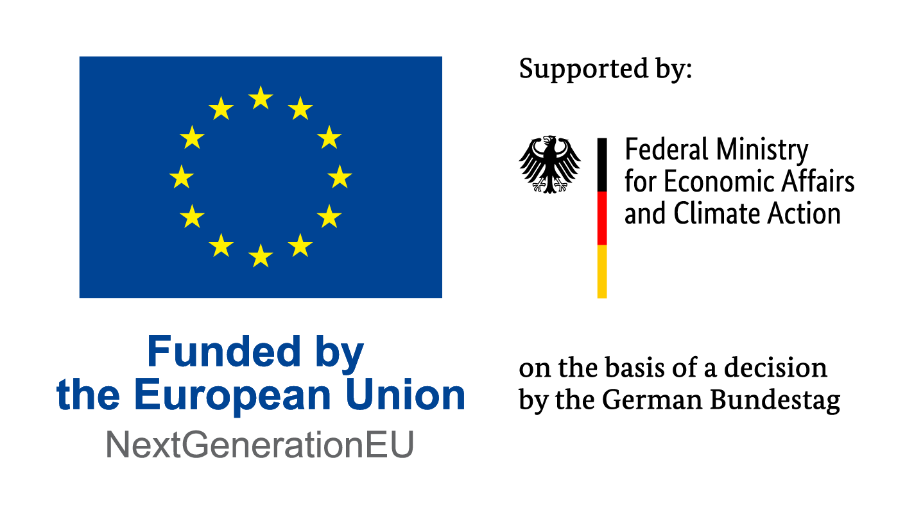

<picture style="padding-bottom: 1em;">
  <source media="(prefers-color-scheme: dark)" srcset="logo/Ankaios__logo_for_dark_bgrd_clipped.png">
  <source media="(prefers-color-scheme: light)" srcset="logo/Ankaios__logo_for_light_bgrd_clipped.png">
  
</picture>

# Eclipse Ankaios

Eclipse Ankaios provides workload and container orchestration for automotive
High Performance Computing Platforms (HPCs). While it can be used for various
fields of applications, it is developed from scratch for automotive use cases
and provides a slim, yet powerful solution to manage containerized applications.
It supports various container runtimes with Podman as the first one, but other
container runtimes and even native applications can be supported. Eclipse
Ankaios is independent of existing communication frameworks like SOME/IP, DDS,
or REST API.

Eclipse Ankaios manages multiple nodes and virtual machines with a single unique
API in order to start, stop, configure, and update containers and workloads. It
provides a central place to manage automotive applications with a setup
consisting of one server and multiple agents. Usually one agent per node
connects to one or more runtimes that are running the workloads.

## Usage

For using Ankaios see [documentation](https://eclipse-ankaios.github.io/ankaios).

## Contribution

This project welcomes contributions and suggestions. Before contributing, make sure to read the
[contribution guideline](CONTRIBUTING.md).

## License

Eclipse Ankaios is licensed using the Apache License Version 2.0.

<!-- markdownlint-disable-file MD041 -->

## Funding

Partly funded by

and

*the publication was partly written within the Shift2SDV project (GA number 101194245) which is supported by the Chips Joint Undertaking and its members, including top-funding by the national authorities of Austria, Denmark, Germany, Greece, Finland, Italy, Netherlands, Poland, Portugal, Spain, Turkey.*

*Co-funded by the European Union. Views and opinions expressed are however those of the author(s) only and do not necessarily reflect those of the European Union or the Chips Joint Undertaking. Neither the European Union nor the granting authorities can be held responsible for them.*

 
