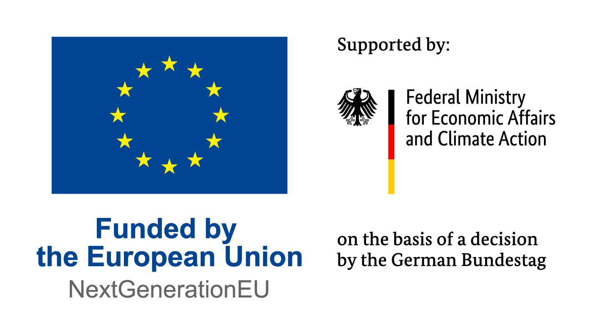

<picture style="padding-bottom: 1em;">
  <source media="(prefers-color-scheme: dark)" srcset="logo/Ankaios__logo_for_dark_bgrd_clipped.png">
  <source media="(prefers-color-scheme: light)" srcset="logo/Ankaios__logo_for_light_bgrd_clipped.png">
  
</picture>

# Eclipse Ankaios

Eclipse Ankaios is a workload and container orchestrator purpose-built for
embedded and automotive platforms. Designed to meet the unique demands of
resource-constrained environments and High-Performance Computing (HPC) systems
in vehicles, Ankaios delivers reliable workload management where it matters
most.

Ankaios supports both **Podman** and **containerd** runtimes, giving you the
freedom to choose the container technology that best fits your architecture and
security requirements. Other container runtimes and even native applications can
be added.
Built on a server-agent architecture, Ankaios manages multiple nodes and virtual
machines through a single unified API to start, stop, configure, and update
workloads. The setup consists of one server and multiple agents — typically one
agent per node — with each agent connecting to one or more runtimes that execute
your workloads. This design scales from simple single-node deployments to complex
distributed systems.

## Key features

* **Declarative configuration** - Define your entire system state in a single
  manifest. Ankaios ensures your workloads match your desired configuration,
  automatically reconciling any drift.
* **Multi-runtime flexibility** - Native support for Podman and containerd. Mix
  runtimes on the same node or run different runtimes on different nodes based on
  your specific requirements.
* **Built for automotive constraints** - Optimized for deterministic behavior and
  minimal resource overhead, while providing modern container orchestration
  capabilities.
* **Distributed by design** - Manage workloads across ECUs, HPCs, and edge devices
  from a central control point with consistent APIs.
* **Dynamic workload management** - Start, stop, update, and monitor containerized
  workloads in real-time. Ankaios handles dependencies, ensures proper startup
  sequences, and provides visibility into workload health.
* **Programmable orchestration** - Native SDKs allow workloads to communicate with
  Ankaios programmatically, to query the system state, trigger workload updates,
  and react to orchestration events.

## Getting started

* 📦 **Installation** - [Get Ankaios up and running on your system](https://eclipse-ankaios.github.io/ankaios/latest/usage/installation/)
* 🚀 **Quick start** - [Deploy your first workload in minutes](https://eclipse-ankaios.github.io/ankaios/latest/usage/quickstart/)
* 🏗️ **Architecture** - [Understand how Ankaios works under the hood](https://eclipse-ankaios.github.io/ankaios/latest/architecture/)
* 📡 **Vehicle signals** - [Send and receive vehicle signals with workloads](https://eclipse-ankaios.github.io/ankaios/latest/usage/tutorial-vehicle-signals/)
* ☁️ **Fleet management** - [Manage vehicle fleets from the cloud](https://eclipse-ankaios.github.io/ankaios/latest/usage/tutorial-fleet-management/)
* 📚 **API reference** - [Explore the complete API documentation](https://eclipse-ankaios.github.io/ankaios/latest/reference/control-interface/)

The full documentation is available at
[eclipse-ankaios.github.io/ankaios](https://eclipse-ankaios.github.io/ankaios).

## Community & resources

* [▶ Eclipse Ankaios YouTube playlist](https://youtube.com/playlist?list=PLXGqib0ZinZFwXpqN9pdFBrtflJVZ--_p)
* [⭐ Awesome Ankaios](https://eclipse-ankaios.github.io/ankaios/latest/usage/awesome-ankaios/)
* [💬 Get support](https://eclipse-ankaios.github.io/ankaios/latest/support/)

## Contribution

This project welcomes contributions and suggestions. Before contributing, make sure to read the
[contribution guideline](CONTRIBUTING.md).

## License

Eclipse Ankaios is licensed using the Apache License Version 2.0.

<!-- markdownlint-disable-file MD041 -->

## Funding

Partly funded by

*The publication was partly written within the Shift2SDV project (GA number 101194245) which is supported by the Chips Joint Undertaking and its members, including top-funding by the national authorities of Austria, Denmark, Germany, Greece, Finland, Italy, Netherlands, Poland, Portugal, Spain, Turkey.*

*Co-funded by the European Union. Views and opinions expressed are however those of the author(s) only and do not necessarily reflect those of the European Union or the Chips Joint Undertaking. Neither the European Union nor the granting authorities can be held responsible for them.*

