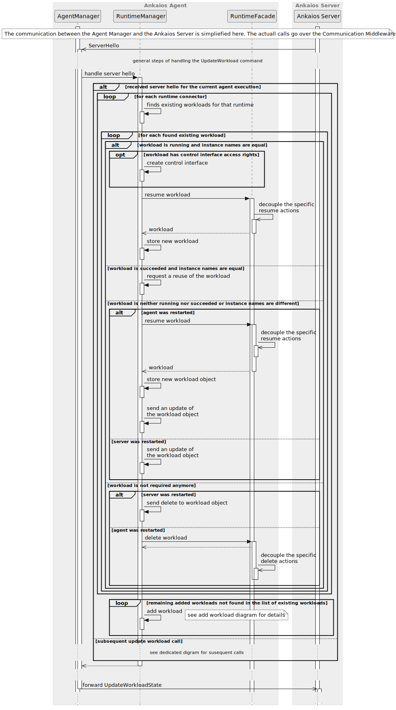
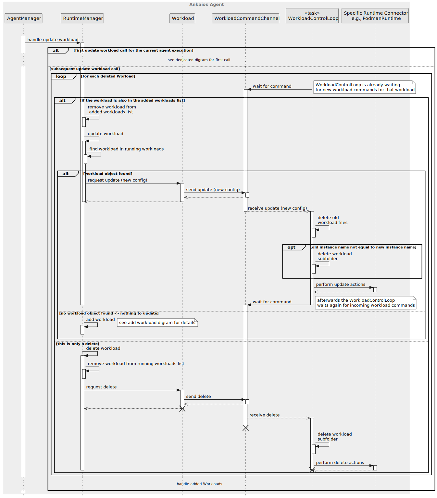
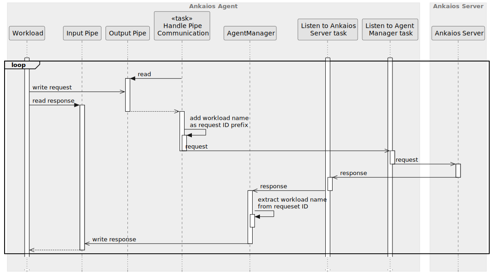

# Ankaios Agent - SW Design

## About this document

This document describes the Software Design for the Ankaios Agent. 

Ankaios is a workload orchestrator supporting a subset of the Kubernetes configurations and is targeted at the automotive use case.

The Ankaios Agent is one of the components of the Ankaios orchestrator and is responsible for running Workloads on the Agent node and forwarding execution requests to the Server.

## Context View

An Ankaios Agent is connected to one single instance of an Ankaios Server. The Agent communicates with the Server to:
* get list of Workloads scheduled for that particular Agent
* get execution statuses of Workloads on other Agents
* forward execution requests from authorized Workloads to the Server

The following diagram shows a high level view of an Ankaios Agent in its context:

Please note that the Ankaios Agent could also run on the same node as the Server.

## Constraints, risks and decisions

### Design decisions

## Structural view

The following diagram shows the structural view of the Ankaios Agent:

### AgentManager

The AgentManager is the main component in the Ankaios Agent and is responsible, amongst others, for pushing Workloads to the runtime adapters and serving the Ankaios Control Interface by authorizing requests from the workloads to the Ankaios Server.

For simplicity, the initial setup of the Ankaios Agent done in the main.rs is also counted as part of this unit.

### RuntimeAdapter

The RuntimeAdapter provides common functionality used by all runtime adapters.

### PodmanAdapter

The PodmanAdapter is a RuntimeAdapter for Podman. It is responsible for dealing with the podman Workloads (start, stop).

### PodmanWorkload

The PodmanWorkload uses Podman REST API to process events from the PodmanAdapter.
The PodmanWorkload also checks periodically status of the podman workload and reports changes of the status. 

### ParameterStorage

Stores information which the Agent gets from the Server. Currently the storage stores the workload status and mapping from workload name to runtime name.

### External Libraries

#### Communication Middleware

The Middleware is responsible for the connection to the Ankaios Server.

#### ExecutionCommand Channel, StateChangeCommand Channel

The channels are defined in the `common` library.
They are used to connect modules in the Ankaios Agent, more precisely they connect task in which modules run.

## Behavioral view

This chapter defines the runtime behavior of the Ankaios Agent in details. The following chapters show essential parts of the behavior and describe the requirements towards the Ankaios Agent.
### Startup sequence

The following diagram shows the startup sequence of the Ankaios Agent:

#### Agent communicates only with the Server
`swdd~agent-shall-use-interfaces-to-server~1`

Status: approved

The Ankaios Agent shall use the given interfaces and channels to communicate with the Server.

Tags:
- AgentManager

Rationale: The Server is "only source of true" and ensures that Agents are in the consistent state.

Needs:
- impl
- itest

#### Agent sends hello
`swdd~agent-sends-hello~1`

Status: approved

When the Agent is connected to the Server, the Agent shall send an `AgentHello` message to the Server containing the agent's name.

Tags:
- AgentManager

Needs:
- impl
- itest

#### AgentManager shall listen for request from the Server
`swdd~agent-manager-listens-requests-from-server~1`

Status: approved

The AgentManager shall listen for the execution requests from the Server.

Tags:
- AgentManager

Needs:
- impl
- utest
- itest

#### All communication with the Server through middleware
`swdd~communication-to-from-agent-middleware~1`

Status: approved

All communication with the Server shall go through the Communication Middleware.

Tags:
- AgentManager

Needs:
- impl
- itest

#### Agent defaults to gRPC Communication Middleware
`swdd~agent-default-communication-grpc~1`

Status: approved

The Ankaios Agent shall use per default a gRPC Communication Middleware.

Tags:
- AgentManager

Needs:
- impl
- itest

#### Agent uses common async communication channels
`swdd~agent-uses-async-channels~1`

Status: approved

The Ankaios Agent shall use asynchronous communication channels from the Common library.

Rationale: The communication channels are especially needed in order to abstract the Communication Middleware.

Tags:
- AgentManager

Needs:
- impl
- utest

#### Agent supports multiple runtime connectors
`swdd~agent-supports-multiple-runtime-connectors~1`

Status: approved

The Ankaios agent shall support multiple runtime connectors.

Tags: 
- RuntimeManager

Needs:
- impl
- utest

#### Agent uses specified runtime connector
`swdd~agent-uses-specified-runtime~1`

Status: approved

The Ankaios agent shall manage workloads using the runtime connector specified in the workload specification.

Tags:
- RuntimeManager

Needs:
- impl
- utest

#### Agent supports Podman
`swdd~agent-supports-podman~2`

Status: approved

The Agent shall support Podman for creating containers as a build-in runtime connector named "podman".

Tags:
- PodmanRuntime

Needs:
- impl
- itest

#### Agent supports K8s resources via podman-kube runtime
`swdd~agent-supports-podman-kube-runtime~1`

Status: approved

The Agent shall support Podman for creating Kubernetes resources as a build-in runtime connector named "podman-kube".

Rationale:
Supporting Kubernetes resources as a separate runtime allows differentiating between plain containers and pods started via Kubernetes manifests.

Tags: 
- PodmanKubeRuntime

Needs:
- impl
- itest

### Handling UpdateWorkload commands from the Ankaios Server

The following diagram show the general steps the Ankaios Agent takes when receiving an UpdateWorkload command:

#### Agent Manager creates Control Interface Instance for each workload
`swdd~agent-create-control-interface-pipes-per-workload~1`

Status: approved

When the Agent Manager gets an `UpdateWorkload` message, for each added Workload with a runtime that is known, the Agent Manager shall create a Control Interface Instance for this Workload.

Tags:
- AgentManager
- ControlInterface

Needs:
- impl
- utest

#### Control Interface creates FIFO files for each workload
`swdd~agent-control-interface-creates-two-pipes-per-workload~1`

Status: approved

Each new ControlInterface instance shall create two FIFO files :

- a FIFO file for the workload to send requests to the Control Interface (called output pipe in the following) 
- a FIFO file for the workload to request responses to the Control Interface (called input pipe in the following) 

Tags:
- ControlInterface

Needs:
- impl
- utest

#### Control Interface pipes at predefined path
`swdd~agent-control-interface-pipes-path-naming~1`

Status: approved

The Control Interface Instance shall create the Control Interface pipes at the following path:
    <Agent run folder>/<Workload execution instance name>/

Rationale:
The Ankaios Agent needs a unique, reproducible name to be able to make the mapping between a workload execution instance and a control interface pipes instance.

Tags: 
- ControlInterface

Needs:
- impl
- utest

#### Agent skips unknown runtime
`swdd~agent-skips-unknown-runtime~1`

Status: approved

When the Ankaios Agent gets an add Workload command with the `UpdateWorklaod` message and the runtime of the Workload is unknown, the RuntimeManager shall skip this Workload.

Tags:
- RuntimeManager

Needs:
- impl
- utest

###### RuntimeManager stores Workload in the list of running workloads
`swdd~agent-stores-running-workload~1`

Status: approved

When the RuntimeManager creates new workload objects via the RuntimeFacade, the RuntimeManager shall store the Workload in a list of running workloads.

Comment:
Please note that the object creation is targeted here and thus also resume or replace of running workloads is in scope.

Rationale:
The workload object is later used to update or delete the workload. The object also stores the ControlInterface for the workload and manages it during the lifetime of the workload.

Tags:
- RuntimeManager

Needs:
- impl
- utest

#### Handling the initial UpdateWorkload after Agent start (starting the RuntimeAdapters)

The following diagram and the subsequent requirements show the steps the Ankaios Agent takes when receiving the first UpdateWorkload command sent by Server. The first UpdateWorkload contains the complete initial list of workloads the Agent shall manage.

##### RuntimeManager initial list of workloads handles existing workloads
`swdd~agent-initial-list-existing-workloads~1`

Status: approved

After receiving the complete list of added workloads from the Ankaios Sever at the initial connection establishment, the RuntimeManager shall handle existing workloads.

Comment:
In case the Agent was already running, the Runtime Adapter can take care of Workloads that were started in an earlier execution. Some of these workloads can be reused, some have to be updated and some stopped.

Tags: 
- RuntimeManager

Needs:
- impl
- utest

##### RuntimeManager handles existing workloads by building list
`swdd~agent-existing-workloads-finds-list~1`

Status: approved

When handling existing workloads, the RuntimeManager shall call each RuntimeFacade to request a list of existing workloads started during the same machine runtime window by a previous execution of an Ankaios Agent with the same name as the currently running Agent.

Comment:
A 'machine runtime window' is the time between the start and shutdown of the machine. Finding existing workloads needs to be done fore stating new workloads in order to avoid conflicts. If this call fails, the agent currently ignores the failure assumes that no workloads are running. It must be confirmed that this behavior is correct.

Tags: 
- RuntimeManager

Needs:
- impl
- utest

##### RuntimeManager handles existing workloads starts new only if not found
`swdd~agent-existing-workloads-starts-new-if-not-found~1`

Status: approved

When handling existing workloads, the RuntimeManager shall only request the corresponding RuntimeFacade to start workloads that are not already running.

Comment:
The RuntimeManager can check if the specified workload is already running by comparing the new workload execution instance name with that of the running instance. Details about starting a workload can be found further on.

Tags:
- RuntimeManager

Needs:
- impl
- utest

##### RuntimeFacade creates workload
`swdd~agent-create-workload~1`

Status: approved

When the RuntimeFacade gets a requests to create a workload, the RuntimeFacade shall:
* request the wrapped runtime to create the workload (incl. starting the state checker monitoring it)
* start the workload task waiting for stop or update commands for that workload
* return a new workload object allowing the communication with the task handling the stop or update commands
 
Comment:
The state checker doesn't need to be started as an additional step here as the runtime starts it when creating the workload.

Rationale:
The task handling stop and update commands is needed to ensure maintaining the order of the commands for a workload while not blocking Ankaios to wait until one command is complete.

Tags: 
- RuntimeFacade

Needs:
- impl
- utest

##### RuntimeManager handles existing workloads resumes existing workloads
`swdd~agent-existing-workloads-resume-existing~1`

Status: approved

When handling existing workloads, for each found existing workload that is request to be started and has unchanged configuration, the RuntimeManager shall request the corresponding RuntimeFacade to resume the workload using a new control interface instance.

Tags:
- RuntimeManager

Needs:
- impl
- utest

##### RuntimeFacade resumes workload
`swdd~agent-resume-workload~1`

Status: approved

When requested, the RuntimeFacade resumes a workload by:
* request the wrapped runtime to start the state checker for that workload
* start the workload task waiting for stop or update commands for that workload
* return a new workload object allowing the communication with the task handling the stop or update commands
 
Comment:
If a workload is running, there is not need to created it again via the specific runtime. The state checker must be started as an additional step here as the runtime does not create a new workload.

Rationale:
The task handling stop and update commands is needed to ensure maintaining the order of the commands for a workload while not blocking Ankaios to wait until one command is complete.

Tags: 
- RuntimeFacade

Needs:
- impl
- utest

##### RuntimeManager handles existing workloads replace updated Workloads
`swdd~agent-existing-workloads-replace-updated~1`

Status: approved

When handling existing workloads, for each found existing workload that is request to be started and for which a change in the configuration was detected, the RuntimeManager shall request the RuntimeFacade to replace the workload.

Comment:
The RuntimeManager can check if the specified workload is already running, but was updated by comparing the new workload execution instance name with that of the running instance.

Tags: 
- RuntimeManager
- 
Needs:
- impl
- utest

##### RuntimeFacade replace Workload
`swdd~agent-replace-workload~1`

Status: approved

When requested, the RuntimeFacade replaces a workload by:
* request the wrapped runtime to delete the old workload
* request the wrapped runtime to create a workload with the new config(incl. starting the state checker monitoring it)
* start the workload task waiting for stop or update commands for that workload
* return a new workload object allowing the communication with the task handling the stop or update commands

Comment:
No need to specifically ask for starting the state checker at that point as runtimes are expected to always create a state checker when creating a workload.

Rationale:
The task handling stop and update commands is needed to ensure maintaining the order of the commands for a workload while not blocking Ankaios to wait until one command is complete.

Tags:
- RuntimeFacade

Needs:
- impl
- utest

##### RuntimeManager handles existing workloads deletes unneeded workloads
`swdd~agent-existing-workloads-delete-unneeded~1`

Status: approved

When handling existing workloads, for each found existing workload that is not in the provided list of initial workloads, the RuntimeManager shall request the RuntimeFacade to delete the workload.

If the the Runtime Adapter finds an existing Workload that is not in the provided list of initial workloads, the Ankaios Agent shall stop the existing Workload.

Tags:
- RuntimeManager

Needs:
- impl
- utest

##### RuntimeFacade delete old workload
`swdd~agent-delete-old-workload~1`

Status: approved

When requested, the RuntimeFacade deletes a workload by:
* deleting the workload via the runtime

Comment:
This delete is done by the specific runtime for a workload Id. No internal workload object is involved in this action.

Tags:
- RuntimeFacade

Needs:
- impl
- utest

#### Handling subsequent UpdateWorkload

The UpdateWorkload message contains two lists of workloads - deleted Workloads specified by name and added Workloads including their desired configuration. The Ankaios Agent goes through the deleted Workloads first in order to free resources before starting to allocate new ones.

The following two diagrams show how deleted and added Workloads are handled by the Agent Manager. The first diagram shows how the deleted Workloads are handled:

After the deleted Workloads are handled, the Ankaios Agent goes through the list of added Workloads

###### Agent handles deleted workloads before added Workloads
`swdd~agent-handle-deleted-before-added-workloads~1`

Status: approved

The RuntimeManager shall first handle the list of deleted Workloads before handling the list of added Workloads.

Comment:
Updated Workloads can be handled before everything is deleted as in the normal case the resource usage will remain the same.

Rationale:
Deleting Workloads first ensures that the machine which executes the workloads has enough resources to start the new ones.

Tags: 
- RuntimeManager

Needs:
- impl
- utest

###### Agent updates deleted and added workloads
`swdd~agent-updates-deleted-and-added-workloads~1`

Status: approved

The RuntimeManager shall request an update of a workload if the workload is in both the list of deleted and added workloads.

Rationale:
This is needed to ensure the order of the commands.

Tags: 
- RuntimeManager

Needs:
- impl
- utest

###### Workload handles update command
`swdd~agent-workload-obj-update-command~1`

Status: approved

When the WorkloadObject receives a trigger to update the workload, it:
* stops the old control interface
* stores the new control interface
* send a command on the command channel to the workload task to update the workload

Tags:
- WorkloadObject

Needs:
- impl
- utest

###### Workload task executes update command
`swdd~agent-workload-tasks-executes-update~1`

Status: approved

When the control task started during the creation of the workload object receives an update command, the workload task shall:
* delete the old workload via the corresponding runtime
* stop the state checker for the workload
* create a new workload via the corresponding runtime (which creates and starts a state checker)
* store the new Id and reference to the state checker inside the workload control task

Rationale:
The workload task allows to asynchronously carry out time consuming actions and still maintain the order of the actions as they are queued on a command channel.

Tags: 
- WorkloadObject

Needs:
- impl
- utest

###### Agent adds on update missing workload
`swdd~agent-add-on-update-missing-workload~1`

Status: approved

When the Ankaios Agent gets an `UpdateWorkload` message that indicates an update of a workload and the workload cannot be found, the RuntimeManager shall trigger adding of the workload.

Comment:
This situation cannot actually occur, but if a workload is requested to be added it shall also be added instead of just tracing an error/warning. 

Tags:
- RuntimeManager

Needs:
- impl
- utest

###### Agent deletes workload on command from server
`swdd~agent-deletes-workload~1`

Status: approved

When the Ankaios agent receives an `UpdateWorkload` message with a workload for deletion that is not also listed as added workload, the agent shall trigger a deletion of the workload.

Tags:
- RuntimeManager

Needs:
- impl
- utest

###### Workload handles delete command
`swdd~agent-workload-obj-delete-command~1`

Status: approved

When the WorkloadObject receives a trigger to deletion the workload, it:
* stops the control interface
* send a command on the command channel to the workload task to delete the workload

Tags:
- WorkloadObject

Needs:
- impl
- utest

###### Workload task executes delete command
`swdd~agent-workload-tasks-executes-delete~1`

Status: approved

When the control task started during the creation of the workload object receives a delete command, the workload task shall:
* delete the old workload via the corresponding runtime
* stop the state checker for the workload
* stop the workload control task

Rationale:
The workload task allows to asynchronously carry out time consuming actions and still maintain the order of the actions as they are queued on a command channel.

Tags: 
- WorkloadObject

Needs:
- impl
- utest

###### Agent updates on add known workload
`swdd~agent-update-on-add-known-workload~1`

Status: approved

When the Ankaios Agent gets an `UpdateWorkload` message with an added workloads that was already started by the RuntimeManager, the RuntimeManager shall trigger the update of the workload.

Comment:
This situation can happen if the Ankaios Server gets restarted. It is not yet confirmed if this handling is correct and it is subject to change.

Tags:
- RuntimeManager

Needs:
- impl
- utest

###### Agent creates workload
`swdd~agent-added-creates-workload~1`

Status: approved

When the Ankaios agent gets an `UpdateWorkload` message with an added workload that was not started already and the runtime is known, the Agent Manager shall request the corresponding RuntimeFacade to create the workload.

Tags:
- RuntimeManager

Needs:
- impl
- utest

##### Adding (creating) a new workload via the podman runtime

The following diagram shows the steps taken by the podman runtime to create a workload:

// TODO update diagram 

###### PodmanAdapter mounts FIFO files into workload
`swdd~podman-adapt-mount-interface-pipes-into-workload~2`

Status: approved

When creating a container a PodmanWorkload shall mount the Control Interface input pipe and the Control Interface output pipe into the container in the file path `/run/ankaios/control_interface`.

Tags:
- ControlInterface

Needs:
- impl
- utest

###### PodmanWorkload pulls a container
`swdd~podman-workload-pulls-container~2`

Status: approved

When PodmanWorkload gets a request to start workload and the image is not already available locally, the PodmanWorkload shall pull the image specified in the configuration.

Tags:
- PodmanWorkload

Needs:
- impl
- utest
- stest

###### PodmanWorkload creates a container
`swdd~podman-workload-creates-container~1`

Status: approved

When PodmanWorkload gets a request to start workload, the PodmanWorkload shall create a container from the image specified in the configuration.

Tags:
- PodmanWorkload

Needs:
- impl
- utest
- stest

###### PodmanWorkload stores container id
`swdd~podman-workload-stores-container-id~1`

Status: approved

When PodmanWorkload creates a container, the PodmanWorkload shall store the container id.

Tags:
- PodmanWorkload

Needs:
- impl
- utest

###### PodmanWorkload starts a container
`swdd~podman-workload-starts-container~1`

Status: approved

When PodmanWorkload gets a request to start workload, the PodmanWorkload shall start the container with the stored container id.

Tags:
- PodmanWorkload

Needs:
- impl
- utest
- stest

#### PodmanWorkload fails to start a container
`swdd~podman-workload-update-workload-state-on-start-failure~1`

Status: approved

When PodmanWorkload gets a request to start workload and the start fails, the PodmanWorkload shall update the workload state to `ExecFailed`.

Rationale: 
A well-defined initial state of that failed workload is needed to handle subsequent change requests to the workload correctly.

Tags: 
- PodmanWorkload

Needs:
- impl
- utest

##### Deleting (stopping) a Workload

The following diagram shows the steps taken by the Workload Facade to fulfill the delete / stop action:

###### PodmanAdapter removes PodmanWorkload from the list of running workloads
`swdd~podman-adapter-removes-podman-workload~2`

Status: approved

When the PodmanAdapter gets a requests to delete a workload, the PodmanAdapter removes the Workload Facade from the list of running workloads.

Tags:
- PodmanAdapter

Needs:
- impl
- utest

###### PodmanAdapter requests PodmanWorkload to stop the workload container
`swdd~podman-adapter-request-stopping-container~2`

Status: approved

When the PodmanAdapter gets a requests to delete a workload, the PodmanAdapter stops the Workload Facade for this workload.

Tags:
- PodmanAdapter

Needs:
- impl
- utest

###### PodmanWorkload stops a container
`swdd~podman-workload-stops-container~1`

Status: approved

When PodmanWorkload gets a request to delete the managed workload, PodmanWorkload shall stop the container with the stored container Id.

Tags:
- PodmanWorkload

Needs:
- impl
- utest
- stest

###### PodmanWorkload deletes a container
`swdd~podman-workload-deletes-container~1`

Status: approved

When PodmanWorkload gets a request to delete the managed workload, PodmanWorkload shall delete the container with the stored container Id.

Tags:
- PodmanWorkload

Needs:
- impl
- utest
- stest

##### Handling UpdateWorkloadState

This section describes how Workload states are handled inside the Ankaios Agent and how they get forwarded to the Ankaios Server.

###### Workload State in Agent
`swdd~podman-workload-state~1`

Status: approved

For each Agent-Workload pair, the PodmanWorkload can be in one of the following states: pending, running, succeeded, failed, unknown, removed.

Tags:
- PodmanWorkload

Needs:
- impl
- utest

###### PodmanWorkload maps Workload State
`swdd~podman-workload-maps-state~1`

Status: approved

The PodmanWorkload shall map the container state returned by the Podman into Workload States according to the next table:

| Podman Container State | Container ExitCode | Workload State |
| ---------------------- | :----------------: | :------------: |
| Created                |         -          |    Pending     |
| Paused                 |         -          |    Unknown     |
| Running                |         -          |    Running     |
| Exited                 |        == 0        |   Succeeded    |
| Exited                 |        != 0        |     Failed     |
| (anything else)        |         -          |    Unknown     |

Comment: This table shows the container states only. The Podman also supports "pod states" which are currently out of the scope of this document, but could be handled later in the project.

Tags:
- PodmanWorkload

Needs:
- impl
- utest

###### PodmanWorkload sends Workload State
`swdd~podman-workload-sends-workload-state~1`

Status: approved

When the Workload State of a Workload changes on a PodmanWorkload, the PodmanWorkload shall send an UpdateWorkloadState message to the Ankaios Server, containing the new Workload State.

Tags:
- PodmanWorkload

Needs:
- impl
- utest
- itest

###### PodmanWorkload monitors the Workload State
`swdd~podman-workload-monitors-workload-state~1`

Status: approved

When the PodmanWorkload is started, the PodmanWorkload shall start monitoring the Workload State.

Tags:
- PodmanWorkload

Needs:
- impl
- utest

###### The interval when PodmanWorkload monitors the Workload State
`swdd~podman-workload-monitor-interval~1`

Status: approved

The interval, how often the PodmanWorkload monitors the Workload State is configurable at compile-time and the value shall be 1 second.

Tags:
- PodmanWorkload

Needs:
- impl

### Storing a Workload State

After the Ankaios Agent is started it receives an information about Workload States of other Workloads running in another Agents:

#### Agent Manager stores all Workload States
`swdd~agent-manager-stores-all-workload-states~1`

Status: approved

The Ankaios Agent shall accept an `UpdateWorkloadState` message from the server and store the contained information.

Tags:
- AgentManager
- ParameterStorage

Comment: The `UpdateWorkloadState` contains workload states of other workloads. The Workload State "removed" is the default and Node-Workload pairs of this type can be represented by not being stored.

Needs:
- impl
- utest

### Forwarding the Control Interface

The Ankaios Agent is responsible to forward Control Interface requests from a Workload to the Ankaios Server and to forward Control Interface responses from the Ankaios Server to the Workload.

#### Agent uses length delimited protobuf for Control Interface pipes
`swdd~agent-uses-length-delimited-protobuf-for-pipes~1`

Status: approved

When sending or receiving message via the Control Interface pipes, Ankaios Agent uses length delimited protobuf encoding.

Tags:
- AgentManager
- ControlInterface

Comment: A length delimited protobuf message, is the protobuf encoded message preceded by the size of the message in bytes encoded as protobuf varint.
This size excludes the size prefix.

Needs:
- impl
- utest

#### Agent listens for Control Interface requests from the output pipe
`swdd~agent-listens-for-requests-from-pipe~1`

Status: approved

The Ankaios Agents shall listen for Control Interface requests from the output pipe of each workload.

Tags:
- AgentManager
- ControlInterface

Needs:
- impl
- utest

#### Agent forwards Control Interface request fom the pipe to the server
`swdd~agent-forward-request-from-control-interface-pipe-to-server~1`

Status: approved

When the Ankaios Agents receives a Control Interface request from a Workload, the Ankaios Agent shall forward this request to the Ankaios Server.

Tags:
- AgentManager
- ControlInterface

Needs:
- impl
- utest

#### Agent adds Workload Name as prefix the request_id of Control Interface requests
`swdd~agent-adds-workload-prefix-id-control-interface-request~1`

Status: approved

When forwarding Control Interface requests from a Workload to the Ankaios server,
the Ankaios Agents shall add the name of the Workload as prefix to the request_id of the Control Interface request.

Tags:
- AgentManager
- ControlInterface

Comment: The prefix is separated from the request_id by a "@" symbol.
This symbol can be used to remove the Workload Name from the request_id.

Needs:
- impl
- utest

#### Agent forwards Control Interface response to the corresponding Workloads input pipe
`swdd~agent-forward-responses-to-control-interface-pipe~1`

Status: approved

When receiving a Control Interface response from the Ankaios Server, the Ankaios Agent shall forward this Control Interface response to the corresponding Workloads input pipe.

Tags:
- AgentManager
- ControlInterface

Needs:
- impl
- utest
- stest

#### Agent uses request_id prefix to forward Control Interface response to the correct Workload
`swdd~agent-uses-id-prefix-forward-control-interface-response-correct-workload~1`

Status: approved

When forwarding a Control Interface response to a Workload, the Ankaios Agent shall determine the correct Workload, to forward the Control Interface response to, using the request_id prefix.

Tags:
- RuntimeManager

Needs:
- impl
- utest

#### Agent removes request_id prefix before forwarding Control Interface response to a Workload
`swdd~agent-remove-id-prefix-forwarding-control-interface-response~1`

Status: approved

When forwarding a Control Interface response to a Workload, the Ankaios Server shall remove the request_id prefix before forwarding the Control Interface response.

Tags:
- RuntimeManager

Needs:
- impl
- utest

#### Agent ensures the Control Interface output pipes are read
`swdd~agent-ensures-control-interface-output-pipe-read~1`

Status: approved

The Ankaios Agent shall ensure, that Control Interface output pipes are opened and messages are read.

Tags:
- AgentManager
- ControlInterface

Comment: If the Ankaios Agent does not open and read the Control Interface output pipes, a Workload could block, trying to write the output pipe.

Needs:
- impl
- utest

#### Agent handles Control Interface input pipe not being read
`swdd~agent-handles-control-interface-input-pipe-not-read~1`

Status: approved

If a Workload does not read data send to it on the Control Interface input pipe, the Ankaios Agent shall handle this situation gracefully.
Hence the Ankaios Agent:

- does not block
- does not use a infinite amount of memory to store message which could not be sent
- overwhelm the Workload with messages once the Workload starts reading the Control Interface input pipe

Tags:
- AgentManager
- ControlInterface

Needs:
- impl
- utest

## Data view

## Error management view

## Physical view

## References

## Glossary

* gRPC - [Google Remote Procedure Call](https://grpc.io/)
* SOME/IP - [Scalable service-Oriented MiddlewarE over IP](https://some-ip.com/)
