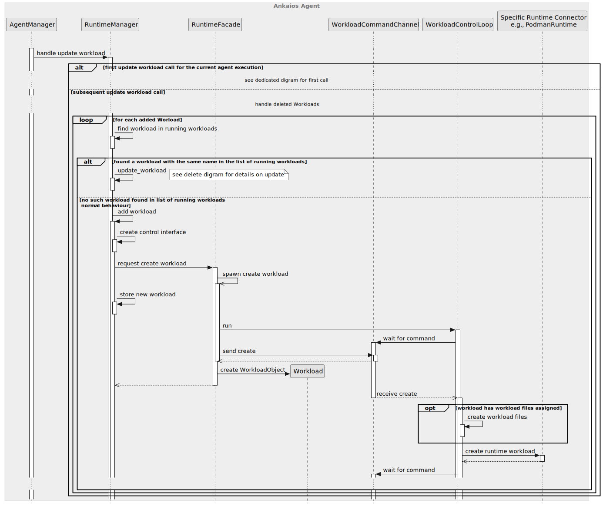

# Ankaios Agent - SW Design

## About this document

This document describes the Software Design for the Ankaios Agent. 

Ankaios is a workload orchestrator supporting a subset of the Kubernetes configurations and is targeted at the automotive use case.

The Ankaios Agent is one of the components of the Ankaios orchestrator and is responsible for running Workloads on the Agent node and forwarding execution requests to the Server.

## Context View

An Ankaios Agent is connected to one single instance of an Ankaios Server. The Agent communicates with the Server to:
* get list of Workloads scheduled for that particular Agent
* get execution statuses of Workloads on other Agents
* forward execution requests from authorized Workloads to the Server

The following diagram shows a high level view of an Ankaios Agent in its context:

Please note that the Ankaios Agent could also run on the same node as the Server.

## Constraints, risks and decisions

### Design decisions

## Structural view

The following diagram shows the structural view of the Ankaios Agent:

### AgentManager

The AgentManager is the main component in the Ankaios Agent and is responsible, amongst others, for pushing Workloads to the runtime adapters and serving the Ankaios Control Interface by authorizing requests from the workloads to the Ankaios Server.

For simplicity, the initial setup of the Ankaios Agent done in the main.rs is also counted as part of this unit.

### RuntimeAdapter

The RuntimeAdapter provides common functionality used by all runtime adapters.

### PodmanAdapter

The PodmanAdapter is a RuntimeAdapter for Podman. It is responsible for dealing with the podman Workloads (start, stop).

### PodmanWorkload

The PodmanWorkload uses Podman REST API to process events from the PodmanAdapter. 
The PodmanWorkload also checks periodically status of the podman workload and reports changes of the status. 

### ParameterStorage

Stores information which the Agent gets from the Server. Currently the storage stores the workload status and mapping from workload name to runtime name.

### External Libraries

#### Communication Middleware

The Middleware is responsible for the connection to the Ankaios Server.

#### ExecutionCommand Channel, StateChangeCommand Channel

The channels are defined in the `common` library.
They are used to connect modules in the Ankaios Agent, more precisely they connect task in which modules run.

## Behavioral view

This chapter defines the runtime behavior of the Ankaios Agent in details. The following chapters show essential parts of the behavior and describe the requirements towards the Ankaios Agent.
### Startup sequence

The following diagram shows the startup sequence of the Ankaios Agent:

#### Agent communicates only with the Server
`swdd~agent-shall-use-interfaces-to-server~1`

Status: approved

The Ankaios Agent shall use the given interfaces and channels to communicate with the Server.

Tags:
- AgentManager

Rationale: The Server is "only source of true" and ensures that Agents are in the consistent state.

Needs:
- impl
- itest

#### Agent sends hello
`swdd~agent-sends-hello~1`

Status: approved

When the Agent is connected to the Server, the Agent shall send an `AgentHello` message to the Server containing the agent's name.

Tags:
- AgentManager

Needs:
- impl
- itest

#### AgentManager shall listen for request from the Server
`swdd~agent-manager-listens-requests-from-server~1`

Status: approved

The AgentManager shall listen for the execution requests from the Server.

Tags:
- AgentManager

Needs:
- impl
- utest
- itest

#### All communication with the Server through middleware
`swdd~communication-to-from-agent-middleware~1`

Status: approved

All communication with the Server shall go through the Communication Middleware.

Tags:
- AgentManager

Needs:
- impl
- itest

#### Agent defaults to gRPC Communication Middleware
`swdd~agent-default-communication-grpc~1`

Status: approved

The Ankaios Agent shall use per default a gRPC Communication Middleware.

Tags:
- AgentManager

Needs:
- impl
- itest

#### Agent uses common async communication channels
`swdd~agent-uses-async-channels~1`

Status: approved

The Ankaios Agent shall use asynchronous communication channels from the Common library.

Rationale: The communication channels are especially needed in order to abstract the Communication Middleware.

Tags:
- AgentManager

Needs:
- impl
- utest

#### Agent uses RuntimeAdapter
`swdd~agent-uses-runtime-adapter~1`

Status: approved

The Ankaios Agent shall manage Workloads using the RuntimeAdapter specified in the Workload Specification.

Tags:
- AgentManager

Needs:
- impl
- utest

#### Agent supports Podman
`swdd~agent-supports-podman~1`

Status: approved

The Agent shall implement the RuntimeAdapter for the Podman.

Tags:
- PodmanAdapter

Needs:
- impl
- itest

### Handling UpdateWorkload commands from the Ankaios Server

The following diagram show the general steps the Ankaios Agent takes when receiving an UpdateWorkload command:

#### Agent Manager creates Control Interface Instance for each workload
`swdd~agent-create-control-interface-pipes-per-workload~1`

Status: approved

When the Agent Manager gets an `UpdateWorkload` message, for each added Workload with a runtime that is known, the Agent Manager shall create a Control Interface Instance for this Workload.

Tags:
- AgentManager
- ControlInterface

Needs:
- impl
- utest

#### Control Interface creates FIFO files for each workload
`swdd~agent-control-interface-creates-two-pipes-per-workload~1`

Status: approved

The Control Interface Instance shall create two FIFO files for each Workload:

- a FIFO file for the workload to send requests to the Control Interface (called output pipe in the following) 
- a FIFO file for the workload to request responses to the Control Interface (called input pipe in the following) 

Tags:
- ControlInterface

Needs:
- impl
- utest

#### Control Interface pipes at predefined path
`swdd~agent-control-interface-pipes-path-naming~1`

Status: approved

The Control Interface Instance shall create the Control Interface pipes at the following path:
    <Agent run folder>/<Workload execution instance name>/

Rationale:
The Ankaios Agent needs a unique, reproducible name to be able to make the mapping between a workload execution instance and a control interface pipes instance.

Tags: 
- ControlInterface

Needs:
- impl
- utest

#### Agent skips unknown runtime
`swdd~agent-skips-unknown-runtime~1`

Status: approved

When the Ankaios Agent gets an add Workload command with the `UpdateWorklaod` message and the runtime of the Workload is unknown, the Agent Manager shall skip this Workload.

Tags:
- AgentManager

Needs:
- impl
- utest

#### Agent Manager stores Workload to Runtime mapping
`swdd~agent-manager-stores-workload-runtime-mapping~1`

Status: approved

When the Ankaios Agent gets an `UpdateWorkload` message with added Workloads and the runtime is known, the Agent shall store the mapping from workload name to runtime name.

Comment:
The mapping is needed to be able to stop a workload as the runtime name is not part of the DeleteWorkload message.

Tags:
- AgentManager
- ParameterStorage

Needs:
- impl
- utest

#### Handling the initial UpdateWorkload after Agent start (starting the RuntimeAdapters)

The following diagram and the subsequent requirements show the steps the Ankaios Agent takes when receiving the first UpdateWorkload command sent by Server. The first UpdateWorkload contains the complete initial list of workloads the Agent shall manage.

##### Agent Manager starts Runtime Adapters with initial list of workloads
`swdd~agent-starts-runtimes-adapters-with-initial-workloads~1`

Status: approved

After receiving the complete list of added workloads from the Ankaios Sever at the initial connection establishment, the Ankaios Agent shall start each RuntimeAdapter with the list of Workloads associated with this adapter.

Comment:
In case the Agent was already running, the Runtime Adapter can take care of Workloads that were started in an earlier execution.

Tags: 
- AgentManager

Needs:
- impl
- utest

##### Runtime Adapter at startup finds existing Workloads
`swdd~agent-adapter-start-finds-existing-workloads~1`

Status: approved

The RuntimeAdapter shall build a list of existing Workloads started during the same machine runtime window by a previous execution of an Ankaios Agent with the same name as the currently running Agent.

Comment:
A 'machine runtime window' is the time between the start and shutdown of the machine.

Tags: 
- PodmanAdapter

Needs:
- impl
- utest

##### Runtime Adapter at startup starts a new Workload only if this Workload is not found
`swdd~agent-adapter-start-new-workloads-if-non-found~1`

Status: approved

After finding all existing Workloads, the Runtime Adapter shall only start workloads that are not already running.

Comment:
The Runtime Adapter can check if the specified workload is already running by comparing the new workload execution instance name with that of the running instance. Details about starting a workload can be found further on.

Tags:
- PodmanAdapter

Needs:
- impl
- utest

##### Runtime Adapter at startup resumes to existing Workloads
`swdd~agent-adapter-start-resume-existing~1`

Status: approved

For each found existing Workload that is request to be started and has unchanged configuration, the Runtime Adapter shall resume the Workload by creating a new specific Workload and and creating the Workload Facade using the resume method.

Comment:
Reconnecting to the Control Interface is done for each added Workload in there was no Control Interface instance for it.

Tags:
- PodmanAdapter

Needs:
- impl
- utest

##### Workload Facade resumes existing Workload
`swdd~agent-facade-resumes-existing-workload~1`

Status: approved

When created with the resume method, the Workload Facade shall resume the specific Workload.

Comment:
Reconnecting to the Control Interface is done for each added Workload in there was no Control Interface instance for it.

Tags:
- WorkloadFacade

Needs:
- impl
- utest

##### Podman Workload resumes existing Workload
`swdd~agent-podman-workload-resumes-existing-workload~1`

Status: approved

When resumed, a Podman Workload shall only start the container monitoring activities.

Comment:
Reconnecting to the Control Interface is done for each added Workload in there was no Control Interface instance for it.

Tags:
- WorkloadFacade

Needs:
- impl
- utest

##### Runtime Adapter at startup replace updated Workloads
`swdd~agent-adapter-start-replace-updated~1`

Status: approved

For each found existing Workload that is request to be started and for which a change in the configuration was detected, the Runtime Adapter shall replace the Workload by creating a new specific Workload and creating the Workload Facade using the replace method.

If the the Runtime Adapter finds an existing Workload that shall now run with a different config according, the Runtime Adapter shall replace the existing Workload with a new one.

Comment:
The Runtime Adapter can check if the specified workload is already running, but was updated by comparing the new workload execution instance name with that of the running instance.

Tags: 
- PodmanAdapter
- 
Needs:
- impl
- utest

##### Workload Facade replace existing Workload
`swdd~agent-facade-replace-existing-workload~1`

Status: approved

When created with the replace method, the Workload Facade shall request the specific Workload to replace the existing Workload with the new one and start waiting for stop or update commands.

Comment:
Reconnecting to the Control Interface is done for each added Workload in there was no Control Interface instance for it.

Tags:
- WorkloadFacade

Needs:
- impl
- utest

##### Podman Workload replaces existing Workload
`swdd~agent-podman-workload-replace-existing-workload~1`

Status: approved

When asked to replace a Workload, the Podman Workload shall stop and delete the container with the specified Id and create and start a new container on its place including starting monitoring it.

Comment:
This action is needed to ensure a proper order of removing and creating a new Workload in case a specific update strategy is required.

Tags:
- WorkloadFacade

Needs:
- impl
- utest

##### Runtime Adapter at startup stops unneeded Workloads
`swdd~agent-adapter-start-unneeded-stopped~1`

Status: approved

If the the Runtime Adapter finds an existing Workload that is not in the provided list of initial workloads, the Ankaios Agent shall stop the existing Workload.

Tags:
- PodmanAdapter

Needs:
- impl
- utest

#### Handling subsequent UpdateWorkload

The UpdateWorkload message contains two lists of workloads - deleted Workloads specified by name and added Workloads including their desired configuration. The Ankaios Agent goes through the deleted Workloads first in order to free resources before starting to allocate new ones.

The following two diagrams show how deleted and added Workloads are handled by the Agent Manager. The first diagram shows how the deleted Workloads are handled:

After the deleted Workloads are handled, the Ankaios Agent goes through the list of added Workloads

###### Agent Manager handles deleted workloads before added Workloads
`swdd~agent-handle-deleted-before-added-workloads~1`

Status: approved

The Agent Manager shall first handle the list of deleted Workloads before handling the list of added Workloads.

Comment:
Updated Workloads can be handled before everything is deleted as in the normal case the resource usage will remain the same.

Rationale:
Deleting Workloads first ensures that the machine which executes the workloads has enough resources to start the new ones.

Tags: 
- AgentManager

Needs:
- impl
- utest

###### Agent Manager updates deleted and added workloads
`swdd~agent-updates-deleted-and-added-workloads~1`

Status: approved

The Agent Manager shall request an update of a Workload from the Runtime Adapter if the Workload is in both the list of deleted and added Workloads.

Rationale:
This is needed to ensure the order of the commands.

Tags: 
- AgentManager

Needs:
- impl
- utest

###### Agent Manager deletes mappings from Workload to Runtime
`swdd~agent-manager-deletes-workload-runtime-mapping~1`

Status: approved

When the Ankaios Agent Manager gets an `UpdateWorkload` message with deleted Workloads and the runtime is known, the Agent Manager shall delete the mapping from workload name to runtime name.

Tags:
- AgentManager
- ParameterStorage

Needs:
- impl
- utest

###### Agent Manager deletes Control Interface instance
`swdd~agent-manager-deletes-control-interface~1`

Status: approved

When the Ankaios Agent Manager gets an `UpdateWorkload` message with deleted Workloads and the runtime is known, the Agent Manager shall delete the Control Interface instance for that Workload.

Comment:
This action also stops listening and forwarding of commands to and from the Server.

Tags:
- AgentManager
- ParameterStorage

Needs:
- impl
- utest

###### Agent Manager forwards deletes Workload calls to Runtime
`swdd~agent-manager-forwards-delete-workload~2`

Status: approved

When the Ankaios Agent Manager gets an `UpdateWorkload` message with deleted Workloads and the runtime is known, the Agent Manager shall request a deletion of the Workload from the corresponding Runtime Adapter.

Tags:
- AgentManager

Needs:
- impl
- utest

###### Agent updates on add known Workload
`swdd~agent-update-on-add-known-workload~1`

Status: approved

When the Ankaios Agent gets an `UpdateWorkload` message with added Workloads that were already started by the Agent Manager, the Agent Manager shall request the update of the Workloads from the corresponding Runtime Adapter.

Comment:
This situation can happen if the Ankaios Server gets restarted. It is not yet confirmed if this handling is correct and it is subject to change.

Tags:
- AgentManager

Needs:
- impl
- utest

###### Agent forwards start Workload message
`swdd~agent-forwards-start-workload~1`

Status: approved

When the Ankaios Agent gets an `UpdateWorkload` message with added Workloads that was not started already and the runtime is known, the Agent Manager shall request the start of the Workloads from the corresponding Runtime Adapter.

Tags:
- AgentManager

Needs:
- impl
- utest

##### Adding (starting) a new Workload

The following diagram shows the steps taken by the Workload Facade to start Workload action:

###### PodmanAdapter creates and starts PodmanWorkload
`swdd~podman-adapter-creates-starts-podman-workload~2`

Status: approved

When the PodmanAdapter gets an add Workload call, the PodmanAdapter shall start a Workload Facade with a newly created PodmanWorkload.

Tags:
- PodmanAdapter

Needs:
- impl
- utest

###### Workload Facade starts workload
`swdd~agent-facade-start-workload~1`

Status: approved

When the Workload Facade gets a requests to start a workload, the Workload Facade shall start the specific provided to it Workload, starting monitoring it and waiting for stop or update commands.

Tags:
- WorkloadFacade

Needs:
- impl
- utest

###### PodmanAdapter stores PodmanWorkload in the list of running workloads
`swdd~podman-adapter-stores-podman-workload~2`

Status: approved

When the PodmanAdapter creates and starts a Workload Facade with a PodmanWorkload, the PodmanAdapter shall store the Workload Facade in a list of running workloads.

Tags:
- PodmanAdapter

Needs:
- impl
- utest

###### PodmanAdapter mounts FIFO files into workload
`swdd~podman-adapt-mount-interface-pipes-into-workload~2`

Status: approved

When creating a container a PodmanWorkload shall mount the Control Interface input pipe and the Control Interface output pipe into the container in the file path `/run/ankaios/control_interface`.

Tags:
- ControlInterface

Needs:
- impl
- utest

###### PodmanWorkload pulls a container
`swdd~podman-workload-pulls-container~2`

Status: approved

When PodmanWorkload gets a request to start workload and the image is not already available locally, the PodmanWorkload shall pull the image specified in the configuration.

Tags:
- PodmanWorkload

Needs:
- impl
- utest
- stest

###### PodmanWorkload creates a container
`swdd~podman-workload-creates-container~1`

Status: approved

When PodmanWorkload gets a request to start workload, the PodmanWorkload shall create a container from the image specified in the configuration.

Tags:
- PodmanWorkload

Needs:
- impl
- utest
- stest

###### PodmanWorkload stores container id
`swdd~podman-workload-stores-container-id~1`

Status: approved

When PodmanWorkload creates a container, the PodmanWorkload shall store the container id.

Tags:
- PodmanWorkload

Needs:
- impl
- utest

###### PodmanWorkload starts a container
`swdd~podman-workload-starts-container~1`

Status: approved

When PodmanWorkload gets a request to start workload, the PodmanWorkload shall start the container with the stored container id.

Tags:
- PodmanWorkload

Needs:
- impl
- utest
- stest

#### PodmanWorkload fails to start a container
`swdd~podman-workload-update-workload-state-on-start-failure~1`

Status: approved

When PodmanWorkload gets a request to start workload and the start fails, the PodmanWorkload shall update the workload state to `ExecFailed`.

Rationale: 
A well-defined initial state of that failed workload is needed to handle subsequent change requests to the workload correctly.

Tags: 
- PodmanWorkload

Needs:
- impl
- utest

##### Updating a Workload

This is a special situation in which the Ankaios Agent receives a delete and an add command for a workload with the same name.

The following diagram shows the steps taken by the Workload Facade to fulfill the update action:

###### Workload Facade update workload
`swdd~agent-facade-update-workload~1`

Status: approved

When the Workload Facade gets a requests to update a workload, the Workload Facade shall stop the existing Workload and create a new Workload on its place including starting monitoring it and waiting for stop or update commands.

Comment:
The difference to replace a workload is that when calling an update we don't know if the Workload is started already. For replace we have found the workload, so we are sure that it is running. Handling the update over the command channel of the Workload Facade ensures that we don't start a Workload after it is stopped. 

Tags:
- WorkloadFacade

Needs:
- impl
- utest

For further details on stopping and starting workloads see the corresponding single actions of adding or deleting a workload.

##### Deleting (stopping) a Workload

The following diagram shows the steps taken by the Workload Facade to fulfill the delete / stop action:

###### PodmanAdapter removes PodmanWorkload from the list of running workloads
`swdd~podman-adapter-removes-podman-workload~2`

Status: approved

When the PodmanAdapter gets a requests to delete a workload, the PodmanAdapter removes the Workload Facade from the list of running workloads.

Tags:
- PodmanAdapter

Needs:
- impl
- utest

###### PodmanAdapter requests PodmanWorkload to stop the workload container
`swdd~podman-adapter-request-stopping-container~2`

Status: approved

When the PodmanAdapter gets a requests to delete a workload, the PodmanAdapter stops the Workload Facade for this workload.

Tags:
- PodmanAdapter

Needs:
- impl
- utest

###### Workload Facade stop workload
`swdd~agent-facade-stops-workload~1`

Status: approved

When the Workload Facade gets a requests to stop a workload, the Workload Facade consumes itself making the object unusable, stops the specific Workload Facade for this workload and stops the Workload Facade task.

Tags:
- WorkloadFacade

Needs:
- impl
- utest

###### PodmanWorkload stops a container
`swdd~podman-workload-stops-container~1`

Status: approved

When PodmanWorkload gets a request to delete the managed workload, PodmanWorkload shall stop the container with the stored container Id.

Tags:
- PodmanWorkload

Needs:
- impl
- utest
- stest

###### PodmanWorkload deletes a container
`swdd~podman-workload-deletes-container~1`

Status: approved

When PodmanWorkload gets a request to delete the managed workload, PodmanWorkload shall delete the container with the stored container Id.

Tags:
- PodmanWorkload

Needs:
- impl
- utest
- stest

##### Handling UpdateWorkloadState

This section describes how Workload states are handled inside the Ankaios Agent and how they get forwarded to the Ankaios Server.

###### Workload State in Agent
`swdd~podman-workload-state~1`

Status: approved

For each Agent-Workload pair, the PodmanWorkload can be in one of the following states: pending, running, succeeded, failed, unknown, removed.

Tags:
- PodmanWorkload

Needs:
- impl
- utest

###### PodmanWorkload maps Workload State
`swdd~podman-workload-maps-state~1`

Status: approved

The PodmanWorkload shall map the container state returned by the Podman into Workload States according to the next table:

| Podman Container State | Container ExitCode | Workload State |
| ---------------------- | :----------------: | :------------: |
| Created                |         -          |    Pending     |
| Paused                 |         -          |    Unknown     |
| Running                |         -          |    Running     |
| Exited                 |        == 0        |   Succeeded    |
| Exited                 |        != 0        |     Failed     |
| (anything else)        |         -          |    Unknown     |

Comment: This table shows the container states only. The Podman also supports "pod states" which are currently out of the scope of this document, but could be handled later in the project.

Tags:
- PodmanWorkload

Needs:
- impl
- utest

###### PodmanWorkload sends Workload State
`swdd~podman-workload-sends-workload-state~1`

Status: approved

When the Workload State of a Workload changes on a PodmanWorkload, the PodmanWorkload shall send an UpdateWorkloadState message to the Ankaios Server, containing the new Workload State.

Tags:
- PodmanWorkload

Needs:
- impl
- utest
- itest

###### PodmanWorkload monitors the Workload State
`swdd~podman-workload-monitors-workload-state~1`

Status: approved

When the PodmanWorkload is started, the PodmanWorkload shall start monitoring the Workload State.

Tags:
- PodmanWorkload

Needs:
- impl
- utest

###### The interval when PodmanWorkload monitors the Workload State
`swdd~podman-workload-monitor-interval~1`

Status: approved

The interval, how often the PodmanWorkload monitors the Workload State is configurable at compile-time and the value shall be 1 second.

Tags:
- PodmanWorkload

Needs:
- impl

### Storing a Workload State

After the Ankaios Agent is started it receives an information about Workload States of other Workloads running in another Agents:

#### Agent Manager stores all Workload States
`swdd~agent-manager-stores-all-workload-states~1`

Status: approved

The Ankaios Agent shall accept an `UpdateWorkloadState` message from the server and store the contained information.

Tags:
- AgentManager
- ParameterStorage

Comment: The `UpdateWorkloadState` contains workload states of other workloads. The Workload State "removed" is the default and Node-Workload pairs of this type can be represented by not being stored.

Needs:
- impl
- utest

### Forwarding the Control Interface

The Ankaios Agent is responsible to forward Control Interface requests from a Workload to the Ankaios Server and to forward Control Interface responses from the Ankaios Server to the Workload.

#### Agent uses length delimited protobuf for Control Interface pipes
`swdd~agent-uses-length-delimited-protobuf-for-pipes~1`

Status: approved

When sending or receiving message via the Control Interface pipes, Ankaios Agent uses length delimited protobuf encoding.

Tags:
- AgentManager
- ControlInterface

Comment: A length delimited protobuf message, is the protobuf encoded message preceded by the size of the message in bytes encoded as protobuf varint.
This size excludes the size prefix.

Needs:
- impl
- utest

#### Agent listens for Control Interface requests from the output pipe
`swdd~agent-listens-for-requests-from-pipe~1`

Status: approved

The Ankaios Agents shall listen for Control Interface requests from the output pipe of each workload.

Tags:
- AgentManager
- ControlInterface

Needs:
- impl
- utest

#### Agent forwards Control Interface request fom the pipe to the server
`swdd~agent-forward-request-from-control-interface-pipe-to-server~1`

Status: approved

When the Ankaios Agents receives a Control Interface request from a Workload, the Ankaios Agent shall forward this request to the Ankaios Server.

Tags:
- AgentManager
- ControlInterface

Needs:
- impl
- utest

#### Agent adds Workload Name as prefix the request_id of Control Interface requests
`swdd~agent-adds-workload-prefix-id-control-interface-request~1`

Status: approved

When forwarding Control Interface requests from a Workload to the Ankaios server,
the Ankaios Agents shall add the name of the Workload as prefix to the request_id of the Control Interface request.

Tags:
- AgentManager
- ControlInterface

Comment: The prefix is separated from the request_id by a "@" symbol.
This symbol can be used to remove the Workload Name from the request_id.

Needs:
- impl
- utest

#### Agent forwards Control Interface response to the corresponding Workloads input pipe
`swdd~agent-forward-responses-to-control-interface-pipe~1`

Status: approved

When receiving a Control Interface response from the Ankaios Server, the Ankaios Agent shall forward this Control Interface response to the corresponding Workloads input pipe.

Tags:
- AgentManager
- ControlInterface

Needs:
- impl
- utest
- stest

#### Agent uses request_id prefix to forward Control Interface response to the correct Workload
`swdd~agent-uses-id-prefix-forward-control-interface-response-correct-workload~1`

Status: approved

When forwarding a Control Interface response to a Workload, the Ankaios Agent shall determine the correct Workload, to forward the Control Interface response to, using the request_id prefix.

Tags:
- AgentManager
- ControlInterface

Needs:
- impl
- utest

#### Agent removes request_id prefix before forwarding Control Interface response to a Workload
`swdd~agent-remove-id-prefix-forwarding-control-interface-response~1`

Status: approved

When forwarding a Control Interface response to a Workload, the Ankaios Server shall remove the request_id prefix before forwarding the Control Interface response.

Tags:
- AgentManager
- ControlInterface

Needs:
- impl
- utest

#### Agent ensures the Control Interface output pipes are read
`swdd~agent-ensures-control-interface-output-pipe-read~1`

Status: approved

The Ankaios Agent shall ensure, that Control Interface output pipes are opened and messages are read.

Tags:
- AgentManager
- ControlInterface

Comment: If the Ankaios Agent does not open and read the Control Interface output pipes, a Workload could block, trying to write the output pipe.

Needs:
- impl
- utest

#### Agent handles Control Interface input pipe not being read
`swdd~agent-handles-control-interface-input-pipe-not-read~1`

Status: approved

If a Workload does not read data send to it on the Control Interface input pipe, the Ankaios Agent shall handle this situation gracefully.
Hence the Ankaios Agent:

- does not block
- does not use a infinite amount of memory to store message which could not be sent
- overwhelm the Workload with messages once the Workload starts reading the Control Interface input pipe

Tags:
- AgentManager
- ControlInterface

Needs:
- impl
- utest

## Data view

## Error management view

## Physical view

## References

## Glossary

* gRPC - [Google Remote Procedure Call](https://grpc.io/)
* SOME/IP - [Scalable service-Oriented MiddlewarE over IP](https://some-ip.com/)
