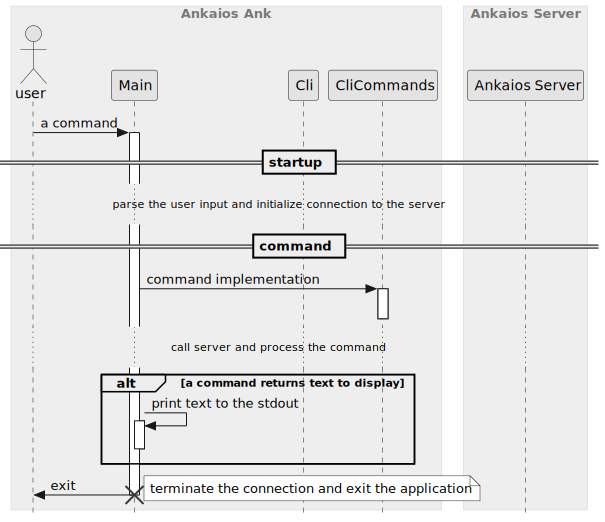
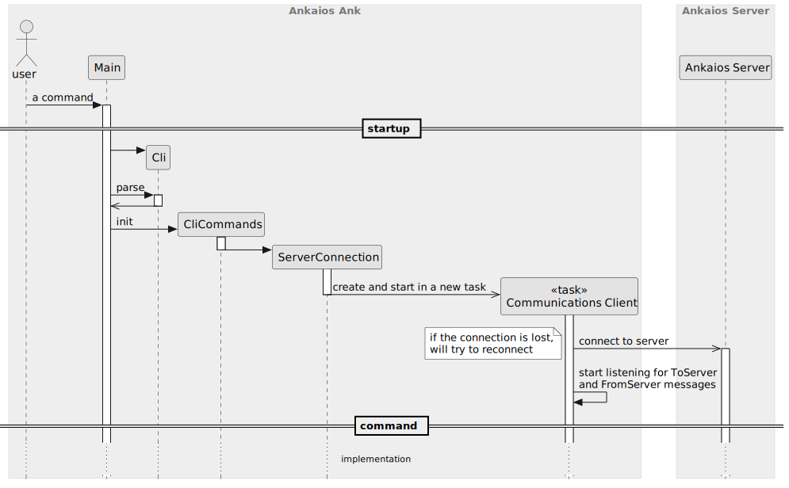

# Ankaios Command Line Interface - SW Design

## About this document

This document describes the Software Design for the Ankaios Ank. The Ankaios Ank is the Command Line Interface (CLI) of Ankaios.

Ankaios is a workload orchestrator supporting a subset of the Kubernetes configurations and is targeted at the automotive use case.

The CLI is a command line tool, which allows developers to directly interact with the cluster. E.g. it allows to get or set current state, get workloads...

## Context View

The Ankaios Ank is connected to the Server through the same interface as the Agent.


## Constraints, risks and decisions

No Constraints or risks are known at the time of writing this document.

### Design decisions

The following section holds the design decisions taken during the development of the CLI.

#### CLI uses proprietary tracing

`swdd~cli-use-proprietary-tracing~1`

Status: approved

The CLI shall use its own proprietary tracing functions with following features:

| message type     | output       | features                                                                                      |
| ---------------- | ------------ | --------------------------------------------------------------------------------------------- |
| error            | `io::stderr` | writes a message to the output and terminates the application with exit code `1`          |
| command response | `io::stdout` | writes a message to the output and terminates the application with exit code `0`          |
| debug            | `io::stdout` | writes a message to the output if the verbose mode is enabled (does not terminate the application) |

Rationale:

The CLI is an application different than Ankaios server or Ankaios agent.
The CLI interacts directly with the user and the user expects a response to the command (if available).
Therefore the information shall not be written to the log, but it shall be provided to the user.

Existing crates either do not behave as it is required or they are too complex for such task.

Needs:

* impl

Considered alternatives:

* keep on using the environment logger
* use another crate which provides tracing functions

## Structural view

Following diagram shows the structural view of the Ankaios Ank.


### CLI (parser)

The CLI parses the commands entered by the user.
This also includes error handling when the user enters unsupported command or forgets to set a mandatory parameter.

### CliCommands

The CliCommands implements the commands.
It uses FromServer Channel and ToServer Channel to interact with the server.

### External Libraries

#### Communication Middleware

The Communication Middleware is responsible for the connection between the Ankaios Server and the Ankaios Agent or the Ankaios CLI.

#### FromServer Channel, ToServer Channel

The channels are defined in the `common` library.

## Behavioral view

This chapter defines the runtime behavior of the Ankaios Ank in details. The following chapters show essential parts of the behavior and describe the requirements towards the Ankaios Ank.

### Startup

The Ankaios Ank is a standalone application which starts when the user enters a command and terminates as soon as the command exits.
Here is an overview how each command looks like:



The startup section is detailed in the next diagram.
Implementation of each command is detailed in the next sub-chapters.



#### Ankaios CLI communicates only with the Ankaios Server
`swdd~server-handle-cli-communication~1`

Status: approved

The Ankaios CLI shall only directly communicate with the Ankaios Server.

Tags:
- CliStartup

Needs:
- impl
- itest

#### All communication between Server and Ankaios CLI goes through Communication Middleware
`swdd~cli-communication-over-middleware~1`

Status: approved

All communication between Server and Ankaios CLI goes through a Communication Middleware plugin configured at compile time for the Ankaios Server and Ankaios CLI.

Rationale: Ankaios shall provide a possibility to exchange the communication layer, but dynamic reconfigurations at startup or runtime are not required.

Tags:
- CliStartup

Needs:
- impl
- itest

#### CLI supports environment variables
`swdd~cli-shall-support-environment-variables~1`

Status: approved

The Ankaios CLI shall support the usage of the following environment variables:

- `ANK_SERVER_URL`, for providing the server url

Rationale:
This increases usability for the Ankaios CLI when the Ankaios CLI is used in different terminal windows to connect to the same Ankaios server remotely.

Tags:
- CliStartup

Needs:
- impl

#### CLI prioritizes cli argument over environment variable
`swdd~cli-prioritizes-cli-argument-over-environment-variable~1`

Status: approved

Command line arguments provided to the the Ankaios CLI shall overwrite environment variables.

Tags:
- CliStartup

Needs:
- impl

#### CLI is a standalone application
`swdd~cli-standalone-application~1`

Status: approved

The Ankaios CLI shall be a standalone application (separate from the Ankaios Server and Client).

Tags:
- CliStartup

Needs:
- impl
- itest

### `ank get state`


#### CLI provides the get desired state
`swdd~cli-provides-get-desired-state~1`

Status: approved

The Ankaios CLI shall provide a function to get the desired state.

Tags:
- GetDesiredState

Needs:
- impl
- utest

#### CLI blocks until the Ankaios Server responds to the request to get the desired state
`swdd~cli-blocks-until-ankaios-server-responds-get-desired-state~1`

Status: approved

When the user invokes the CLI with a request to the get desired state, the CLI shall block and wait until the response from the Ankaios Server is received.

Tags:
- GetDesiredState

Needs:
- impl
- utest

#### CLI returns the desired state from Ankaios Server via CLI communication interface
`swdd~cli-returns-desired-state-from-server~1`

Status: approved

When the CLI receives the desired state from Ankaios Server, the CLI shall return this response to the user.

Tags:
- GetDesiredState

Needs:
- impl
- utest

#### CLI shall support presenting the desired state as JSON
`swdd~cli-shall-support-desired-state-json~1`

Status: approved

When the CLI receives the desired state from Ankaios Server via CLI communication interface,
the CLI shall support the possibility to present the desired state as a JSON to the user.

Tags:
- GetDesiredState

Needs:
- impl
- utest

#### CLI shall support presenting the desired state as YAML
`swdd~cli-shall-support-desired-state-yaml~1`

Status: approved

When the CLI receives the desired state from Ankaios Server via CLI communication interface,
the CLI shall support the possibility to present the desired state as a YAML to the user.

Tags:
- GetDesiredState

Needs:
- impl
- utest

#### CLI provides object field mask as arguments to get only the given parts of desired state
`swdd~cli-provides-object-field-mask-arg-to-get-partial-desired-state~1`

Status: approved

The Ankaios CLI shall provide an option to request and deliver only a part of the desired state.

Tags:
- GetDesiredState

Needs:
- impl
- utest

#### CLI returns a compact state when provided object field mask arguments
`swdd~cli-returns-compact-state-object-when-object-field-mask-provided~1`

Status: approved

When an object field mask is provided as additional argument, the Ankaios CLI shall return the compact state containing the values of the given fields.

Tags:
- GetDesiredState

Needs:
- impl
- utest

#### CLI returns `apiVersion` with the desired state
`swdd~cli-returns-api-version-with-desired-state~1`

Status: approved

When the user invokes the CLI with a request to get the desired state,
the CLI shall display the field `apiVersion` of the desired state together with the requested desired state.

Rationale:
Output of the `ank get state` can be (and it is meant to be) used as input for the command `ank set state`.
The `ank set state` requires the apiVersion, therefore the `ank get state` must display `apiVersion` too.

Tags:
- GetDesiredState

Needs:
- impl
- utest

#### CLI returns `apiVersion` with the startup state
`swdd~cli-returns-api-version-with-startup-state~1`

Status: approved

When the user invokes the CLI with a request to get startup state,
the CLI shall display the field `apiVersion` of the startup state together with the requested startup state.

Tags:
- GetStartupState

Needs:
- impl
- utest

### `ank get workload`


#### CLI provides the list of workloads
`swdd~cli-provides-list-of-workloads~1`

Status: approved

The Ankaios CLI shall provide a function to get the list of workloads.

Tags:
- GetWorkloads

Needs:
- impl
- utest

#### CLI blocks until the Ankaios Server responds to the request to get the list of workloads
`swdd~cli-blocks-until-ankaios-server-responds-list-workloads~1`

Status: approved

When the user invokes the CLI with a request to get the list of workloads, the CLI shall block and wait until the response from the Ankaios Server is received.

Tags:
- GetWorkloads

Needs:
- impl
- utest

#### CLI shall sort the list of workloads
`swdd~cli-shall-sort-list-of-workloads~1`

Status: approved

When the CLI receives the list of workloads from the Ankaios Server via CLI communication interface, the CLI shall sort the list by workload name.

Tags:
- GetWorkloads

Needs:
- impl
- utest

#### CLI shall filter the list of workloads
`swdd~cli-shall-filter-list-of-workloads~1`

When the CLI receives the list of workloads from the Ankaios Server via CLI communication interface,
the CLI shall filter the workloads from the server using filtering criteria entered by the user in the command.

Tags:
- GetWorkloads

Needs:
- impl
- utest

#### CLI present the list of workloads
`swdd~cli-shall-present-list-of-workloads~1`

Status: approved

When the CLI receives the list of workloads from the Ankaios Server via CLI communication interface
and CLI has sorted the list
and the CLI has filtered the list,
the CLI shall present the processed list of workloads to the user.

Tags:
- GetWorkloads

Needs:
- impl
- utest

#### CLI shall present workloads as a table
`swdd~cli-shall-present-workloads-as-table~1`

Status: approved

When the CLI presents workloads to the user, the CLI shall display the workloads as a table with following columns:

| WORKLOAD NAME | AGENT | RUNTIME | EXECUTION STATE | ADDITIONAL INFO    |
| ------------- | ----- | ------- | --------------- | ------------------ |
| workload1     | agent | runtime | state           | state related info |
| workload2     | agent | runtime | state           | state related info |

Note:
The column runtime is not filled when the workload has been deleted.
This can happen when the workload has been deleted from the current state and the workload state is reported as "removed".

Tags:
- CliCommands

Needs:
- impl
- utest

### `ank set state`


#### CLI provides a function to set the desired state
`swdd~cli-provides-set-desired-state~1`

Status: approved

The Ankaios CLI shall provide a function to set the desired state.

Tags:
- SetDesiredState

Needs:
- swdd
- impl
- utest

#### CLI blocks until the Ankaios Server responds to the request to set the desired state
`swdd~cli-blocks-until-ankaios-server-responds-set-desired-state~2`

Status: approved

When the user invokes the CLI with a request to set the desired state, the CLI shall request an update of the state including a watch on the updated workloads.

Tags:
- SetDesiredState

Needs:
- impl
- utest

#### CLI requests update state with watch
`swdd~cli-requests-update-state-with-watch~1`

Status: approved

When the CLI executes an update of the Ankaios state including a watch on the updated workloads, the CLI shall request an update of the state from the Ankaios server.

Tags:
- CliCommands

Needs:
- impl
- utest

#### CLI requests update state with watch error
`swdd~cli-requests-update-state-with-watch-error~1`

Status: approved

When the CLI executes an update of the Ankaios state including a watch on the updated workloads and the Ankaios server responds with an error, the CLI shall present the error to the user.

Tags:
- CliCommands

Needs:
- impl
- utest

#### CLI requests update state with watch success
`swdd~cli-requests-update-state-with-watch-success~1`

Status: approved

When the CLI executes an update of the Ankaios state including a watch on the updated workloads
and the Ankaios server responds with a success message containing the IDs of the changed workloads
and the `no-wait` flag for the CLI is not set,
the CLI shall watch the changed workloads.

Tags:
- CliCommands

Needs:
- impl
- utest

#### CLI watches workloads
`swdd~cli-watches-workloads~1`

Status: approved

When the CLI watches a list of workloads, the CLI shall:
* get the desired state from the Ankaios server
* filter only the workloads specified to watch
* present the list of workloads to the user
* listen for `UpdateWorkloadState` messages from the Ankaios server
* update each workload execution state until a final state is reached

Tags:
- CliCommands

Needs:
- impl
- utest

#### CLI checks for final state of a workload
`swdd~cli-checks-for-final-workload-state~1`

Status: approved

When the CLI checks if a workload has reached its final expected workload execution state, the CLI shall regard the state for final if the state is one of:
* running
* succeeded
* failed
* removed
* pending(starting_failed) with "No more retries"

Tags:
- CliCommands

Needs:
- impl
- utest

#### CLI shall support YAML files with the state object to set desired state
`swdd~cli-supports-yaml-to-set-desired-state~1`

Status: approved

When the user invokes the CLI with a request to the set desired state, the CLI shall support files in YAML format with the state object.

Tags:
- SetDesiredState

Needs:
- impl
- utest

### `ank delete workload`


#### CLI provides a function to delete workloads
`swdd~cli-provides-delete-workload~1`

Status: approved

The Ankaios CLI shall provide a function to delete workloads.

Tags:
- DeleteWorkload

Needs:
- swdd
- impl
- utest

#### CLI blocks until the Ankaios Server responds to the request to delete workloads
`swdd~cli-blocks-until-ankaios-server-responds-delete-workload~2`

Status: approved

When the user invokes the CLI with a request to delete workloads, the CLI shall request an update of the state including a watch on the updated workloads.

Tags:
- DeleteWorkload

Needs:
- impl
- utest

#### Do not send the request to delete workloads when they are not found
`swdd~no-delete-workloads-when-not-found~1`

Status: approved

When the user invokes the CLI with a request to delete workloads and the CLI does not find the workloads in the current state, the CLI shall not send the request to delete workloads to the server.

Tags:
- DeleteWorkload

Needs:
- impl
- utest

### `ank run workload`


#### CLI provides a function to run a workload
`swdd~cli-provides-run-workload~1`

Status: approved

The Ankaios CLI shall provide a function to run workload.

Tags:
- RunWorkload

Needs:
- impl
- utest

#### CLI blocks until the Ankaios Server responds to the request to run workloads
`swdd~cli-blocks-until-ankaios-server-responds-run-workload~2`

Status: approved

When the user invokes the CLI with a request to run a workload, the CLI shall request an update of the state including a watch on the updated workloads.

Tags:
- RunWorkload

Needs:
- impl
- utest

### `ank apply [-d] [--agent agent_name] <manifest.yaml> ...`

#### Ankaios manifest

The Ankaios manifest is a YAML (or a JSON) file composed of a list of workload specifications under the `workloads` keyword.

```yaml
# Example of a list of two workload specifications with the names 'nginx' and 'hello1'.
apiVersion: "v0.1"
workloads:
  nginx:
    agent: agent_A
    restart: true
    runtime: podman
    runtimeConfig: |
      image: docker.io/nginx:latest
      commandOptions: ["-p", "8081:80"]
  hello1:
    # For this workload the following are not set:
    # - agent name
    restart: true
    runtime: podman
    runtimeConfig: |
      image: alpine:latest
      commandOptions: [ "--rm"]
      commandArgs: [ "echo", "Hello Ankaios"]
```

#### CLI supports Ankaios manifest
`swdd~cli-apply-supports-ankaios-manifest~1`

Status: approved

The Ankaios CLI apply command shall support the Ankaios manifest file format.

Tags:
- AnkaiosManifest

Needs:
- impl
- utest

#### CLI provides a function to accept a list of Ankaios manifest files
`swdd~cli-apply-accepts-list-of-ankaios-manifests~1`

Status: approved

When the user calls the Ankaios Cli `apply` command with one or multiple files,
the Ankaios CLI shall process the content of all provided files.

Needs:
- impl
- utest
- stest

#### CLI provides a function to accept an Ankaios manifest content from `stdin`
`swdd~cli-apply-accepts-ankaios-manifest-content-from-stdin~1`

Status: approved

When the user calls the Ankaios CLI `apply` command with a file named `-`,
the Ankaios CLI shall read data from stdin.

Needs:
- impl
- utest
- stest

#### CLI generates a state object from Ankaios manifests
`swdd~cli-apply-generates-state-object-from-ankaios-manifests~1`

Status: approved

When the user does not provide the optional argument `-d`
and the Ankaios CLI accepts the manifest content from file(s) or from `stdin`,
the Ankaios CLI shall parse the manifest content into a state object.

Needs:
- impl
- utest
- stest

#### CLI generates filter masks from Ankaios manifests
`swdd~cli-apply-generates-filter-masks-from-ankaios-manifests~1`

Status: approved

When the Ankaios CLI accepts the manifest content from file(s) or from `stdin`,
the Ankaios CLI shall parse the manifest content into a list of filter masks.

Needs:
- impl
- utest
- stest

#### CLI sends update state request for `ank apply ...`
`swdd~cli-apply-send-update-state~1`

Status: approved

When the user calls the Ankaios CLI `apply` command
and the CLI has generated a state object from the input
and the CLI has generated a filter masks from the input,
the CLI shall request an update of the state including a watch on the updated workloads.

Needs:
- impl
- utest
- stest

#### CLI provides a function to overwrite the agent names
`swdd~cli-apply-ankaios-manifest-agent-name-overwrite~1`

Status: approved

When the user provides the optional argument `--agent`
and the Ankaios CLI parses the manifest content into a state object,
the Ankaios CLI shall overwrite the agent names in the state object, built as specified in the manifest content, with the one given by the argument.

Needs:
- impl
- utest
- stest

#### CLI emits an error on absence of agent name
`swdd~cli-apply-ankaios-manifest-error-on-agent-name-absence~1`

Status: approved

When the agent name is not specified in a workload specification
and the user does not provide the agent name via the optional argument `--agent`
and the user calls the Ankaios CLI `apply` command,
the Ankaios CLI shall create a list of filter masks from all `workloads` in the `desiredState` of all given files.

Needs:
- impl
- utest
- stest

## Data view


## Error management view

## Deployment view

## References

## Glossary

<!-- markdownlint-disable-file MD004 MD022 MD032 -->
