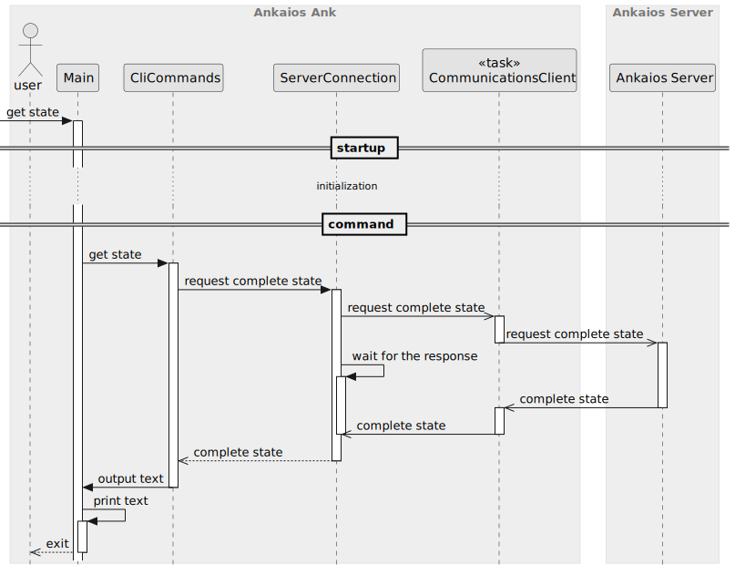
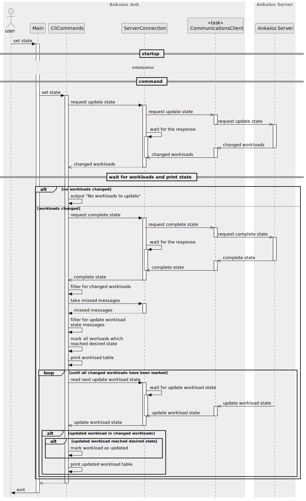
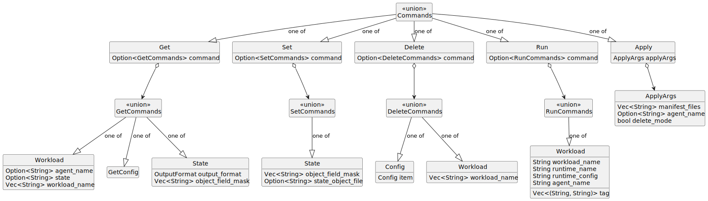

# Ankaios Command Line Interface - SW Design

## About this document

This document describes the Software Design for the Ankaios Ank. The Ankaios Ank is the Command Line Interface (CLI) of Ankaios.

Ankaios is a workload orchestrator supporting a subset of the Kubernetes configurations and is targeted at the automotive use case.

The CLI is a command line tool, which allows developers to directly interact with the cluster. E.g. it allows to get or set current state, get workloads...

## Context View

The Ankaios Ank is connected to the Server through the same interface as the Agent.


## Constraints, risks and decisions

No Constraints or risks are known at the time of writing this document.

### Design decisions

The following section holds the design decisions taken during the development of the CLI.

#### CLI uses proprietary tracing

`swdd~cli-use-proprietary-tracing~1`

Status: approved

The CLI shall use its own proprietary tracing functions with following features:

| message type     | output       | features                                                                                      |
| ---------------- | ------------ | --------------------------------------------------------------------------------------------- |
| error            | `io::stderr` | writes a message to the output and terminates the application with exit code `1`          |
| command response | `io::stdout` | writes a message to the output and terminates the application with exit code `0`          |
| debug            | `io::stdout` | writes a message to the output if the verbose mode is enabled (does not terminate the application) |

Rationale:

The CLI is an application different than Ankaios server or Ankaios agent.
The CLI interacts directly with the user and the user expects a response to the command (if available).
Therefore the information shall not be written to the log, but it shall be provided to the user.

Existing crates either do not behave as it is required or they are too complex for such task.

Needs:

* impl

Considered alternatives:

* keep on using the environment logger
* use another crate which provides tracing functions

#### The CLI does not limit the size of the missed message buffer
`swdd~cli-does-not-limit-missed-message-buffer-size~1`

Status: approved

While the CLI waits for a response from the Ankaios server,
it stores all other messages received from the Ankaios server in a buffer,
as some messages might be needed after the response is received.
If the Ankaios server takes time to response to the request and many other messages are send,
the buffer can grow without limit.

Rationale:

The buffer is left to grow without limit for the following reasons:

* This problem is unlikely to occur as:
  (1) the server must take a long time to respond or does not respond at all.
  (2) the server must send many messages to the CLI
* The CLI is intended for interactive usage.
  If the response takes to long, the user can terminate the CLI.
* The CLI is intended for use during development and not for use in production.
  Crashes are more acceptable here.
* The CLI will be used on a developer PC and not on embedded devices.
  Memory constraints are not of the biggest concern.
* All alternatives need an additional parameter (size of buffer or timeout)

Considered alternatives:

* Introducing a ring buffer.
  If the buffer grows to large, the oldest messages would be dropped.
  This could lead to important messages being missed.
* The size of the buffer could be limited.
  If the buffer would exceed the limit, the CLI would exit with a failure.
* The CLI could timeout, if the Ankaios server takes to long to respond.
  This would not solve the problem directly, but it would reduce the probability of the problem occurring.

## Structural view

Following diagram shows the structural view of the Ankaios Ank.


### CLI (parser)

The CLI parses the commands entered by the user.
This also includes error handling when the user enters unsupported command or forgets to set a mandatory parameter.

### CliCommands

The CliCommands implements the commands.
It uses FromServer Channel and ToServer Channel to interact with the server.

### CliTable

The CliTable provides an interface for creating different table output formats.
It unifies the creation of table layouts in different places in the Ankaios CLI by abstracting the table row types through generalization.

### External Libraries

#### Communication Middleware

The Communication Middleware is responsible for the connection between the Ankaios Server and the Ankaios Agent or the Ankaios CLI.

#### FromServer Channel, ToServer Channel

The channels are defined in the `common` library.

## Behavioral view

This chapter defines the runtime behavior of the Ankaios Ank in details. The following chapters show essential parts of the behavior and describe the requirements towards the Ankaios Ank.

### Startup

The Ankaios Ank is a standalone application which starts when the user enters a command and terminates as soon as the command exits.
Here is an overview how each command looks like:


The startup section is detailed in the next diagram.
Implementation of each command is detailed in the next sub-chapters.


#### Ankaios CLI communicates only with the Ankaios Server
`swdd~server-handle-cli-communication~1`

Status: approved

The Ankaios CLI shall only directly communicate with the Ankaios Server.

Tags:
- CliCommands

Needs:
- impl
- itest

#### All communication between Server and Ankaios CLI goes through Communication Middleware
`swdd~cli-communication-over-middleware~1`

Status: approved

All communication between Server and Ankaios CLI goes through a Communication Middleware plugin configured at compile time for the Ankaios Server and Ankaios CLI.

Rationale: Ankaios shall provide a possibility to exchange the communication layer, but dynamic reconfigurations at startup or runtime are not required.

Tags:
- CliCommands

Needs:
- impl
- itest

#### CLI supports server url cli argument
`swdd~cli-supports-server-url-cli-argument~1`

Status: approved

The Ankaios CLI shall support the cli argument `--server-url` (short alias `-s`) with value format `protocol://host:port`, alternatively configurable via the environment variable `ANK_SERVER_URL` which has lower priority compared to explicitly provided cli arguments.

Comment:
The `protocol` depends on the configured communication protocol. `host` means an ip address or a domain name.

Tags:
- CliCommands

Needs:
- impl

#### CLI is a standalone application
`swdd~cli-standalone-application~1`

Status: approved

The Ankaios CLI shall be a standalone application (separate from the Ankaios Server and Client).

Tags:
- CliCommands

Needs:
- impl
- itest

#### CLI supports PEM file paths as cli arguments for mTLS
`swdd~cli-supports-pem-file-paths-as-cli-arguments~1`

Status: approved

The Ankaios CLI shall support the following cli arguments all of which contain a file path to a PEM file, alternatively configurable over environment variables which have lower priority compared to explicitly provided cli arguments:

| Argument    | Environment variable | Description                                 |
|-------------|----------------------|---------------------------------------------|
| `--ca_pem`  | `ANK_CA_PEM`         | file path to the root certificate authority |
| `--crt_pem` | `ANK_CRT_PEM`        | file path to the certificate                |
| `--key_pem` | `ANK_KEY_PEM`        | file path to the key                        |

Comment:
The PEM file format is a text-based, human-readable format. PEM files can contain certificates, private keys, public keys and even certificate chains, making them more versatile compared to other formats.

Rationale:
The Ankaios CLI uses the PEM files to establish a mutual transport layer security (mTLS) communication.

Tags:
- CliCommands

Needs:
- impl
- stest

#### CLI supports cli argument for insecure communication
`swdd~cli-supports-cli-argument-for-insecure-communication~1`

Status: approved

The Ankaios CLI shall support the cli argument `--insecure` (short alias `-k`), alternatively configurable via the environment variable `ANK_INSECURE` which has lower priority compared to explicitly provided cli arguments.

Comment:
The Ankaios CLI supports an insecure communication channel to the Ankaios server. Communicating over insecure channels is convenient during an evaluation or a development phase.

Tags:
- CliCommands

Needs:
- impl
- stest

#### CLI provides file paths for mTLS to communication middleware
`swdd~cli-provides-file-paths-to-communication-middleware~1`

Status: approved

When the file paths of the root certificate, the CLI certificate and the CLI key is provided upon startup, then the Ankaios CLI shall provide each of these file paths to the communication middleware.

Rationale:
The communication middleware is responsible for establishing a secure communication channel.

Tags:
- CliCommands

Needs:
- impl

#### CLI establishes insecure connection on provided insecure cli argument
`swdd~cli-establishes-insecure-communication-based-on-provided-insecure-cli-argument~1`

Status: approved

When the user runs the Ankaios CLI with enabled insecure communication and the Ankaios CLI initializes the communication middleware, then the Ankaios CLI shall instruct the communication middleware to use an insecure communication channel.

Comment:
Communicating over insecure channels is convenient during an evaluation or a development phase.

Tags:
- CliCommands

Needs:
- impl
- stest

#### CLI fails upon missing file paths and insecure cli arguments
`swdd~cli-fails-on-missing-file-paths-and-insecure-cli-arguments~1`

Status: approved

If the user runs the Ankaios CLI without providing the cli arguments for the mTLS PEM file paths or the insecure cli argument, then the Ankaios CLI shall:
* exit with a non zero exit code
* output an error message containing the reason and a help message

Rationale:
The demand for an explicit communication mode prevents a user from implicitly creating an Ankaios setup using insecure communication.

Tags:
- CliCommands

Needs:
- impl

### `ank get state`



#### CLI provides the get desired state
`swdd~cli-provides-get-desired-state~1`

Status: approved

The Ankaios CLI shall provide a function to get the desired state.

Tags:
- Cli
- CliCommands

Needs:
- impl
- utest

#### CLI blocks until the Ankaios Server responds to the request to get the desired state
`swdd~cli-blocks-until-ankaios-server-responds-get-desired-state~1`

Status: approved

When the user invokes the CLI with a request to the get desired state, the CLI shall block and wait until the response from the Ankaios Server is received.

Tags:
- CliCommands

Needs:
- impl
- utest

#### CLI returns the desired state from Ankaios Server via CLI communication interface
`swdd~cli-returns-desired-state-from-server~1`

Status: approved

When the CLI receives the desired state from Ankaios Server, the CLI shall return this response to the user.

Tags:
- CliCommands

Needs:
- impl
- utest

#### CLI shall support presenting the desired state as JSON
`swdd~cli-shall-support-desired-state-json~1`

Status: approved

When the CLI receives the desired state from Ankaios Server via CLI communication interface,
the CLI shall support the possibility to present the desired state as a JSON to the user.

Tags:
- CliCommands

Needs:
- impl
- utest

#### CLI shall support presenting the desired state as YAML
`swdd~cli-shall-support-desired-state-yaml~1`

Status: approved

When the CLI receives the desired state from Ankaios Server via CLI communication interface,
the CLI shall support the possibility to present the desired state as a YAML to the user.

Tags:
- CliCommands

Needs:
- impl
- utest

#### CLI provides object field mask as arguments to get only the given parts of desired state
`swdd~cli-provides-object-field-mask-arg-to-get-partial-desired-state~1`

Status: approved

The Ankaios CLI shall provide an option to request and deliver only a part of the desired state.

Tags:
- Cli

Needs:
- impl
- utest

#### CLI returns a compact state when provided object field mask arguments
`swdd~cli-returns-compact-state-object-when-object-field-mask-provided~1`

Status: approved

When an object field mask is provided as additional argument, the Ankaios CLI shall return the compact state containing the values of the given fields.

Tags:
- CliCommands

Needs:
- impl
- utest

#### CLI returns `apiVersion` with the desired state
`swdd~cli-returns-api-version-with-desired-state~1`

Status: approved

When the user invokes the CLI with a request to get the desired state,
the CLI shall display the field `apiVersion` of the desired state together with the requested desired state.

Rationale:
Output of the `ank get state` can be (and it is meant to be) used as input for the command `ank set state`.
The `ank set state` requires the apiVersion, therefore the `ank get state` must display `apiVersion` too.

Tags:
- CliCommands

Needs:
- impl
- utest

### `ank get workload`


#### CLI provides the list of workloads
`swdd~cli-provides-list-of-workloads~1`

Status: approved

The Ankaios CLI shall provide a function to get the list of workloads.

Tags:
- Cli
- CliCommands

Needs:
- impl
- utest

#### CLI blocks until the Ankaios Server responds to the request to get the list of workloads
`swdd~cli-blocks-until-ankaios-server-responds-list-workloads~1`

Status: approved

When the user invokes the CLI with a request to get the list of workloads, the CLI shall block and wait until the response from the Ankaios Server is received.

Tags:
- CliCommands

Needs:
- impl
- utest

#### CLI processes CompleteState to list workloads
`swdd~processes-complete-state-to-list-workloads~1`

Status: approved

When the CLI is requested to retrieve the list of workloads from the Ankaios Server, the CLI shall:
* request the whole CompleteState
* create a list entry for each workload state of the CompleteState with empty runtime name
* replace the empty runtime name for each list entry by extracting it from the corresponding workload configuration inside the CompleteState

Rational:
A workload state is not responsible for containing the runtime name of a workload.

Tags:
- CliCommands

Needs:
- impl
- utest

#### CLI shall sort the list of workloads
`swdd~cli-shall-sort-list-of-workloads~1`

Status: approved

When the CLI receives the list of workloads from the Ankaios Server via CLI communication interface, the CLI shall sort the list by workload name.

Tags:
- CliCommands

Needs:
- impl
- utest

#### CLI shall filter the list of workloads
`swdd~cli-shall-filter-list-of-workloads~1`

When the CLI receives the list of workloads from the Ankaios Server via CLI communication interface,
the CLI shall filter the workloads from the server using filtering criteria entered by the user in the command.

Tags:
- Cli
- CliCommands

Needs:
- impl
- utest

#### CLI present the list of workloads
`swdd~cli-shall-present-list-of-workloads~1`

Status: approved

When the CLI receives the list of workloads from the Ankaios Server via CLI communication interface
and CLI has sorted the list
and the CLI has filtered the list,
the CLI shall present the processed list of workloads to the user.

Tags:
- CliCommands

Needs:
- impl
- utest

#### CLI shall present workloads as a table
`swdd~cli-shall-present-workloads-as-table~1`

Status: approved

When the CLI presents workloads to the user, the CLI shall display the workloads as a table with following columns:

| WORKLOAD NAME | AGENT | RUNTIME | EXECUTION STATE | ADDITIONAL INFO    |
| ------------- | ----- | ------- | --------------- | ------------------ |
| workload1     | agent | runtime | state           | state related info |
| workload2     | agent | runtime | state           | state related info |

Note:
The column runtime is not filled when the workload has been deleted.
This can happen when the workload has been deleted from the current state and the workload state is reported as "removed". The table shall be well displayed and shall not flicker on updates.

Tags:
- CliCommands

Needs:
- impl
- utest

### `ank set state`



#### CLI provides a function to set the desired state
`swdd~cli-provides-set-desired-state~1`

Status: approved

The Ankaios CLI shall provide a function to set the desired state.

Tags:
- Cli
- CliCommands

Needs:
- impl
- utest

#### CLI blocks until the Ankaios Server responds to the request to set the desired state
`swdd~cli-blocks-until-ankaios-server-responds-set-desired-state~2`

Status: approved

When the user invokes the CLI with a request to set the desired state, the CLI shall request an update of the state including a watch on the updated workloads.

Tags:
- CliCommands

Needs:
- impl
- utest

#### CLI requests update state with watch
`swdd~cli-requests-update-state-with-watch~2`

Status: approved

When the CLI executes an update of the Ankaios state including a watch on the updated workloads, the CLI shall:
* request the current CompleteState from the Ankaios server
* request an update of the state from the Ankaios server

Comment:
The requested CompleteState is used to handle the watch on the updated workloads, not for constructing the updated state.

Rationale:
Requesting the CompleteState before updating the state is required in order to handle the wait mode properly when a workload is deleted that was not initially started due to a disconnected agent.

Tags:
- CliCommands

Needs:
- impl
- utest

#### CLI requests update state with watch error
`swdd~cli-requests-update-state-with-watch-error~1`

Status: approved

When the CLI executes an update of the Ankaios state including a watch on the updated workloads and the Ankaios server responds with an error, the CLI shall present the error to the user.

Tags:
- CliCommands

Needs:
- impl
- utest

#### CLI requests update state with watch success
`swdd~cli-requests-update-state-with-watch-success~1`

Status: approved

When the CLI executes an update of the Ankaios state including a watch on the updated workloads
and the Ankaios server responds with a success message containing the IDs of the changed workloads
and the `no-wait` flag for the CLI is not set,
the CLI shall watch the changed workloads.

Tags:
- CliCommands

Needs:
- impl
- utest

#### CLI watches workloads
`swdd~cli-watches-workloads~1`

Status: approved

When the CLI watches a list of workloads, the CLI shall:
* get the CompleteState from the Ankaios server
* filter only the workloads specified to watch
* sort the workload list alphabetically
* present the list of workloads to the user
* listen for `UpdateWorkloadState` messages from the Ankaios server
* update each workload execution state until a final state is reached

Tags:
- CliCommands

Needs:
- impl
- utest

#### CLI checks for final state of a workload
`swdd~cli-checks-for-final-workload-state~3`

Status: approved

When the CLI checks if a workload has reached its final expected state, the CLI shall regard the state for final if the agent managing that workload is disconnected or the execution state is one of:
* Running(Ok)
* Succeeded(Ok)
* Failed(ExecFailed)
* NotScheduled
* Removed
* Pending(StartingFailed)
* AgentDisconnected

Tags:
- CliCommands

Needs:
- impl
- utest

#### CLI shall support YAML files with the state object to set desired state
`swdd~cli-supports-yaml-to-set-desired-state~1`

Status: approved

When the user invokes the CLI with a request to the set desired state, the CLI shall support files in YAML format with the state object.

Tags:
- Cli
- CliCommands

Needs:
- impl
- utest

### `ank delete workload`

The sequence is the same as for [`ank set state`](#ank-set-state).

#### CLI provides a function to delete workloads
`swdd~cli-provides-delete-workload~1`

Status: approved

The Ankaios CLI shall provide a function to delete workloads.

Tags:
- Cli
- CliCommands

Needs:
- impl
- utest

#### CLI blocks until the Ankaios Server responds to the request to delete workloads
`swdd~cli-blocks-until-ankaios-server-responds-delete-workload~2`

Status: approved

When the user invokes the CLI with a request to delete workloads, the CLI shall request an update of the state including a watch on the updated workloads.

Tags:
- CliCommands

Needs:
- impl
- utest

### `ank run workload`

The sequence is the same as for [`ank set state`](#ank-set-state).

#### CLI provides a function to run a workload
`swdd~cli-provides-run-workload~1`

Status: approved

The Ankaios CLI shall provide a function to run workload.

Tags:
- Cli
- CliCommands

Needs:
- impl
- utest

#### CLI blocks until the Ankaios Server responds to the request to run workloads
`swdd~cli-blocks-until-ankaios-server-responds-run-workload~2`

Status: approved

When the user invokes the CLI with a request to run a workload, the CLI shall request an update of the state including a watch on the updated workloads.

Tags:
- CliCommands

Needs:
- impl
- utest

### `ank apply [-d] [--agent agent_name] <manifest.yaml> ...`

The sequence is the same as for [`ank set state`](#ank-set-state).

#### Ankaios manifest

The Ankaios manifest is a YAML (or a JSON) file composed of a list of workload specifications under the `workloads` keyword.

```yaml
# Example of a list of two workload specifications with the names 'nginx' and 'hello1'.
apiVersion: "v0.1"
workloads:
  nginx:
    agent: agent_A
    restartPolicy: ALWAYS
    runtime: podman
    runtimeConfig: |
      image: docker.io/nginx:latest
      commandOptions: ["-p", "8081:80"]
  hello1:
    # For this workload the following are not set:
    # - agent name
    restartPolicy: ALWAYS
    runtime: podman
    runtimeConfig: |
      image: alpine:latest
      commandOptions: [ "--rm"]
      commandArgs: [ "echo", "Hello Ankaios"]
```

#### CLI supports Ankaios manifest
`swdd~cli-apply-supports-ankaios-manifest~1`

Status: approved

The Ankaios CLI apply command shall support the Ankaios manifest file format.

Tags:
- CliCommands

Needs:
- impl
- utest

#### CLI provides a function to accept a list of Ankaios manifest files
`swdd~cli-apply-accepts-list-of-ankaios-manifests~1`

Status: approved

When the user calls the Ankaios Cli `apply` command with one or multiple files,
the Ankaios CLI shall process the content of all provided files.

Tags:
- CliCommands

Needs:
- impl
- utest
- stest

#### CLI provides a function to accept an Ankaios manifest content from `stdin`
`swdd~cli-apply-accepts-ankaios-manifest-content-from-stdin~1`

Status: approved

When the user calls the Ankaios CLI `apply` command with a file named `-`,
the Ankaios CLI shall read data from stdin.

Tags:
- CliCommands

Needs:
- impl
- utest
- stest

#### CLI generates a state object from Ankaios manifests
`swdd~cli-apply-generates-state-object-from-ankaios-manifests~1`

Status: approved

When the user does not provide the optional argument `-d`
and the Ankaios CLI accepts the manifest content from file(s) or from `stdin`,
the Ankaios CLI shall parse the manifest content into a state object.

Tags:
- CliCommands

Needs:
- impl
- utest
- stest

#### CLI generates filter masks from Ankaios manifests
`swdd~cli-apply-generates-filter-masks-from-ankaios-manifests~1`

Status: approved

When the Ankaios CLI accepts the manifest content from file(s) or from `stdin`,
the Ankaios CLI shall parse the manifest content into a list of filter masks.

Tags:
- CliCommands

Needs:
- impl
- utest
- stest

#### CLI sends update state request for `ank apply ...`
`swdd~cli-apply-send-update-state~1`

Status: approved

When the user calls the Ankaios CLI `apply` command
and the CLI has generated a state object from the input
and the CLI has generated a filter masks from the input,
the CLI shall request an update of the state including a watch on the updated workloads.

Tags:
- CliCommands

Needs:
- impl
- utest
- stest

#### CLI provides a function to overwrite the agent names
`swdd~cli-apply-ankaios-manifest-agent-name-overwrite~1`

Status: approved

When the user provides the optional argument `--agent`
and the Ankaios CLI parses the manifest content into a state object,
the Ankaios CLI shall overwrite the agent names in the state object, built as specified in the manifest content, with the one given by the argument.

Tags:
- CliCommands

Needs:
- impl
- utest
- stest

#### CLI emits an error on absence of agent name
`swdd~cli-apply-ankaios-manifest-error-on-agent-name-absence~1`

Status: approved

When the agent name is not specified in a workload specification
and the user does not provide the agent name via the optional argument `--agent`
and the user calls the Ankaios CLI `apply` command,
the Ankaios CLI shall create a list of filter masks from all `workloads` in the `desiredState` of all given files.

Tags:
- CliCommands

Needs:
- impl
- utest
- stest

### `ank get agents`


#### CLI provides the list of connected agents
`swdd~cli-provides-list-of-agents~1`

Status: approved

The Ankaios CLI shall provide a function to get the list of Ankaios agents connected to the Ankaios server.

Tags:
- Cli
- CliCommands

Needs:
- impl
- utest
- stest

#### CLI shall present connected agents as table
`swdd~cli-presents-connected-agents-as-table~2`

Status: approved

When the Ankaios CLI presents connected Ankaios agents to the user, the Ankaios CLI shall present the agents as rows in a table with the following content:

| NAME                     | WORKLOADS                          | CPU USAGE                           | FREE MEMORY                |
| ------------------------ | ---------------------------------- | ----------------------------------- | -------------------------- |
| `<agent_name>` as text   | `<assigned_workloads>` as number   | `<cpu_usage>` as usage in percent   | `<free_memory>` in bytes   |

Tags:
- CliCommands

Needs:
- impl
- utest

#### CLI processes CompleteState to provide connected Ankaios agents
`swdd~cli-processes-complete-state-to-provide-connected-agents~1`

Status: approved

When the user invokes the CLI with a request to provide the list of connected Ankaios agents, the Ankaios CLI shall:
* request the whole CompleteState of Ankaios server
* create a table row for each Ankaios agent listed inside the CompleteState's `agents` field with the agent name and the amount of workload states of its managed workloads as well as the agent resource availability

Rationale:
Counting the workload states, rather than the assigned workloads in the desired state for each agent, ensures the correct number of workloads, even if a workload has been deleted from the desired state, but the actual deletion has not yet been scheduled.

Tags:
- CliCommands

Needs:
- impl
- utest

### Handling other message while waiting for response


#### CLI stores unexpected messages
`swdd~cli-stores-unexpected-message~1`

Status: approved

While the Ankaios CLI waits for a response from the Ankaios Server,
the Ankaios CLI shall store all unrelated received messages for later processing.

Rationale:
While communicating with the Ankaios server the ank CLI could already receive unsolicited `UpdateWorkloadState` messages that are needed later during command execution. Storing the messages ensure that they are not missed and the CLI does not block endlessly waiting for them, e.g., while waiting for the end state for an apply command.

Tags:
- CliCommands

Needs:
- impl
- utest

### Shell completion
`swdd~cli-shell-completion~1`

Status: approved

When the user starts typing an Ankaios CLI command, the zsh and bash shell shall propose completions for arguments including dynamic completions for workload names, object field masks and agents.

Rationale:
A user's productivity is increased when command completions are provided which reduces lookups for the user.

Comment:
If possible more shells shall be supported as well.

Tags:
- CliCommands

Needs:
- impl
- utest

### CliTable allows creation of different table output formats

#### CliTable provides default table output
`swdd~cli-table-provides-default-table-output~1`

Status: approved

The CliTable shall provide a function to create a table output with the following table layout:
* table style blank
* no padding on the left and right side of the table

Tags:
- CliTable

Needs:
- impl
- utest

#### CliTable provides table output with a wrapped column
`swdd~cli-table-provides-table-output-with-wrapped-column~1`

Status: approved

The CliTable shall provide a function to create a table output with wrapping a specific column to the remaining terminal width with the following table layout:
* table style blank
* no padding on the left and right side of the table

Tags:
- CliTable

Needs:
- impl
- utest

#### CliTable provides table output with a truncated column
`swdd~cli-table-provides-table-output-with-truncated-column~1`

Status: approved

The CliTable shall provide a function to create a table output with truncating a specific column to the remaining terminal width with the following table layout:
* table style blank
* no padding on the left and right side of the table
* truncated column content suffixed by `...`

Tags:
- CliTable

Needs:
- impl
- utest

#### CliTable calculates wrapped/truncated column width according to terminal width
`swdd~cli-table-wrapped-truncated-column-width-depends-on-terminal-width~1`

Status: approved

When the CliTable is requested to create a table with a wrapped or truncated column, the CliTable shall:
* determine the column name length of this column
* determine the length of the longest content of this column otherwise zero as the longest length if the whole column is empty
* calculate the maximum between the longest content length and the column name length
* calculate the total table width of all other columns by subtracting the calculated maximum length from the total table width
* check if the remaining terminal width is reasonable by comparing if the difference between the current terminal width and column name length is greater or equal to the total table width of the other columns
* return the available column width by subtracting the total table width of all other columns from the terminal width if the terminal width is reasonable otherwise an error

Tags:
- CliTable

Needs:
- impl
- utest

## Data view



## Error management view

## Deployment view

## References

## Glossary

<!-- markdownlint-disable-file MD004 MD022 MD032 -->
