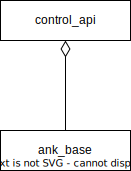

# API library - SW Design

## About this document

This document describes the Software Design for the API library of Ankaios.

Ankaios is a workload orchestrator supporting a subset of the Kubernetes configurations and is targeted at the automotive use case.

The API library provides the definition of the external interface of Ankaios - the Control Interface.
The data structures defined here are used by Ankaios and the managed workloads to communicate.

## Context View

The following diagram shows a high level overview of the API library and its context:

## Constraints, risks and decisions

### Design decisions

## Structural view

The API library provides two Protobuf files : one containing the base definition of the data structures used by Ankaios for the Control Interface and the one that defines the Control Interface itself:

### Ank Base

#### Ank Base provides object definitions
`swdd~ank-base-provides-object-definitions~1`

Status: approved

The ank_base.proto file provides the definitions of the main Ankaios objects.

Rationale:
The Protobuf file is separated from the Control Interface to enable reusing it for implementations of the Communication Middleware.

Tags:
AnkBase

Needs:
- impl

### Control API

#### Control API provides definitions for the Control Interface
`swdd~control-api-provides-control-interface-definitions~1`

Status: approved

The control_api.proto file provides the definitions of the Ankaios Control Interface.

Tags:
ControlAPI

Needs:
- impl

## Data view

## Error management view

## Physical view

## References

## Glossary

* Protobuf - [Protocol Buffers](https://protobuf.dev/)

<!-- markdownlint-disable-file MD004 MD022 MD032 -->
