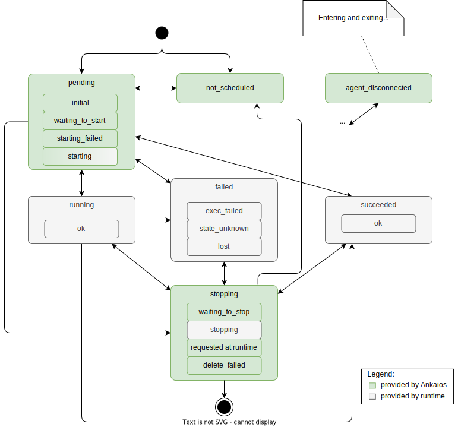

# Common library - SW Design

## About this document

This document describes the Software Design for the Common library of Ankaios.

Ankaios is a workload orchestrator supporting a subset of the Kubernetes configurations and is targeted at the automotive use case.

The Common library is a collection of units used in other components.
The goal is to avoid code duplication especially when it is about definitions of interfaces and basic structures (don't repeat yourself).

## Context View

The following diagram shows a high level overview of the Common library and its context:

The diagram does not show all dependencies between the Common library and other components of Ankaios as anybody can use the Common library.
On the other hand the Common library is not allowed to use other component of Ankaios.

## Constraints, risks and decisions

### Design decisions

#### The Common library dependencies
`swdd~common-library-dependencies~1`

The Common library shall not use any other component of Ankaios.

Rationale: Other components are allowed to use the Common library.
Allowing dependencies in other direction would cause a cyclic dependency.

## Structural view

The Common library is a collection of independent units (structures, interfaces) used by other components of Ankaios.
For this reason it is useless to draw a structural diagram for this library.

### FromServerChannel

Simplifies sending and receiving `FromServer` messages. Internally uses a multi-producer, single-consumer channel from Tokio.

#### Provide `FromServerChannel`
`swdd~from-server-channel~1`

Status: approved

The Common library shall provide an asynchronous communication channel that supports sending and receiving the `FromServer` message.

Rationale: The communication channels are especially needed in order to abstract the Communication Middleware.

Tags:
- FromServerChannel

Needs:
- impl
- utest

### ToServerChannel

Simplifies sending and receiving `ToServer` messages. Internally uses a multi-producer, single-consumer channel from Tokio.

#### Provide `ToServerChannel`
`swdd~to-server-channel~1`

Status: approved

The Common library shall provide an asynchronous communication channel that supports sending and receiving the `ToServer` message.

Rationale: The communication channels are especially needed in order to abstract the Communication Middleware.

Tags:
- ToServerChannel

Needs:
- impl
- utest

### Objects

Definitions of objects which are needed in all other components of Ankaios.
These objects especially include objects which needs to be sent through for the `FromServerChannel` and `ToServerChannel`.

#### WorkloadStatesMap

The WorkloadStatesMap is a container that holds workload execution states and allows searching through them in an efficient way.

#### AgentMap

The AgentMap is an associative data structure that stores the names of the agents connected to the server as keys and the corresponding agent attributes as values.

#### Provide common object representation
`swdd~common-object-representation~1`

Status: approved

The Common library shall provide data structures for all objects that need to be sent through the asynchronous communication channels.

Tags:
- Objects

Needs:
- impl
- utest

#### Ankaios supported workload states
`swdd~common-workload-states-supported-states~1`

Status: approved

Ankaios shall support the following execution states with substates for a workload:

- agent disconnected
- pending
    * initial
    * starting
    * waiting to start
    * starting failed
- running
    * ok
- stopping
    * waiting to stop
    * stopping
    * requested at runtime
    * delete failed
- succeeded
    * ok
- failed
    * exec failed
    * unknown
    * lost
- not scheduled
- removed

Tags:
- Objects

Needs:
- impl
- utest

The Following diagram shows all Ankaios workload states and the possible transitions between them:

#### Workload state transitions
`swdd~common-workload-state-transitions~1`

status: approved

Upon transitioning from the 'stopping' or 'waiting_to_stop' state to either 'running', 'succeeded', or 'failed', the workload execution state shall yield again a 'stopping' state.

Rationale:
This hysteresis is particularly necessary when the stopping operation is in progress, but the workload is still running and reported to be running. To prevent the state from flipping multiple times, the new value must depend on the old one and remain in the 'stopping' state.

Tags:
- Objects

Needs:
- impl
- utest

#### Workload states map allows managing workload execution states
`swdd~state-map-for-workload-execution-states~2`

Status: approved

The WorkloadStatesMap represents the current execution states of the managed by Ankaios workloads and allows performant management of the states by providing the following functionalities:
* getting all workload states for an agent
* getting the workload state of a workload
* getting all workload states except the ones for a specific agent
* marking all states of an agent as agent disconnected
* adding an initial state for a list of workloads
* adding new states to the map
* keeping the map clean by deleting the entries for removed workloads
* removing states from the map

Comment:
The WorkloadStatesMap is actually the object exposed to the external interfaces, but provides some additional functionality.

Tags:
- WorkloadStatesMap

Needs:
- impl
- utest

#### Ankaios workload execution state additional information
`swdd~common-workload-state-additional-information~1`

Status: approved

Ankaios shall support a string with additional information for the workload execution state.

Rationale:
The additional information could be provided by the runtime and is helpful for debugging purposes.

Tags:
- Objects

Needs:
- impl
- utest

#### Ankaios workload execution state identification
`swdd~common-workload-state-identification~1`

Status: approved

Ankaios shall support workload execution state identification by the combination of:

- workload name
- assigned agent name
- runtime config hash
- workload id (optional depending on the execution state as provided by the runtime)

Rationale:
The workload id is additionally needed for identification to support restarts of workloads with 'at least once' update strategy.

Tags:
- Objects

Needs:
- impl
- utest

#### AgentMap manages agent names along with agent attributes
`swdd~agent-map-manages-agent-names-with-agent-attributes~2`

Status: approved

The AgentMap provides the following functionalities:
* inserting an agent name with default attributes
* checking whether an entry for an agent exists
* removing an agent name with its associated attributes
* storing the agent attributes
* updating an agent's node resource availability

Comment:
The AgentMap is actually the object exposed to the external interfaces, but provides some additional functionality.

Tags:
- AgentMap

Needs:
- impl

#### Workload add conditions for dependencies
`swdd~workload-add-conditions-for-dependencies~1`

Status: approved

Ankaios shall support the following add conditions for a workload dependency:
* `running` - the workload is operational
* `succeeded` - the workload has successfully exited
* `failed` - the workload has exited with an error or could not be started

Rationale:
Some workloads may need another service to be running before they can be started, others may need preparatory tasks which have been successfully finished. Dependencies on failure of workloads allows the execution of mitigation or recording actions.

Tags:
- Objects

Needs:
- impl
- utest

#### Workload delete conditions for dependencies
`swdd~workload-delete-conditions-for-dependencies~1`

Status: approved

Ankaios shall support the following delete conditions for a workload dependency:
* `running` - the workload is operational
* `not pending nor running` - the workload is not running nor it is going to be started soon

Rationale:
Delete conditions are needed to be able to stop a workload on which others depend and for the update strategy `at least once` when the workload is shifted from one agent to another.

Tags:
- Objects

Needs:
- impl
- utest

#### Provide deterministic object serialization
`swdd~common-object-serialization~1`

Status: approved

The Common library shall provide a sorted serialization of unordered data structures.

Rationale:
Associative arrays using hash tables are typically used for fast access but the data is stored unordered.
To provide a consistent view to the user such data types shall be serialized into an ordered output.

Tags:
- Objects

Needs:
- impl
- utest

#### Provide a method that checks if the workload requires control interface
`swdd~common-workload-needs-control-interface~1`

Status: approved

When allow rules for the Control Interface access are specified in the workload specification, the Common library shall approve the creation of a Control Interface.

Tags:
- Objects

Needs:
- impl
- utest

#### Provide a method that checks if the workload has files assigned
`swdd~common-workload-has-files~1`

Status: approved

When the field `files` of the workload specification contains at least one entry, the Common library shall approve the mount of the workload files specified in the field.

Tags:
- Objects

Needs:
- impl
- utest

#### Naming of Workload execution instances
`swdd~common-workload-execution-instance-naming~1`

Status: approved

The Common library shall provide functionality for retrieving the Workload execution instance name of the workload in the following naming schema:

    <Workload name>.<runtime config hash>.<Agent name>

Where the hash of the workload runtime config is calculated from the complete runtime config string provided in the workload specification.

Rationale:
A unique, consistent and reproducible naming that allows detecting changes in the workload configuration is needed to be able to check if a workload specification differs from the workload execution instance. Such a configuration drift could occur during windows in which an Ankaios Agent was unresponsive or down.

Tags:
- Objects

Needs:
- impl
- utest

#### Workload naming convention
`swdd~common-workload-naming-convention~1`

Status: approved

The Common library shall provide functionality for enforcing a workload name to:
* contain only regular upper and lowercase characters (a-z and A-Z), numbers and the symbols "-" and "_"
* have a minimal length of 1 character
* have a maximal length of 63 characters

Rationale:
A consistent naming manner assures stability in usage and compatibility with Ankaios internal structure by ensuring proper function of the filtering.

Tags:
- Objects

Needs:
- impl
- utest
- stest

#### Agent naming convention
`swdd~common-agent-naming-convention~3`

Status: approved

The Common library shall provide functionality for enforcing an agent name to contain only regular upper and lowercase characters (a-z and A-Z), numbers and the symbols "-" and "_".

Comment:
Supporting an empty agent name in a workload configuration allows for scenarios where a workload is not scheduled on an Ankaios agent.

Rationale:
A consistent naming manner assures stability in usage and compatibility with Ankaios internal structure by ensuring proper function of the filtering.

Tags:
- Objects

Needs:
- impl
- utest
- stest

#### Config item key naming convention
`swdd~common-config-item-key-naming-convention~1`

Status: approved

The Common library shall provide functionality for enforcing a config item key to contain only regular upper and lowercase characters (a-z and A-Z), numbers and the symbols "-" and "_".

Rationale:
A consistent naming manner assures stability in usage and compatibility with Ankaios internal structure by ensuring proper function of the filtering.

Tags:
- Objects

Needs:
- impl
- utest
- stest

#### Config aliases and referenced config keys naming convention
`swdd~common-config-aliases-and-config-reference-keys-naming-convention~1`

Status: approved

The Common library shall provide functionality for enforcing a workload's config reference key value pairs to contain only regular upper and lowercase characters (a-z and A-Z), numbers and the symbols "-" and "_".

Rationale:
A consistent naming manner assures stability in usage and compatibility with Ankaios internal structure by ensuring proper function of the filtering.

Tags:
- Objects

Needs:
- impl
- utest
- stest

#### Control Interface access rules filter mask conventions
`swdd~common-access-rules-filter-mask-convention~1`

Status: approved

The Common library shall provide functionality for enforcing a non-empty filter mask for Control Interface access `StateRule`s.

Rationale:
An empty filter mask for an allow access rules is might be misunderstood as allow nothing.

Tags:
- Objects

Needs:
- impl
- utest
- stest

#### Control Interface convention for workload names in logs access rules
`swdd~common-access-rules-logs-workload-names-convention~1`

Status: approved

The Common library shall provide functionality for enforcing the validity of workload names in Control Interface access `LogRule`s:
- to contain at most one wildcard symbol "*"
- to be able to match a workload following the naming convention (e.g. not being to long, only containing valid characters)

Rationale:
This shall prevent users from providing rules which will never match any workload.
Otherwise, invalid deny rules could lead to workloads having more rights than expected.

Tags:
- Objects

Needs:
- impl
- utest

#### Provide common conversions between Ankaios and protobuf
`swdd~common-conversions-between-ankaios-and-proto~1`

Status: approved

The Common library shall provide conversion functions between Ankaios objects and protobuf objects.

Tags:
- Objects

Needs:
- impl
- utest

### Common interface definitions

This includes definition of interfaces, which are used in other libraries and executables of Ankaios.

#### Provide common interface definitions
`swdd~common-interface-definitions~1`

Status: approved

The Common library shall provide interface used by Ankaios' libraries and executables.

Rationale: This prevents code duplication in accordance to the DRY principle.

Tags:
- CommonInterfaces

Needs:
- impl

### Common Helpers

Different helper methods used by other components of Ankaios. For example regarding error handling or testing.

#### Provide common helper methods
`swdd~common-helper-methods~1`

Status: approved

The Common library shall provide helper methods used by Ankaios' libraries and executables.

Rationale: This prevents code duplication in accordance to the DRY principle.

Tags:
- CommonHelpers

Needs:
- impl

#### Provide common version checking functionality
`swdd~common-version-checking~1`

Status: approved

The Common library shall provide a common version checking functionality that fails if a provided version differs from the current major and minor one.

Rationale:
The version checking is executed in different Ankaios components and must behave in the same way. The failure on a different minor version is required as Ankaios is currently at a 0 (zero) major version.

Tags:
- CommonHelpers

Needs:
- impl
- utest

### State manipulation

Provides methods for accessing or updating parts of objects, as used by field masks.

#### State manipulation uses period separated paths
`swdd~common-state-manipulation-path~1`

Status: approved

The state manipulation methods of the Common library shall use paths separated by the '.' symbols.

Tags:
- CommonStateManipulation

Needs:
- impl
- utest

#### State manipulation allows to set values
`swdd~common-state-manipulation-set~1`

Status: approved

The Common library shall provide a method to set the value of an object at a certain path.

Tags:
- CommonStateManipulation

Needs:
- impl
- utest

#### State manipulation set operation adds missing objects
`swdd~common-state-manipulation-set-add-missing-objects~1`

Status: approved

When setting the value of an object at a certain path, the Common library shall add missing intermediate objects as empty objects followed by the newly added value.

Tags:
- CommonStateManipulation

Needs:
- impl
- utest

#### State manipulation allows to remove values
`swdd~common-state-manipulation-remove~1`

Status: approved

The Common library shall provide a method to remove the value of an object at a certain path.

Tags:
- CommonStateManipulation

Needs:
- impl
- utest

#### State manipulation allows to get values
`swdd~common-state-manipulation-get~1`

Status: approved

The Common library shall provide a method to get the value of an object at a certain path.

Tags:
- CommonStateManipulation

Needs:
- impl
- utest

#### State manipulation provides functionality to expand wildcards
`swdd~common-state-manipulation-expand-wildcards~1`

Status: approved

The Common library shall provide a method for expanding paths containing wildcards ('*') as segments, using an existing object.

Comment:
The result is a list of all paths valid for the given object, resulting from replacing wildcard segments with any possible segment.
The result is a list of all paths valid for the given object, resulting from replacing wildcard segments with any possible segment.

Tags:
- CommonStateManipulation

Needs:
- impl
- utest

#### State manipulation provides functionality to calculate state differences
`swdd~common-state-manipulation-calculate-state-differences~1`

Status: approved

The Common library shall provide a method for calculating the state differences between a current state and a new state represented as associative data structures with returning the absolute paths for added, updated and removed fields.

Comment:
A custom Depth-Search-First (DFS) implementation comparing the current and new state fields is used.
A sequence is treated as a leaf and in mappings only `string`s are supported as keys.
An update from an empty sequence to a non-empty sequence is treated as an added field and the other way around as a removed field.
Any other changes to a sequence field is treated as an updated field.

Tags:
- CommonStateManipulation

Needs:
- impl
- utest

## Data view

## Error management view

## Physical view

## References

## Glossary

<!-- markdownlint-disable-file MD004 MD022 MD032 -->
