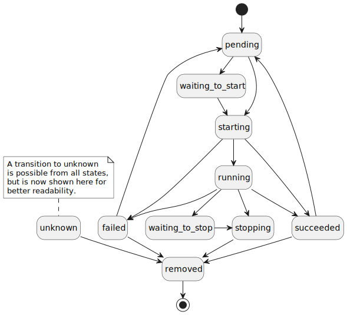

# Example Component - SW Design

## About this document

This document describes the Software Design for the Common library of Ankaios.

Ankaios is a workload orchestrator supporting a subset of the Kubernetes configurations and is targeted at the automotive use case.

The Common library is a collection of units used in other components.
The goal is to avoid code duplication especially when it is about definitions of interfaces and basic structures (don't repeat yourself).

## Context View

The following diagram shows a high level overview of the Common library and its context:

The diagram does not show all dependencies between the Common library and other components of Ankaios as anybody can use the Common library.
On the other hand the Common library is not allowed to use other component of Ankaios.

## Constraints, risks and decisions

### Design decisions

#### The Common library dependencies
`swdd~common-library-dependencies~1`

The Common library shall not use any other component of Ankaios.

Rationale: Other components are allowed to use the Common library.
Allowing dependencies in other direction would cause a cyclic dependency.

## Structural view

The Common library is a collection of independent units (structures, interfaces) used by other components of Ankaios.
For this reason it is useless to draw a structural diagram for this library.

### ExecutionCommandChannel

Simplifies sending and receiving `ExecutionCommand`s. Internally uses a multi-producer, single-consumer channel from Tokio.

#### Provide `ExecutionCommandChannel`
`swdd~execution-command-channel~1`

Status: approved

The Common library shall provide an asynchronous communication channel that supports sending and receiving the `ExecutionCommand`.

Rationale: The communication channels are especially needed in order to abstract the Communication Middleware.

Tags:
- ExecutionCommandChannel

Needs:
- impl

### StateChangeCommandChannel

Simplifies sending and receiving `StateChangeCommand`s. Internally uses a multi-producer, single-consumer channel from Tokio.

#### Provide `StateChangeCommandChannel`
`swdd~state-change-command-channel~1`

Status: approved

The Common library shall provide an asynchronous communication channel that supports sending and receiving the `StateChangeCommand`.

Rationale: The communication channels are especially needed in order to abstract the Communication Middleware.

Tags:
- StateChangeCommandChannel

Needs:
- impl

### Objects

Definitions of objects which are needed in all other components of Ankaios.
These objects especially include objects which needs to be sent through for the `ExecutionCommandChannel` and `StateChangeCommandChannel`.

#### Provide common object representation
`swdd~common-object-representation~1`

Status: approved

The Common library shall provide data structures for all objects that need to be sent through the asynchronous communication channels.

Tags:
- Objects

Needs:
- impl
- utest

#### Ankaios supported workload states
`swdd~common-supported-workload-states~1`

Status: approved

Ankaios shall support the following execution states for a workload:

- pending
- waiting_to_start
- starting
- running
- succeeded
- failed
- waiting_to_stop
- stopping
- removed
- unknown

Tags:
- Objects

Needs:
- impl
- utest

The Following diagram shows all Ankaios workload states and the possible transitions between them:

#### Workload add conditions for dependencies
`swdd~workload-add-conditions-for-dependencies~1`

Status: approved

Ankaios shall support the following add conditions for a workload dependency:
* `running` - the workload is operational
* `succeeded` - the workload has successfully exited 
* `failed` - the workload has exited with an error or could not be started

Rationale:
Some workloads may need another service to be running before they can be started, others may need preparatory tasks which have been successfully finished. Dependencies on failure of workloads allows the execution of mitigation or recording actions.

Tags: 
- Objects

Needs:
- impl
- utest

#### Workload delete conditions for dependencies
`swdd~workload-delete-conditions-for-dependencies~1`

Status: approved

Ankaios shall support the following delete conditions for a workload dependency:
* `running` - the workload is operational
* `not pending nor running` - the workload is not running nor it is going to be started soon

Rationale:
Delete conditions are needed to be able to stop a workload on which others depend and for the update strategy `at least once` when the workload is shifted from one agent to another.

Tags:
- Objects

Needs:
- impl
- utest

#### Provide deterministic object serialization
`swdd~common-object-serialization~1`

Status: approved

The Common library shall provide a sorted serialization of unordered data structures.

Rationale:
Associative arrays using hash tables are typically used for fast access but the data is stored unordered.
To provide a consistent view to the user such data types shall be serialized into an ordered output.

Tags:
- Objects

Needs:
- impl
- utest

#### Naming of Workload execution instances
`swdd~common-workload-execution-instance-naming~1`

Status: approved

The Common library shall provide functionality for retrieving the Workload execution instance name of the workload in the following naming schema:

    <Workload name>.<runtime config hash>.<Agent name>

Where the hash of the workload runtime config is calculated from the complete runtime config string provided in the workload specification.

Rationale:
A unique, consistent and reproducible naming that allows detecting changes in the workload configuration is needed to be able to check if a workload specification differs from the workload execution instance. Such a configuration drift could occur during windows in which an Ankaios Agent was unresponsive or down.

Tags:
- Objects

Needs:
- impl
- utest

#### Provide common conversions between Ankaios and protobuf
`swdd~common-conversions-between-ankaios-and-proto~1`

Status: approved

The Common library shall provide conversion functions between Ankaios objects and protobuf objects.

Tags:
- Objects

Needs:
- impl
- utest

### Common interface definitions

This includes definition of interfaces, which are used in other libraries and executables of Ankaios.

#### Provide common interface definitions
`swdd~common-interface-definitions~1`

Status: approved

The Common library shall provide interface used by Ankaios' libraries and executables.

Rationale: This prevents code duplication in accordance to the DRY principle.

Tags:
- CommonInterfaces

Needs:
- impl

### Helper methods

Different helper methods used by other components of Ankaios. For example regarding error handling or testing.

#### Provide common helper methods
`swdd~common-helper-methods~1`

Status: approved

The Common library shall provide helper methods used by Ankaios' libraries and executables.

Rationale: This prevents code duplication in accordance to the DRY principle.

Tags:
- CommonHelpers

Needs:
- impl

## Data view

## Error management view

## Physical view

## References

## Glossary

<!-- markdownlint-disable-file MD004 MD022 MD032 -->
