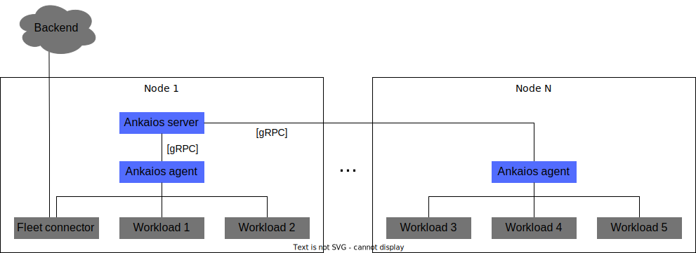
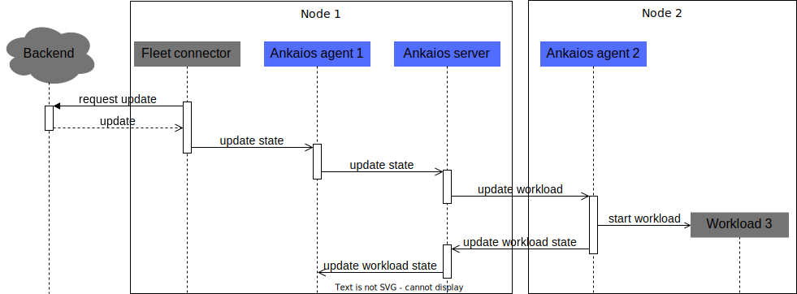

# Architecture

## Overview

Two executables are used for each Ankaios deployment: the Ankaios server and the Ankaios agent:

When started, the Ankaios server loads the configured startup state of the cluster and stores it as a desired state. To reach this desired state, the server instructs the Ankaios agents to start and stop workloads.
Each Ankaios cluster runs exactly one instance of the Ankaios server making the server the single source of truth.

A running instance of the Ankaios agent is present on every node where Ankaios needs to execute workloads.
The Ankaios agent is responsible for starting and stopping workloads, according to the commands it gets from the Ankaios server.

The Ankaios server itself does not run workloads directly so in order to start workloads on the node running the server, an Ankaios agent shall be started there too.

Ankaios also allows workloads to change the state stored in the Ankaios server via the [control interface](./reference/control-interface.md).
Workloads access this interface by sending their requests to the Ankaios agent managing them. Each request is checked by the Ankaios agent and, on successful authorization, forwarded to the Ankaios server.
This interface can be used to, e.g.:

- Dynamically reconfigure the system to start a parking assistant.
- Start additional workloads requested by an OEM backend to collect data about the road condition.

In the diagram above one of the workloads on <nobr>node 1</nobr> acts as fleet connector.
It accesses a backend and forwards commands to the Ankaios server.
In the example below the fleet connector gets an update from the backend, which adds a workload to <nobr>node 2</nobr>.

### Notes

- Ankaios uses gRPC for communication between the Ankaios server and the Ankaios agents,
  but the internal structure of Ankaios allows to replace gRPC with another communication protocol.
- The communication between workloads is not in the scope of Ankaios.
  The communication must be set up separately,
  which allows to use any technology needed for the project, e.g. network, named pipes, unix sockets or shared memory.
