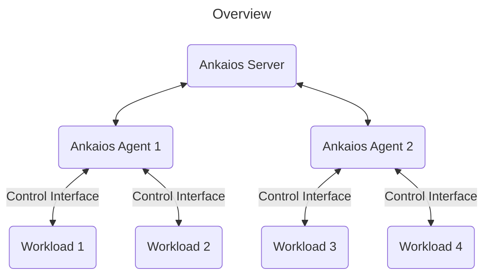
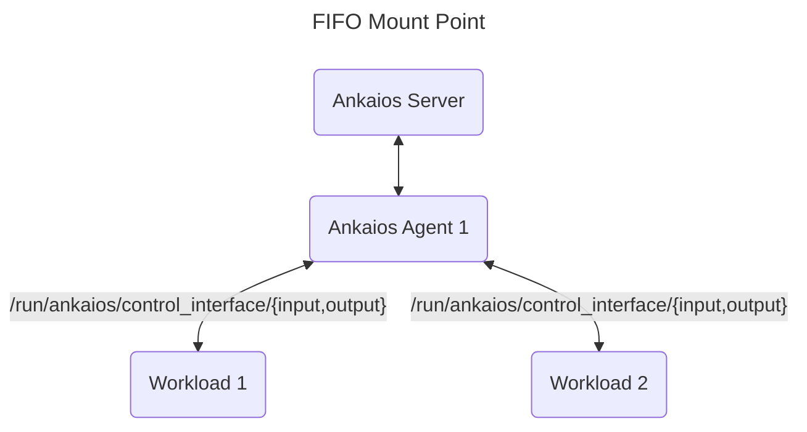
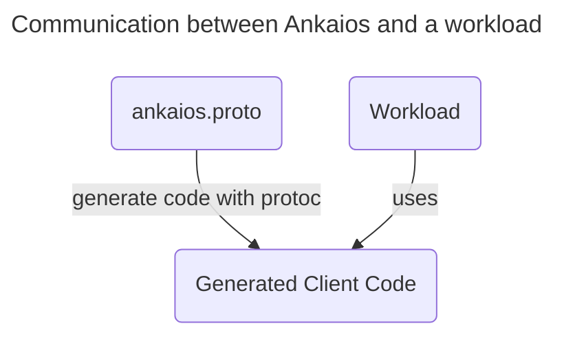
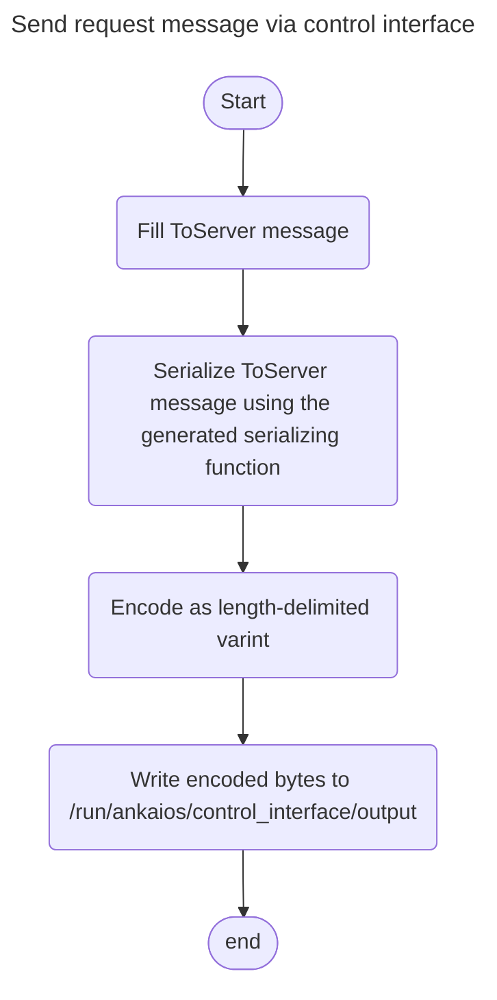
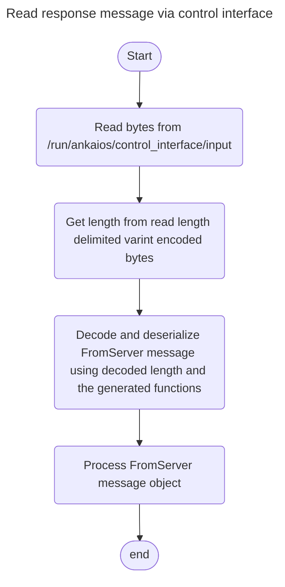

# Control interface

The [control interface](./control-interface.md) allows the [workload](glossary.md#workload) developers to easily integrate the communication between the Ankaios system and their applications.

!!! note

    The control interface is currently only available for workloads using the
    `podman` runtime and not for the `podman-kube` runtime.

## Overview



The [control interface](./control-interface.md) enables a [workload](glossary.md#workload) to communicate with the Ankaios system by interacting with the Ankaios server through writing/reading communication data to/from the provided FIFO files in the [FIFO mount point](#fifo-mount-point).

## FIFO mount point



The [control interface](./control-interface.md) relies on [FIFO](https://en.wikipedia.org/wiki/Named_pipe) (also known as [named pipes](https://en.wikipedia.org/wiki/Named_pipe)) to enable a [workload](glossary.md#workload) process to communicate with the Ankaios system. For that purpose, Ankaios creates a mount point for each [workload](glossary.md#workload) to store the FIFO files. At the mount point `/run/ankaios/control_interface/` the [workload](glossary.md#workload) developer can find the FIFO files `input` and `output` and use them for the communication with the Ankaios server. Ankaios uses its own communication protocol described in [protocol documentation](./_ankaios.proto.md#oprotocol-documentation) as a [protobuf IDL](https://protobuf.com/docs/language-spec) which allows the client code to be generated in any programming language supported by the [protobuf compiler](https://protobuf.dev/reference/). The generated client code can then be integrated and used in a [workload](#communication-between-ankaios-and-workloads).

## Communication between Ankaios and workloads



In order to enable the communication between a workload and the Ankaios system, the workload needs to make use of the control interface by sending and processing serialized messages defined in `ankaios.proto` via writing to and reading from the provided FIFO files `output` and `input` found in the mount point `/run/ankaios/control_interface/`. By using the [protobuf compiler (protoc)](https://protobuf.dev/reference/) code in any programming language supported by the protobuf compiler can be generated. The generated code contains functions for serializing and deserializing the messages to and from the Protocol Buffers binary format.

## Length-delimited protobuf message layout

The messages are encoded using the [length-delimited wire type format](https://protobuf.dev/programming-guides/encoding/#length-types) and layout inside the FIFO file according to the following visualization:


Every protobuf message is prefixed with its byte length telling the reader how much bytes to read to consume the protobuf message.
The byte length has a dynamic length and is encoded as [VARINT](https://protobuf.dev/programming-guides/encoding/#length-types).

## Control interface examples

The subfolder `examples` inside the [Ankaios repository](https://github.com/eclipse-ankaios/ankaios) contains example workload applications in various programming languages that are using the control interface. They demonstrate how to easily use the control interface in self-developed workloads. All examples share the same behavior regardless of the programming language and are simplified to focus on the usage of the control interface. Please note that the examples are not are not optimized for production usage.

The following sections showcase in Rust some important parts of the communication with the Ankaios cluster using the control interface. The same concepts are also used in all of the example workload applications.

### Sending request message from a workload to Ankaios server

To send out a request message from the workload to the Ankaios Server the request message needs to be serialized using the generated serializing function, then encoded as [length-delimited protobuf message](#length-delimited-protobuf-message-layout) and then written directly into the `output` FIFO file. The type of request message is [ToServer](_ankaios.proto.md#toserver).



Code snippet in [Rust](https://www.rust-lang.org/) for sending request message via control interface:

```rust
use api::proto;
use prost::Message;
use std::{collections::HashMap, fs::File, io::Write, path::Path};

const ANKAIOS_CONTROL_INTERFACE_BASE_PATH: &str = "/run/ankaios/control_interface";

fn create_update_workload_request() -> proto::ToServer {
    let new_workloads = HashMap::from([(
        "dynamic_nginx".to_string(),
        proto::Workload {
            runtime: "podman".to_string(),
            agent: "agent_A".to_string(),
            restart: false,
            update_strategy: proto::UpdateStrategy::AtMostOnce.into(),
            access_rights: None,
            tags: vec![proto::Tag {
                key: "owner".to_string(),
                value: "Ankaios team".to_string(),
            }],
            runtime_config: "image: docker.io/library/nginx\ncommandOptions: [\"-p\", \"8080:80\"]"
                .to_string(),
            dependencies: HashMap::new(),
        },
    )]);

    proto::ToServer {
        to_server_enum: Some(proto::to_server::ToServerEnum::Request(proto::Request {
            request_id: "request_id".to_string(),
            request_content: Some(proto::request::RequestContent::UpdateStateRequest(
                proto::UpdateStateRequest {
                    new_state: Some(proto::CompleteState {
                        desired_state: Some(proto::State {
                            workloads: new_workloads,
                            configs: HashMap::default(),
                            cronjobs: HashMap::default(),
                        }),
                        ..Default::default()
                    }),
                    update_mask: vec!["desiredState.workloads.dynamic_nginx".to_string()],
                },
            )),
        })),
    }
}

fn write_to_control_interface() {
    let pipes_location = Path::new(ANKAIOS_CONTROL_INTERFACE_BASE_PATH);
    let sc_req_fifo = pipes_location.join("output");

    let mut sc_req = File::create(&sc_req_fifo).unwrap();

    let protobuf_update_workload_request = create_update_workload_request();

    println!("{}", &format!("Sending UpdateStateRequest containing details for adding the dynamic workload \"dynamic_nginx\": {:#?}", protobuf_update_workload_request));

    sc_req
        .write_all(&protobuf_update_workload_request.encode_length_delimited_to_vec())
        .unwrap();
}

fn main() {
    write_to_control_interface();
}
```

### Processing response message from Ankaios server

To process a response message from the Ankaios Server the workload needs to read out the bytes from the `input` FIFO file. As the bytes are encoded as [length-delimited protobuf message](#length-delimited-protobuf-message-layout) with a variable length, the length needs to be decoded and extracted first. Then the length can be used to decode and deserialize the read bytes to a response message object for further processing. The type of the response message is [FromServer](_ankaios.proto.md#fromserver).



Code Snippet in [Rust](https://www.rust-lang.org/) for reading response message via control interface:

```rust
use api::proto;
use prost::Message;
use std::{fs::File, io, io::Read, path::Path};

const ANKAIOS_CONTROL_INTERFACE_BASE_PATH: &str = "/run/ankaios/control_interface";
const MAX_VARINT_SIZE: usize = 19;

fn read_varint_data(file: &mut File) -> Result<[u8; MAX_VARINT_SIZE], io::Error> {
    let mut res = [0u8; MAX_VARINT_SIZE];
    let mut one_byte_buffer = [0u8; 1];
    for item in res.iter_mut() {
        file.read_exact(&mut one_byte_buffer)?;
        *item = one_byte_buffer[0];
        // check if most significant bit is set to 0 if so it is the last byte to be read
        if *item & 0b10000000 == 0 {
            break;
        }
    }
    Ok(res)
}

fn read_protobuf_data(file: &mut File) -> Result<Box<[u8]>, io::Error> {
    let varint_data = read_varint_data(file)?;
    let mut varint_data = Box::new(&varint_data[..]);

    // determine the exact size for exact reading of the bytes later by decoding the varint data
    let size = prost::encoding::decode_varint(&mut varint_data)? as usize;

    let mut buf = vec![0; size];
    file.read_exact(&mut buf[..])?; // read exact bytes from file
    Ok(buf.into_boxed_slice())
}

fn read_from_control_interface() {
    let pipes_location = Path::new(ANKAIOS_CONTROL_INTERFACE_BASE_PATH);
    let ex_req_fifo = pipes_location.join("input");

    let mut ex_req = File::open(&ex_req_fifo).unwrap();

    loop {
        if let Ok(binary) = read_protobuf_data(&mut ex_req) {
            let proto = proto::FromServer::decode(&mut Box::new(binary.as_ref()));

            println!("{}", &format!("Receiving FromServer containing the workload states of the current state: {:#?}", proto));
        }
    }
}

fn main() {
    read_from_control_interface();
}
```
