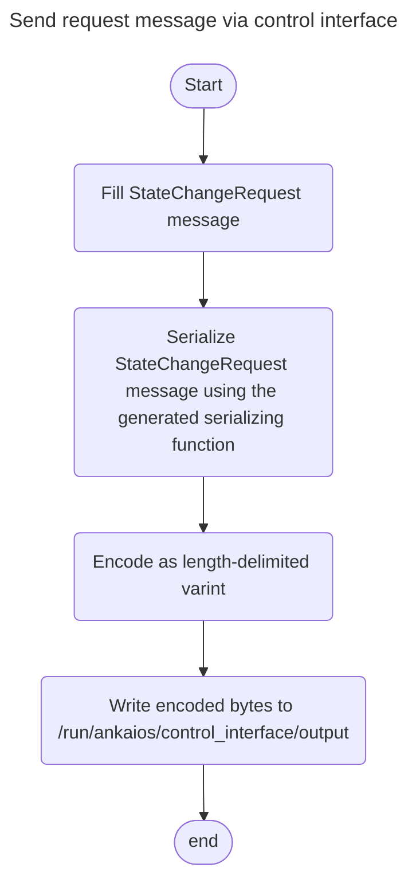

# Control interface

The [control interface](./control-interface.md) allows the [workload](glossary.md#workload) developers to easily integrate the communication between the Ankaios system and their applications.

!!! note

    The control interface is currently only available for workloads using the 
    `podman` runtime and not for the `podman-kube` runtime.

## Overview


The [control interface](./control-interface.md) enables a [workload](glossary.md#workload) to communicate with the Ankaios system by interacting with the Ankaios server through writing/reading communication data to/from the provided FIFO files in the [FIFO mount point](#fifo-mount-point). 

## FIFO mount point


The [control interface](./control-interface.md) relies on [FIFO](https://en.wikipedia.org/wiki/Named_pipe) (also known as [named pipes](https://en.wikipedia.org/wiki/Named_pipe)) to enable a [workload](glossary.md#workload) process to communicate with the Ankaios system. For that purpose, Ankaios creates a mount point for each [workload](glossary.md#workload) to store the FIFO files. At the mount point `/run/ankaios/control_interface/` the [workload](glossary.md#workload) developer can find the FIFO files `input` and `output` and use them for the communication with the Ankaios server. Ankaios uses its own communication protocol described in [protocol documentation](./_ankaios.proto.md#oprotocol-documentation) as a [protobuf IDL](https://protobuf.com/docs/language-spec) which allows the client code to be generated in any programming language supported by the [protobuf compiler](https://protobuf.dev/reference/). The generated client code can then be integrated and used in a [workload](#communication-between-ankaios-and-workloads).

## Communication between Ankaios and workloads


In order to enable the communication between a workload and the Ankaios system, the workload needs to make use of the control interface by sending and processing serialized messages defined in `ankaios.proto` via writing to and reading from the provided FIFO files `output` and `input` found in the mount point `/run/ankaios/control_interface/`. By using the [protobuf compiler (protoc)](https://protobuf.dev/reference/) code in any programming language supported by the protobuf compiler can be generated. The generated code contains functions for serializing and deserializing the messages to and from the Protocol Buffers binary format.

## Sending request message from a workload to Ankaios server
To send out a request message from the workload to the Ankaios Server the request message needs to be serialized using the generated serializing function, then encoded using [length-delimited wire type format](https://protobuf.dev/programming-guides/encoding/#length-types) and then written directly into the `output` FIFO file. The type of request message is [StateChangeRequest](_ankaios.proto.md#statechangerequest).



Code snippet in [Rust](https://www.rust-lang.org/) for sending request message via control interface:
```rust
use api::proto;

use prost::Message;
use tokio::{
    fs::File,
    io::{AsyncReadExt, AsyncWriteExt},
};

#[tokio::main]
async fn main() {
    let control_interface_mount_point = Path::new("/run/ankaios/control_interface");
    let out_fifo_location = control_interface_mount_point.join("output");
    let mut out_fifo = File::create(&out_fifo_location).await.unwrap();

    // Fill StateChangeRequest message
    let request_msg_update_state = proto::StateChangeRequest {
            state_change_request_enum: Some(
                proto::state_change_request::StateChangeRequestEnum::UpdateState(
                    proto::UpdateStateRequest {
                        new_state: Some(proto::CompleteState {
                            ..Default::default()
                        }),
                        update_mask: vec![
                            "currentState.workloads.api_sample".to_string(),
                        ],
                    },
                ),
            ),
        };

    // Serialize StateChangeRequest message using the generated serializing function
    // and encode as length-delimited varint
    // using encode_length_delimited_to_vec() function provided by prost through code generation
    let out_bytes = request_msg_update_state.encode_length_delimited_to_vec();

    // Write encoded bytes to /run/ankaios/control_interface/output
    out_fifo
        .write_all(&out_bytes)
        .await
        .unwrap();
}
```
## Processing response message from Ankaios server
To process a response message from the Ankaios Server the workload needs to read out the bytes from the `input` FIFO file. As the bytes are encoded in [length-delimited wire type format](https://protobuf.dev/programming-guides/encoding/#length-types) with a variable length the length needs to be decoded and extracted first. Then the length can be used to decode and deserialize the read bytes to a response message object for further processing. The type of the response message is [ExecutionRequest](_ankaios.proto.md#executionrequest).


Code Snippet in [Rust](https://www.rust-lang.org/) for reading response message via control interface:
```rust
use api::proto;

use prost::Message;
use tokio::{
    fs::File,
    io::{AsyncReadExt, AsyncWriteExt},
};

async fn read_protobuf_data(file: &mut File) -> Result<Box<[u8]>, io::Error> {
    let varint_data = read_varint_data(file).await?;
    let mut varint_data = Box::new(&varint_data[..]);

    // determine the exact size for exact reading of the bytes later by decoding the varint data
    let size = prost::encoding::decode_varint(&mut varint_data)? as usize;

    let mut buf = vec![0; size];
    file.read_exact(&mut buf[..]).await?; // read exact bytes from file
    Ok(buf.into_boxed_slice())
}

async fn read_varint_data(file: &mut File) -> Result<[u8; MAX_VARINT_SIZE], io::Error> {
    let mut res = [0u8; MAX_VARINT_SIZE];
    for item in res.iter_mut() {
        *item = file.read_u8().await?;
        // check if signature bit is set to 0 if so it is the last byte to be read
        if *item & 0b10000000 == 0 {
            break;
        }
    }
    Ok(res)
}

#[tokio::main]
async fn main() {
    let control_interface_mount_point = Path::new("/run/ankaios/control_interface");
    let in_fifo_location = control_interface_mount_point.join("input");    
    let mut in_fifo = File::open(&in_fifo_location).await.unwrap();

    tokio::spawn(async move {
        println!("listen to ExecutionRequest ...");
        loop {
            if let Ok(binary) = read_protobuf_data(&mut in_fifo).await {
                let proto = proto::ExecutionRequest::decode(&mut Box::new(binary.as_ref()));

                println!("Got ExecutionRequest: {:#?}", proto);

                // process received ExecutionRequest response message here ...
            }
        }
    });
}


```
