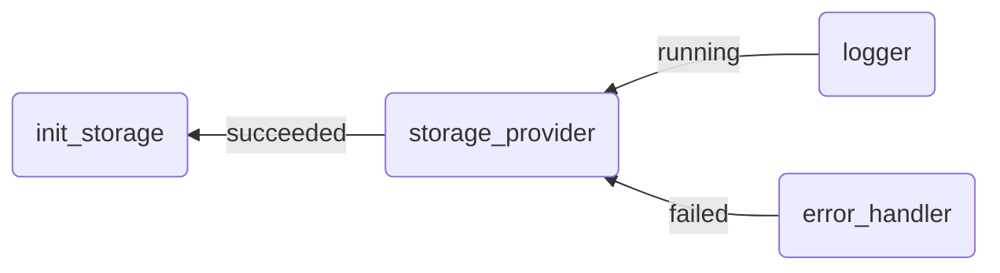

# Inter-workload dependencies

Ankaios allows a user to configure dependencies between workloads.

Ankaios supports two types of inter-workload dependencies:

- explicit inter-workload dependencies
- implicit inter-workload dependencies

The [explicit inter-workload dependencies](#explicit-inter-workload-dependencies) are configured by the user inside a workload's configuration and considered by Ankaios when starting a workload. Ankaios starts workloads having dependencies only when all of its dependencies are met. In this way, the user can define a specific sequence in which the workloads are started.

The [implicit inter-workload dependencies](#implicit-inter-workload-dependencies) are defined by Ankaios internally and considered when a dependency itself is deleted.

## Explicit inter-workload dependencies

Ankaios supports the following dependency types:

| Dependency type |  AddCondition         | meaning                                       |
| --------------- | --------------------- | --------------------------------------------- |
| running         | ADD_COND_RUNNING      | the dependency must be operational            |
| succeeded       | ADD_COND_SUCCEEDED    | the dependency must be exited successfully    |
| failed          | ADD_COND_FAILED       | the dependency must be failed                 |

A user defines one or multiple dependencies for an workload by configuring the `AddCondition` for each dependency within the field `dependencies`:

```yaml
logger:
  agent: agent_A
  runtime: podman
  dependencies:
    storage_provider: ADD_COND_RUNNING
  ...
```

Ankaios starts the workload `logger` when the `storage_provider` is operational. As long as the workload has unmet dependencies, its ExecutionState is `Pending(WaitingToStart)`.

!!! Note

    Ankaios rejects manifests and workload configurations with dependencies forming a cycle. A manifest is only valid when its workloads and their dependencies form an acyclic directed graph.

The following example use case shows how to use the dependency types to configure inter-workload dependencies:



A logging service expects a storage provider to be started first and to be in an operational state, because the logging service requires a storage to which it can write logs. The start of the storage provider itself must wait until the initialization of the storage has been completed (init_storage). In case of a failure of the storage provider an error handler is started to handle the errors.

The following Ankaios manifest contains the configuration of each workload with its dependencies:

```yaml linenums="1" hl_lines="6 7 15 16 31 32"
apiVersion: v0.1
workloads:
  logger:
    runtime: podman
    agent: agent_A
    dependencies:
      storage_provider: ADD_COND_RUNNING # (1)
    runtimeConfig: |
      image: alpine:latest
      commandOptions: [ "--entrypoint", "/bin/sleep" ]
      commandArgs: [ "3" ]
  storage_provider:
    runtime: podman
    agent: agent_B
    dependencies:
      init_storage: ADD_COND_SUCCEEDED # (2)
    runtimeConfig: |
      image: alpine:latest
      commandOptions: [ "--entrypoint", "/bin/sh" ]
      commandArgs: [ "-c", "sleep 5; exit 1" ]
  init_storage: # (3)
    runtime: podman
    agent: agent_B
    runtimeConfig: |
      image: alpine:latest
      commandOptions: [ "--entrypoint", "/bin/sleep" ]
      commandArgs: [ "2" ]
  error_handler:
    runtime: podman
    agent: agent_A
    dependencies:
      storage_provider: ADD_COND_FAILED # (4)
    runtimeConfig: |
      image: alpine:latest
      commandArgs: [ "echo", "report failed storage provider"]
```

1. logger is only started when storage_provider is operational.
2. storage_provider is only started when init_storage has been completed successfully.
3. init_storage is started immediately since it has no dependencies to wait for.
4. error_handler is only started when storage_provider has been failed.

Workloads can also have dependencies that do not yet exist in the Ankaios state.

Let's assume that Ankaios is started with an Ankaios manifest containing all the workloads of the previous example besides the `error_handler`. Afterwards a user updates the desired state and adds the `restart_service` which restarts some workloads. The `restart_service` shall run when the `error_handler` has been completed.

The following Ankaios manifest contains the `restart_service` workload having a dependency to the `error_handler` which does not exist inside the current desired state:

```yaml
workloads:
  restart_service:
    runtime: podman
    agent: agent_B
    dependencies:
      error_handler: ADD_COND_SUCCEEDED
    runtimeConfig: |
      image: alpine:latest
      commandArgs: [ "echo", "restart of storage workloads"]
```

In this case Ankaios delays the start of the `restart_service` until the `error_handler` has reached the specified state.

## Implicit inter-workload dependencies

Ankaios automatically defines implicit dependencies internally to prevent a workload from failing or going into an undesired state when a dependency is requested to be deleted. They cannot be configured by the user itself. Implicit dependencies are only defined for dependencies on which other workloads depend on with dependency type `running`.

Ankaios does not explicitly delete a workload when its dependency is deleted. Instead, a delete of a dependency is delayed until all dependent workloads have been deleted. As long as the dependency cannot be deleted, it has the ExecutionState `Stopping(WaitingToStop)`.

In the previous example, the workload `logger` depends on the `storage_provider` with dependency type `running`. When the user deletes the dependency `storage_provider`, Ankaios delays the delete until the dependent workload `logger` is neither pending nor running.

!!! Note

    Ankaios does not define implicit dependencies for workloads having dependencies with dependency types `succeeded` and `failed`.
