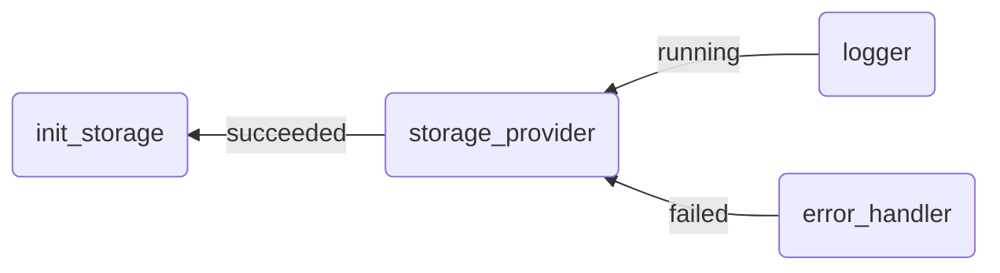

# Inter-workload dependencies

Ankaios enables users to configure dependencies between workloads.

There are two types of inter-workload dependencies supported by Ankaios:

- explicit
- implicit

The user configures [explicit inter-workload dependencies](#explicit-inter-workload-dependencies) within a workload's configuration, which Ankaios considers when starting the workload. Ankaios starts workloads with dependencies only when all dependencies are met, allowing the user to define a specific sequence for starting workloads.

Ankaios defines [implicit inter-workload dependencies](#implicit-inter-workload-dependencies) internally and takes them into account when a dependency is deleted.

## Explicit inter-workload dependencies

Ankaios supports the following dependency types:

| Dependency type |  AddCondition      | Description                                           |
| --------------- | ------------------ | ----------------------------------------------------- |
| running         | ADD_COND_RUNNING   | The dependency must be operational.                   |
| succeeded       | ADD_COND_SUCCEEDED | The dependency must be successfully exited.           |
| failed          | ADD_COND_FAILED    | The dependency must exit with a non-zero return code. |

The user configures the `AddCondition` for each dependency in the `dependencies` field to define one or multiple dependencies for a workload.

```yaml
apiVersion: v1
workloads:
  logger:
    agent: agent_A
    runtime: podman
    dependencies:
      storage_provider: ADD_COND_RUNNING
    ...
```

When the `storage_provider` is operational, Ankaios starts the `logger` workload. The ExecutionState of the workload remains `Pending(WaitingToStart)` until all dependencies are met.

!!! Note

    Ankaios rejects manifests and workload configurations with cyclic dependencies. A manifest is valid only when its workloads and dependencies form a directed acyclic graph.

This example demonstrates how to use dependency types to configure inter-workload dependencies:



The logging service requires an operational storage provider to write logs. Therefore, the storage provider must be started first and its initialization (init_storage) must be completed before starting the provider itself. In case of a failure, an error handler is started to manage errors.

The Ankaios manifest below includes the configuration of each workload and its dependencies:

```yaml linenums="1" hl_lines="6 7 15 16 31 32"
apiVersion: v1
workloads:
  logger:
    runtime: podman
    agent: agent_A
    dependencies:
      storage_provider: ADD_COND_RUNNING # (1)!
    runtimeConfig: |
      image: alpine:latest
      commandOptions: [ "--entrypoint", "/bin/sleep" ]
      commandArgs: [ "3" ]
  storage_provider:
    runtime: podman
    agent: agent_B
    dependencies:
      init_storage: ADD_COND_SUCCEEDED # (2)!
    runtimeConfig: |
      image: alpine:latest
      commandOptions: [ "--entrypoint", "/bin/sh" ]
      commandArgs: [ "-c", "sleep 5; exit 1" ]
  init_storage: # (3)!
    runtime: podman
    agent: agent_B
    runtimeConfig: |
      image: alpine:latest
      commandOptions: [ "--entrypoint", "/bin/sleep" ]
      commandArgs: [ "2" ]
  error_handler:
    runtime: podman
    agent: agent_A
    dependencies:
      storage_provider: ADD_COND_FAILED # (4)!
    runtimeConfig: |
      image: alpine:latest
      commandArgs: [ "echo", "report failed storage provider"]
```

1. The logger is started only when the storage provider is operational.
2. The storage provider is started only after the successful completion of init_storage.
3. init_storage starts immediately since it has no dependencies to wait for.
4. The error_handler is only started when the storage_provider has failed.

Workloads may have dependencies that do not currently exist in the Ankaios state.

Assuming Ankaios is started with a manifest containing all previous workloads except for the `error_handler`, a user can update the desired state by adding the `restart_service` workload. This workload restarts certain workloads and should run after the `error_handler` has completed. The following Ankaios manifest includes the `restart_service` workload, which depends on the non-existent `error_handler` in the current desired state:

```yaml
workloads:
  restart_service:
    runtime: podman
    agent: agent_B
    dependencies:
      error_handler: ADD_COND_SUCCEEDED
    runtimeConfig: |
      image: alpine:latest
      commandArgs: [ "echo", "restart of storage workloads"]
```

Ankaios delays the `restart_service` until the `error_handler` reaches the specified state.

## Implicit inter-workload dependencies

Ankaios automatically defines implicit dependencies to prevent a workload from failing or entering an undesired state when a dependency is deleted. These dependencies cannot be configured by the user. Ankaios only defines implicit dependencies for dependencies that other workloads depend on with the `running` dependency type.

Ankaios does not explicitly delete a workload when its dependency is deleted. Instead, Ankaios delays the deletion of a dependency until all dependent workloads have been deleted. The dependency will have the ExecutionState `Stopping(WaitingToStop)` as long as it cannot be deleted.

In the previous example, the workload `logger` depends on the `storage_provider` with a `running` dependency type. When the user updates or deletes the `storage_provider` dependency, Ankaios delays the deletion until the dependent workload `logger` is neither pending nor running.

If an update meets the delete conditions but not the add conditions, Ankaios will execute the delete operation directly without delaying the entire update.

!!! Note

    Ankaios does not define implicit dependencies for workloads that have dependencies with the `succeeded` and `failed` types.
