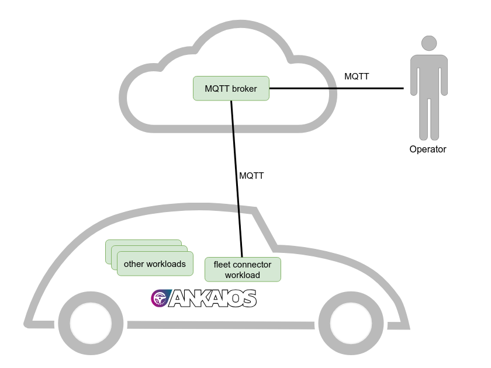

# Tutorial: Manage a fleet of vehicles from the cloud

## Introduction

This tutorial will show you how to manage a fleet of vehicles running Ankaios. We will remotely start new workloads on a vehicle and update existing ones.
This tutorial assumes that the reader is familiar with the basics of Ankaios showcased in the tutorial [Sending and Receiving Vehicle Signals](tutorial-vehicle-signals.md).

To connect the vehicles to the cloud, we use an MQTT connection. Each vehicle connects to a central MQTT broker. The connection from the vehicle is established by a fleet connector workload managed by Ankaios. The benefit of using an Ankaios workload is that workloads have direct access to the Ankaios control interface, allowing them to start, stop and update other workloads.

<figure markdown>
  
  <figcaption>Fleet management overview</figcaption>
</figure>

To complete this tutorial, you will need a Linux platform, which can be a WSL2, RaspberryPi, a Linux PC or a virtual machine.
It's also assumed that the Ankaios setup is done with mutual TLS (mTLS) disabled or using the default installation settings.

## MQTT broker

In the real world, the MQTT broker would reside in the cloud, but for this tutorial, we set up an MQTT broker on the local machine using the existing Eclipse Mosquitto container image. The container is started with Podman directly to emulate that it is running outside of the vehicle.

```shell
podman run -d --net=host docker.io/eclipse-mosquitto:2.0.20
```

This will start a broker on localhost listening on port 1883. For production use cases, MQTT would use TLS and access control, which is skipped here for simplicity.

We separate the messages for the different vehicles by using the following topic scheme:

```text
vehicle/<VIN>/
```

Our example vehicle is assigned VIN 1. Let's listen to all messages to and from this vehicle by subscribing to the topic `vehicle/1/#`:

```shell
podman run --net=host docker.io/eclipse-mosquitto:2.0.20 mosquitto_sub -h localhost -t "vehicle/1/#" -v
```

For now no messages will be shown in this window, but keep it open for the duration of this tutorial to observe the communication, once we proceed with the following steps.

## Fleet connector

The fleet connector is a containerized workload managed by Ankaios. It will have two connections:

1. MQTT connection to the cloud in order to receive messages for starting, stopping and updating workloads in the vehicle and to return the response.
2. Connection to the Ankaios' [control interface](../reference/control-interface.md) in order to execute the instructions to start, stop and update workloads.

The control interface is made available to each workload via named pipes (FIFO) using a protobuf IDL. In this tutorial, we will use the Ankaios SDK for Python, [ank-sdk-python](https://github.com/eclipse-ankaios/ank-sdk-python), which provides a convenient way to access the control interface.

Let's take a look at the Fleet Connector implementation:

```python
from ankaios_sdk import Workload, Ankaios, WorkloadStateEnum, WorkloadSubStateEnum, AnkaiosLogLevel, Manifest, Request, CompleteState
import paho.mqtt.client as mqtt
import json
import os
import logging
import sys

logger = logging.getLogger("fleetconnector")
stdout = logging.StreamHandler(stream=sys.stdout)
stdout.setLevel(logging.INFO)
logger.addHandler(stdout)
logger.setLevel(logging.INFO)

# Configuration for MQTT  broker and topics
BROKER = os.environ.get('MQTT_BROKER_ADDR', 'localhost')
PORT = int(os.environ.get('MQTT_BROKER_PORT', '1883'))
VEHICLE_ID = os.environ.get('VIN')
BASE_TOPIC = f"vehicle/{VEHICLE_ID}"

# Create a new Ankaios object.
# The connection to the control interface is automatically done at this step.
# The Ankaios class supports context manager syntax:
with Ankaios() as ankaios:

    # Callback when the client receives a CONNACK response from the MQTT server
    def on_connect(client, userdata, flags, reason_code, properties):
        client.subscribe(f"{BASE_TOPIC}/manifest/apply/req")
        client.subscribe(f"{BASE_TOPIC}/manifest/delete/req")
        client.subscribe(f"{BASE_TOPIC}/state/req")

    # Callback when a PUBLISH message is received from the MQTT server
    def on_message(client, userdata, msg):
        try:
            logger.info(f"Received message on topic {msg.topic} with payload {msg.payload.decode()}")
            # Handle request for applying a manifest
            if msg.topic == f"{BASE_TOPIC}/manifest/apply/req":
                manifest = Manifest.from_string(str(msg.payload.decode()))
                ret = ankaios.apply_manifest(manifest)
                if ret is not None:
                    client.publish(f"{BASE_TOPIC}/manifest/apply/resp", json.dumps(ret.to_dict()))
            # Handle request for deleting a manifest
            elif msg.topic == f"{BASE_TOPIC}/manifest/delete/req":
                manifest = Manifest.from_string(str(msg.payload.decode()))
                ret = ankaios.delete_manifest(manifest)
                if ret is not None:
                    client.publish(f"{BASE_TOPIC}/manifest/delete/resp", json.dumps(ret.to_dict()))
            # Handle request for getting the state of Ankaios
            elif msg.topic == f"{BASE_TOPIC}/state/req":
                state = ankaios.get_state(field_masks=json.loads(str(msg.payload.decode())))
                client.publish(f"{BASE_TOPIC}/state/resp", json.dumps(state.to_dict()))
        except Exception as e:
            logger.error(f"Error processing message: {e}")

    # Create an MQTT client instance
    mqtt_client = mqtt.Client(mqtt.CallbackAPIVersion.VERSION2)

    # Assign the callbacks
    mqtt_client.on_connect = on_connect
    mqtt_client.on_message = on_message

    # Connect to the MQTT broker
    mqtt_client.connect(BROKER, PORT, 60)

    # Blocking call that processes network traffic, dispatches callbacks,
    # and handles reconnecting.
    mqtt_client.loop_forever()
```

This Python script runs inside a container managed by Ankaios. Using

```python
with Ankaios() as ankaios:
```

the script connects to the Ankaios control interface. After connecting to the MQTT broker using

```python
mqtt_client.connect(BROKER, PORT, 60)
```

the script will listen for incoming MQTT messages.

* **`vehicle/<VIN>/manifest/apply/req`**: This topic allows a remote operator to send an Ankaios manifest that will be applied by the fleet connector using

    ```python
    ret = ankaios.apply_manifest(manifest)
    ```

* **`vehicle/<VIN>/manifest/delete/req`**: This topic allows a remote operator to send an Ankaios manifest that will be deleted by the fleet connector using

    ```python
    ret = ankaios.delete_manifest(manifest)
    ```

* **`vehicle/<VIN>/state/req`**: Using this topic a remote operator can request the current Ankaios state from the fleet connector using

    ```python
     state = ankaios.get_state(field_masks=json.loads(str(msg.payload.decode())))
    ```

    The field mask must be provided in JSON format in the message. We will see an example later in this tutorial.

The full source code for the fleet connector is available in the [Ankaios repository](https://github.com/eclipse-ankaios/ankaios/tree/main/tools/tutorial_fleet_management/fleet-connector). The Ankaios SDK for python provides many more features as shown in its [documentation](https://eclipse-ankaios.github.io/ank-sdk-python/). Be sure to use the correct version of the SDK that matches the version of Ankaios you are using.

## Deploying the fleet connector

If you have not yet installed Ankaios, please follow the instructions [here](installation.md).
The following examples assume that the installation script was used with the default options.

We want the fleet connector to run when the vehicle is started and Ankaios is started. Therefore, we add the fleet connector to the startup configuration for Ankaios. Modify `/etc/ankaios/state.yaml` to include:

```yaml title="/etc/ankaios/state.yaml"
apiVersion: v0.1
workloads:
  fleetconnector:
    runtime: podman
    agent: agent_A
    controlInterfaceAccess:
      allowRules:
        - type: StateRule
          operation: ReadWrite
          filterMask:
            - "*"
    restartPolicy: NEVER
    runtimeConfig: |
      image: ghcr.io/eclipse-ankaios/fleet-connector:0.5.3
      commandOptions: [ "--net=host", "-e", "VIN=1"]
```

Since the fleet connector needs to access the Ankaios control interface, we need to allow this with the `controlInterfaceAccess` section in the manifest.
See the [reference documentation](../../reference/_ankaios.proto/#controlinterfaceaccess) for more information on that.

Now we start Ankaios with:

```shell
sudo systemctl start ank-server ank-agent
```

And we check that the fleet connector is up and running with:

```shell
ank -k get workloads
```

## Remote installation of a vehicle data sender

Now we want to use the fleet connector to remotely install a new containerized workload on the vehicle. The workload is called `vehicle-data-sender`. It will send a (random) speed value to the MQTT broker in the cloud. The full source code of the vehicle data sender is available in the [Ankaios repository](https://github.com/eclipse-ankaios/ankaios/tree/main/tools/tutorial_fleet_management/vehicle-data-sender).

First, we need to create a manifest and name that file `vehicle-data-sender.yaml`:

```yaml title="vehicle-data-sender.yaml"
apiVersion: v0.1
workloads:
  vehicle-data-sender:
    runtime: podman
    restartPolicy: NEVER
    agent: agent_A
    configs:
      c: vehicle-data-sender-config
    runtimeConfig: |
      image: ghcr.io/eclipse-ankaios/vehicle-data-sender:0.1.0
      commandOptions:
        - "--net=host"
        {{#each c.env}}
        - "-e"
        - "{{key}}={{value}}"
        {{/each}}
configs:
  vehicle-data-sender-config:
    env:
      - key: MQTT_BROKER_ADDR
        value: localhost
      - key: MQTT_BROKER_PORT
        value: "1883"
      - key: TOPIC
        value: vehicle/1/sensors/speed
      - key: INTERVAL
        value: "1"
```

In this manifest, we separate the config from the workload so that we can easily update them separately later.
The config items can be referenced in the `agent` and `runtimeConfig` workload fields using the [handlebars template language](https://handlebarsjs.com).
For all supported fields and syntax, see the corresponding chapter in the [reference documentation](https://eclipse-ankaios.github.io/ankaios/main/reference/startup-configuration/).

Then we send this file via MQTT to the `vehicle/1/manifest/apply/req` topic:

```shell
TOPIC=vehicle/1/manifest/apply/req
FILE=vehicle-data-sender.yaml
podman run --rm --net=host -v $PWD/$FILE:/$FILE docker.io/eclipse-mosquitto:2.0.20 mosquitto_pub -h localhost -t "$TOPIC" -f $FILE
```

The fleet connector will receive this message and use the Ankaios control interface to apply this manifest. Looking at the previous window where we subscribed to MQTT topics, we can see that we are receiving messages from the vehicle data sender, such as

```text
vehicle/1/sensors/speed 1
vehicle/1/sensors/speed 2
vehicle/1/sensors/speed 3
...
```

We can also remotely request the workload states from the fleet connector by sending a message to the `vehicle/1/state/req` topic. Our fleet connector requires the object field mask in the message and so we send `["workloadStates"]`:

```shell
TOPIC=vehicle/1/state/req
MSG='["workloadStates"]'
podman run --rm --net=host docker.io/eclipse-mosquitto:2.0.20 mosquitto_pub -h localhost -t "$TOPIC" -m "$MSG"
```

In the windows with the MQTT subscription, we can see the state arriving as a JSON object using the topic `vehicle/1/state/resp`.

## Remote re-configuration of the vehicle data sender

Maybe sending speed values to the cloud once per second is a little too often. To change the interval we just need to change the config.

Let's create a new file `config.yaml` with just the config for the vehicle data sender and increase the interval to 10 seconds.

```yaml title="config.yaml" hl_lines="11-12"
apiVersion: v0.1
configs:
  vehicle-data-sender-config:
    env:
      - key: MQTT_BROKER_ADDR
        value: localhost
      - key: MQTT_BROKER_PORT
        value: "1883"
      - key: TOPIC
        value: vehicle/1/sensors/speed
      - key: INTERVAL
        value: "10"
```

Then we just have to publish the new manifest:

```shell
TOPIC=vehicle/1/manifest/apply/req
FILE=config.yaml
podman run --rm --net=host -v $PWD/$FILE:/$FILE docker.io/eclipse-mosquitto:2.0.20 mosquitto_pub -h localhost -t "$TOPIC" -f $FILE
```

Upon receiving the new config via the fleet connector, Ankaios will stop and restart the `vehicle-data-sender` with the new config. After a few seconds we can see that the speed value is now published every 10 seconds.

## Remote deletion of a workload

Now that we have received enough vehicle sensor data, we can delete the `vehicle-data-sender` workload.
We can also do this remotely using the fleet connector.
Just publish the manifest with the workload and config from the previous sections to the `vehicle/1/manifest/delete/req` topic:

```shell
TOPIC=vehicle/1/manifest/delete/req
FILE=vehicle-data-sender.yaml
podman run --rm --net=host -v $PWD/$FILE:/$FILE docker.io/eclipse-mosquitto:2.0.20 mosquitto_pub -h localhost -t "$TOPIC" -f $FILE
```

## Conclusion

This tutorial presented a simple way to manage a fleet of vehicles using Ankaios as an embedded container and workload orchestrator. A sample fleet connector was created using some of the features of the Ankaios SDK for Python. In the near future there will also be an [Ankaios SDK for Rust](https://github.com/eclipse-ankaios/ank-sdk-rust).

If you have questions or want to to discuss a specific use case, you can contact the Ankaios maintainers via [Slack](https://join.slack.com/t/ankaios/shared_invite/zt-2inyhbehh-iVp3YZD09VIgybv8D1gDpQ) or [Github discussions](https://github.com/eclipse-ankaios/ankaios/discussions) (see also [Support](../support.md)).
