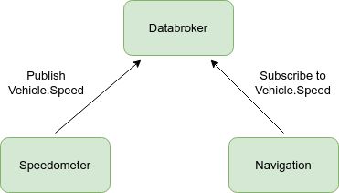
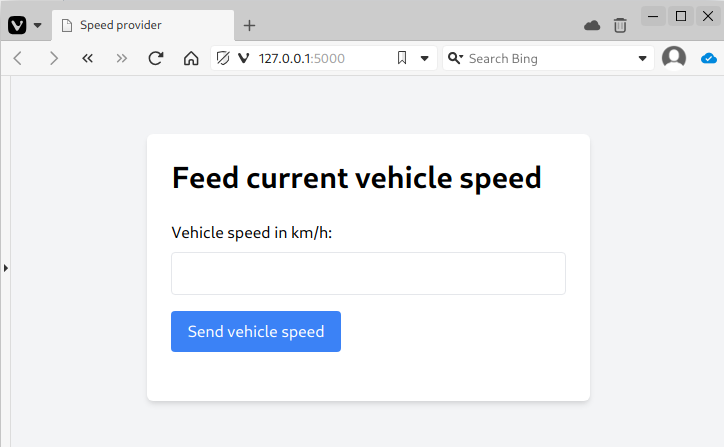

# Tutorial: Sending and receiving vehicle signals

## Introduction

In this tutorial, we will show you how to use Ankaios to set up workloads that publish and subscribe to vehicle signals in accordance with the [Vehicle Signal Specification (VSS)](https://covesa.github.io/vehicle_signal_specification/).
The central workload will be a databroker from the [Kuksa.val project](https://github.com/eclipse/kuksa.val). It will receive vehicle speed signals published from a speed provider workload. Finally a speed consumer workload will consume those speed limits.

<figure markdown>
  
  <figcaption>Overview of workloads</figcaption>
</figure>

To run this tutorial you will need a Linux platform, which can be a RaspberryPi or a Linux PC or virtual machine.
Additionally, it's assumed that the Ankaios setup is done with mutual TLS (mTLS) disabled or using its default installation settings.

## Start the databroker

If you have not yet installed Ankaios, please follow the instructions [here](https://eclipse-ankaios.github.io/ankaios/latest/usage/installation/).
The following examples assume that the installation script has been used with the default options.

Make sure that Ankaios server and agent are started:

```shell
sudo systemctl start ank-server
sudo systemctl start ank-agent
```

Now we have Ankaios up and running with a server and an agent.
To run the databroker we need to create an Ankaios manifest:

```yaml title="databroker.yaml"
apiVersion: v0.1
workloads:
  databroker:
    runtime: podman
    agent: agent_A
    runtimeConfig: |
      image: ghcr.io/eclipse/kuksa.val/databroker:0.4.1
      commandArgs: ["--insecure"]
      commandOptions: ["--net=host"]
```

This defines a workload `databroker` to be scheduled on agent `agent_A` (default agent name when using standard installation procedure) using the runtime `podman`.
See the [reference documentation](https://eclipse-ankaios.github.io/ankaios/latest/reference/startup-configuration/#configuration-structure) for the other attributes.

Let's have a look at the `runtimeConfig` which in this case is specific for the `podman` runtime.

* `image: ghcr.io/eclipse/kuksa.val/databroker:0.4.1` specifies the container image according to the OCI image format. Fortunately, the Kuksa.val project already provides an image for the databroker that we can use here.
* `commandArgs: ["--insecure"]`: These are command arguments which are passed to the container, in this case to the container's entrypoint. As we are not using authentication for the databroker we pass the argument `--insecure`.
* `commandOptions: ["--net=host"]`: These options are passed to the `podman run` command. We want to use the host network for the databroker.

Store the Ankaios manifest listed above in a file `databroker.yaml`.

Then start the workload:

```shell
ank -k apply databroker.yaml
```

!!! Note

    The instructions assume the default installation without mutual TLS (mTLS) for communication. With `-k` or `--insecure` the `ank` CLI will connect without mTLS. Alternatively, set the environment variable `ANK_INSECURE=true` to avoid passing the argument to each `ank` CLI command. For an Ankaios setup with mTLS, see [here](./mtls-setup.md).

The Ankaios agent `agent_A` will now instruct podman to start the workload.
The command waits until the databroker is running.
It should finally print:

```text
 WORKLOAD NAME   AGENT     RUNTIME     EXECUTION STATE   ADDITIONAL INFO
 databroker      agent_A   podman      Running(Ok)
```

## Start the speed provider

Now we want to start a workload that publishes vehicle speed values and call that `speed-provider`.

```yaml title="speed-provider.yaml"
apiVersion: v0.1
workloads:
  speed-provider:
    runtime: podman
    agent: agent_A
    runtimeConfig: |
      image: ghcr.io/eclipse-ankaios/speed-provider:0.1.1
      commandOptions:
        - "--net=host"
```

The source code for that image is available in the [Anakios repo](https://github.com/eclipse-ankaios/ankaios/tree/main/tools/tutorial_vehicle_signals).

Start the workload with:

```shell
ank -k apply speed-provider.yaml
```

The command waits until the speed-provider is running.
It should finally print:

```text
 WORKLOAD NAME    AGENT     RUNTIME     EXECUTION STATE   ADDITIONAL INFO
 speed-provider   agent_A   podman      Running(Ok)
```

The speed-provider workload provides a web UI that allows the user to enter a speed value that is then sent to the databroker. The web UI is available on <http://127.0.0.1:5000>. If your web browser is running on a different host than the Ankaios agent, replace 127.0.0.1 with the IP address of the host running the Ankaios agent.

<figure markdown>
  
  <figcaption>Speed provider web UI</figcaption>
</figure>

## Add an agent

We currently have an agent running as part of the Ankaios cluster, running the databroker and the speed provider.
The next workload we want to start is a speed consumer that consumes vehicle speed values.
A speed consumer such as a navigation system typically runs on a separate node for infotainment.  A separate node requires a new Ankaios agent.
Let's create another Ankaios agent to connect to the existing server.
For this tutorial we can either use a separate Linux host or use the existing one.
Start a new agent with:

```shell
ank-agent -k --name infotainment --server-url http://<SERVER_IP>:25551
```

If the agent is started on the same host as the existing Ankaios server and agent, then we will call it as follows:

```shell
ank-agent -k --name infotainment --server-url http://127.0.0.1:25551
```

As the first agent was started by systemd, it runs as root and therefore calls podman as root.
The second agent is started by a non-root user and therefore also uses podman in user mode.
Ankaios does not need root privileges and can be started as any user.

Now we have two agents runnings in the Ankaios cluster, `agent_A` and `infotainment`.

For the next steps we need to keep this terminal untouched in order to keep the agent running.

## Start the speed consumer

Now we can start a speed-consumer workload on the new agent:

```yaml title="speed-consumer.yaml"
apiVersion: v0.1
workloads:
  speed-consumer:
    runtime: podman
    runtimeConfig: |
      image: ghcr.io/eclipse-ankaios/speed-consumer:0.1.2
      commandOptions:
        - "--net=host"
        - "-e"
        - "KUKSA_DATA_BROKER_ADDR=127.0.0.1"
```

In case the speed-consumer workload is not running on the same host as the databroker you need to adjust the `KUKSA_DATA_BROKER_ADDR`.

Note that this time the image does not specify the agent.
While we could add `agent: infotainment`, this time we pass the agent name when the workload starts:

```shell
ank -k apply --agent infotainment speed-consumer.yaml
```

!!! note

    If you are running the ank command on a host that is different from the host
    on which the Ankaios server is running, you need to add a parameter `-s <SERVER_URL>` like:

    ```
    ank -k apply -s http://127.0.0.1:25551 --agent infotainment speed-consumer.yaml
    ```

    Optionally the server URL can also be provided via environment variable:

    ```
    export ANK_SERVER_URL=http://127.0.0.1:25551
    ank -k apply --agent infotainment speed-consumer.yaml
    ```

The command waits until speed consumer is running.
It should print:

```text
 WORKLOAD NAME    AGENT          RUNTIME     EXECUTION STATE   ADDITIONAL INFO
 speed-consumer   infotainment   podman      Running(Ok)
```

We can check all running workloads with

```shell
ank -k get workloads
```

The output should be:

```text
 WORKLOAD NAME    AGENT          RUNTIME   EXECUTION STATE   ADDITIONAL INFO
 databroker       agent_A        podman    Running(Ok)
 speed-consumer   infotainment   podman    Running(Ok)
 speed-provider   agent_A        podman    Running(Ok)
```

## Reading workload logs

The speed-consumer workload subscribes to the vehicle speed signal and prints it to stdout.
Use the web UI of the speed-provider to send a few vehicle speed values and watch the log messages of the speed-consumer.
As the logs are specific for a runtime, we use Podman to read the logs:

```shell
podman logs -f $(podman ps -a | grep speed-consumer | awk '{print $1}')
```

!!! info

    If you want to see the logs of the databroker or speed-provider you need to use `sudo podman` instead of `podman` (two occurences) as those workloads run on podman as root on agent_A.

Now, we want to change the existing Ankaios manifest of the speed-provider to use auto mode which sends a new speed limit value every second.

```yaml title="speed-provider.yaml" hl_lines="10 11"
apiVersion: v0.1
workloads:
  speed-provider:
    runtime: podman
    agent: agent_A
    runtimeConfig: |
      image: ghcr.io/eclipse-ankaios/speed-provider:0.1.1
      commandOptions:
        - "--net=host"
        - "-e"
        - "SPEED_PROVIDER_MODE=auto"
```

We apply the changes with:

```shell
ank -k apply speed-provider.yaml
```

and recognize that we get a new speed value every 1 second.

## Ankaios state

Previously we have used `ank -k get workloads` to a get list of running workloads.
Ankaios also maintains a current state which can be retrieved with:

```shell
ank -k get state
```

Let's delete all workloads and check the state again:

```shell
ank -k delete workload databroker speed-provider speed-consumer
ank -k get state
```

If we want to start the three workloads on startup of the Ankaios server and agents we need to create a startup manifest file.
In the default installation this file is `/etc/ankaios/state.yaml` as we can see in the systemd until file of the Ankaios server:

```shell
$ systemctl cat ank-server
# /etc/systemd/system/ank-server.service
[Unit]
Description=Ankaios server

[Service]
Environment="RUST_LOG=info"
ExecStart=/usr/local/bin/ank-server --insecure --startup-config /etc/ankaios/state.yaml

[Install]
WantedBy=default.target
```

Now we create a startup manifest file containing all three workloads:

```yaml title="/etc/ankaios/state.yaml" hl_lines="13 14 24 25"
apiVersion: v0.1
workloads:
  databroker:
    runtime: podman
    agent: agent_A
    runtimeConfig: |
      image: ghcr.io/eclipse/kuksa.val/databroker:0.4.1
      commandArgs: ["--insecure"]
      commandOptions: ["--net=host"]
  speed-provider:
    runtime: podman
    agent: agent_A
    dependencies:
      databroker: ADD_COND_RUNNING
    runtimeConfig: |
      image: ghcr.io/eclipse-ankaios/speed-provider:0.1.1
      commandOptions:
        - "--net=host"
        - "-e"
        - "SPEED_PROVIDER_MODE=auto"
  speed-consumer:
    runtime: podman
    agent: infotainment
    dependencies:
      databroker: ADD_COND_RUNNING
    runtimeConfig: |
      image: ghcr.io/eclipse-ankaios/speed-consumer:0.1.2
      commandOptions:
        - "--net=host"
        - "-e"
        - "KUKSA_DATA_BROKER_ADDR=127.0.0.1"
```

As the speed-provider and the speed-consumer shall only be started after the databroker is running, we have added dependencies:

```yaml
dependencies:
  databroker: ADD_COND_RUNNING
```

The next time the Ankaios server and the two agents will be started, this startup config will be applied.
