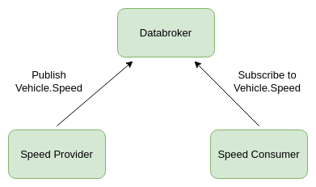

# Tutorial: Sending and receiving vehicle signals

## Introduction

In this tutorial, we will show you how to use Ankaios to set up workloads that publish and subscribe to vehicle signals in accordance with the [Vehicle Signal Specification (VSS)](https://covesa.github.io/vehicle_signal_specification/).
The central workload will be a databroker from the [Kuksa.val project](https://github.com/eclipse/kuksa.val). It will receive vehicle speed signals published from a speedometer workload. Finally a navigation workload will consume those speed limits.

<figure markdown>
  
  <figcaption>Overview of workloads</figcaption>
</figure>

To run this tutorial you will need a Linux platform, which can be a RaspberryPi or a Linux PC or virtual machine.

## Start the databroker

If you have not yet installed Ankaios, please follow the instructions [here](https://eclipse-ankaios.github.io/ankaios/latest/usage/installation/).
The following examples assume that the installation script has been used with the default options.

Make sure that Ankaios server and agent are started:

```shell
sudo systemctl start ank-server
sudo systemctl start ank-agent
```

Now we have Ankaios up and running with a server and an agent.
To run the databroker we need to create an Ankaios manifest:

```yaml title="databroker.yaml"
workloads:
  databroker:
    runtime: podman
    agent: agent_A
    restart: true
    updateStrategy: AT_MOST_ONCE
    accessRights:
      allow: []
      deny: []
    tags: []
    runtimeConfig: |
      image: ghcr.io/eclipse/kuksa.val/databroker:0.4.1
      commandArgs: ["--insecure"]
      commandOptions: ["--net=host"]
```

This defines a workload `databroker` to be scheduled on agent `agent_A` (default agent name when using standard installation procedure) using the runtime `podman`.
See the [reference documentation](https://eclipse-ankaios.github.io/ankaios/latest/reference/startup-configuration/#configuration-structure) for the other attributes.

Let's have a look at the `runtimeConfig` which in this case is specific for the `podman` runtime.

* `image: ghcr.io/eclipse/kuksa.val/databroker:0.4.1` specifies the container image according to the OCI image format. Fortunately, the Kuksa.val project already provides an image for the databroker that we can use here.
* `commandArgs: ["--insecure"]`: These are command arguments which are passed to the container, in this case to the container's entrypoint. As we are not using authentication for the databroker we pass the argument `--insecure`.
* `commandOptions: ["--net=host"]`: These options are passed to the `podman run` command. We want to use the host network for the databroker.

Store the Ankaios manifest listed above in a file `databroker.yaml`.

Then start the workload:

```shell
ank apply databroker.yaml
```

The Ankaios agent `agent_A` will now instruct podman to start the workload.
We can watch the result with:

```shell
$ ank get workloads
 WORKLOAD NAME   AGENT     RUNTIME   EXECUTION STATE
 databroker      agent_A   podman    Running
```

## Start the speedometer

Now we want to start a workload that publishes vehicle speed values and call that `speedometer`.

```yaml title="speedometer.yaml"
workloads:
  speedometer:
    runtime: podman
    agent: agent_A
    restart: true
    updateStrategy: AT_MOST_ONCE
    accessRights:
      allow: []
      deny: []
    tags: []
    runtimeConfig: |
      image: ghcr.io/eclipse-ankaios/speedometer:0.1.0
      commandOptions:
        - "--net=host"
        - "-e"
        - "SPEEDOMETER_INTERVAL=1"
```

The source code for that image is available in the [Anakios repo](https://github.com/eclipse-ankaios/ankaios/tree/main/tools/tutorial_vehicle_signals).

We start the workload with:

```shell
ank apply speedometer.yaml
```

Now the workload is started and sends a new vehicle speed value every second.

```shell
$ ank get workloads
 WORKLOAD NAME   AGENT     RUNTIME   EXECUTION STATE
 databroker      agent_A   podman    Running
 speedometer     agent_A   podman    Running
```

## Add an agent

We currently have an agent running as part of the Ankaios cluster, running the databroker and the speedometer.
The next workload we want to start is a navigation system that consumes vehicle speed values.
A navigation system usually runs on a separate node for infotainment. A separate node requires a new Ankaios agent.
Let's create another Ankaios agent to connect to the existing server.
For this tutorial we can either use a separate Linux host or use the existing one.
Start a new agent with:

```shell
ank-agent --name infotainment --server-url http://<SERVER_IP>:25551
```

If the agent is started on the same host as the existing Ankaios server and agent, then we will call it as follows:

```shell
ank-agent --name infotainment --server-url http://127.0.0.1:25551
```

As the first agent was started by systemd, it runs as root and therefore calls podman as root.
The second agent is started by a non-root user and therefore also uses podman in user mode.
Ankaios does not need root privileges and can be started as any user.

Now we have two agents runnings in the Ankaios cluster, `agent_A` and `infotainment`.

For the next steps we need to keep this terminal untouched in order to keep the agent running.

## Start the navigation

Now we can start a navigation workload as vehicle speed consumer on the new agent:

```yaml title="navigation.yaml"
workloads:
  navigation:
    runtime: podman
    restart: true
    updateStrategy: AT_MOST_ONCE
    accessRights:
      allow: []
      deny: []
    tags: []
    runtimeConfig: |
      image: ghcr.io/eclipse-ankaios/speed-consumer:0.1.0
      commandOptions:
        - "--net=host"
        - "-e"
        - "KUKSA_DATA_BROKER_ADDR=127.0.0.1"
```

In case the navigation workload is not running on the same host as the databroker you need to adjust the `KUKSA_DATA_BROKER_ADDR`.

Note that this time the image does not specify the agent.
While we could add `agent: infotainment`, this time we pass the agent name when the workload starts:

```shell
ank apply --agent infotainment navigation.yaml
```

!!! note

    If you are running the ank command on a host that is different from the host
    on which the Ankaios server is running, you need to add a parameter `-s <SERVER_URL>` like:

    ```
    ank apply -s http://127.0.0.1:25551 --agent infotainment navigation.yaml
    ```

    Optionally the server URL can also be provided via environment variable:

    ```
    export ANK_SERVER_URL=http://127.0.0.1:25551
    ank apply --agent infotainment navigation.yaml
    ```

And we check that the new workload is running:

```shell
$ ank get workloads
 WORKLOAD NAME   AGENT      RUNTIME   EXECUTION STATE
 databroker      agent_A    podman    Running
 speedometer     agent_A    podman    Running
 navigation      infotainment podman    Running
```

## Reading workload logs

The navigation workload subscribes to the vehicle speed signal and prints it to stdout.
As the logs are specific for a runtime, we use Podman to read the logs

```shell
podman logs -f $(podman ps -a | grep navigation | awk '{print $1}')
```

!!! info

    If you want to see the logs of the databroker or speedometer you need to use `sudo podman` instead of `podman` (two occurences) as those workloads run on podman as root on agent_A.

Now, in the existing file, we want to change the interval for the speedometer:

```yaml title="speedometer.yaml" hl_lines="16"
workloads:
  speedometer:
    runtime: podman
    agent: agent_A
    restart: true
    updateStrategy: AT_MOST_ONCE
    accessRights:
      allow: []
      deny: []
    tags: []
    runtimeConfig: |
      image: ghcr.io/eclipse-ankaios/speedometer:0.1.0
      commandOptions:
        - "--net=host"
        - "-e"
        - "SPEEDOMETER_INTERVAL=0.5"
```

We apply the changes with:

```shell
ank apply speedometer.yaml
```

and recognize that we get a new speed value every 0.5 seconds.

## Ankaios state

Previously we have used `ank get workloads` to a get list of running workloads.
Ankaios also maintains a current state which can be retrieved with:

```shell
ank get state
```

Let's delete all workloads and check the state again:

```shell
ank delete workload databroker speedometer navigation
ank get state
```

If we want to start the three workloads on startup of the Ankaios server and agents we need to create a startup state file.
In the default installation this file is `/etc/ankaios/state.yaml` as we can see in the systemd until file of the Ankaios server:

```shell
$ systemctl cat ank-server
# /etc/systemd/system/ank-server.service
[Unit]
Description=Ankaios server

[Service]
ExecStart=/usr/local/bin/ank-server --startup-config /etc/ankaios/state.yaml

[Install]
WantedBy=default.target
```

Now we create a startup state file containing all three workloads:

```yaml title="/etc/ankaios/state.yaml" hl_lines="24 25 41 42"
workloads:
  databroker:
    runtime: podman
    agent: agent_A
    restart: true
    updateStrategy: AT_MOST_ONCE
    accessRights:
      allow: []
      deny: []
    tags: []
    runtimeConfig: |
      image: ghcr.io/eclipse/kuksa.val/databroker:0.4.1
      commandArgs: ["--insecure"]
      commandOptions: ["--net=host"]
  speedometer:
    runtime: podman
    agent: agent_A
    restart: true
    updateStrategy: AT_MOST_ONCE
    accessRights:
      allow: []
      deny: []
    tags: []
    dependencies:
      databroker: ADD_COND_RUNNING
    runtimeConfig: |
      image: ghcr.io/eclipse-ankaios/speedometer:0.1.0
      commandOptions:
        - "--net=host"
        - "-e"
        - "SPEEDOMETER_INTERVAL=1"
  navigation:
    runtime: podman
    agent: infotainment
    restart: true
    updateStrategy: AT_MOST_ONCE
    accessRights:
      allow: []
      deny: []
    tags: []
    dependencies:
      databroker: ADD_COND_RUNNING
    runtimeConfig: |
      image: ghcr.io/eclipse-ankaios/speed-consumer:0.1.0
      commandOptions:
        - "--net=host"
        - "-e"
        - "KUKSA_DATA_BROKER_ADDR=127.0.0.1"
```

As the speedometer and the navigation shall only be started after the databroker is running, we have added dependencies:

```yaml
dependencies:
  databroker: running
```

The next time the Ankaios server and the two agents will be started, this startup config will be applied.
