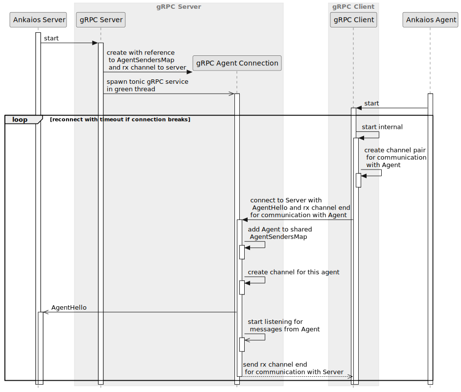
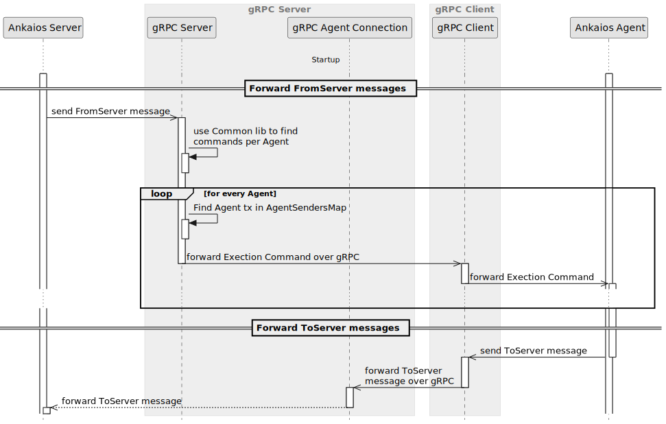
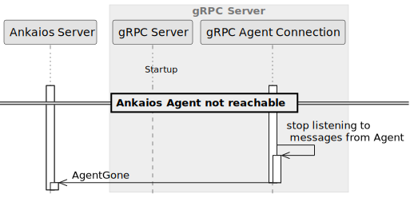

# gRPC Communication Middleware - SW Design

## About this document

This document describes the Software Design for the gRPC Communication Middleware.

## Context View

The gRPC Communication Middleware is a specific implementation of the Ankaios Communication Middleware. It is responsible for handling the communication between an instance of the Ankaios Server and the Agents connected to it including the initial connection of an Agent.

The Ankaios Communication Middleware is specified by two interfaces defined by the Common Library. The gRPC Communication Middleware implements these interfaces.

The Communication Middleware interfaces define how the middleware is started and how data flows in and out of it. To be able to have an easily exchangeable middleware and at the same time reduce the amount of code, the data flow is going through the Communication Channels also defined by the Common library.

Furthermore, the gRPC Communication Middleware supports mutual Transport Layer Security (mTLS), providing an additional layer of security for any gRPC communication between the Ankaios Server and its connected Agents. This feature ensures that both the server and the agent are authenticated before establishing a secure connection, thereby protecting sensitive data from potential eavesdropping or tampering.

To enable mTLS, the gRPC Communication Middleware leverages client and server certificates, which are managed within the Common Library. When an Agent attempts to connect to the Ankaios Server, it presents its certificate for verification. Similarly, the server presents its own certificate to the connecting Agent. If both certificates are valid and trusted, the connection is established securely using mTLS.

By implementing this security measure, the gRPC Communication Middleware ensures that only authorized Agents can connect to the Ankaios Server, thereby enhancing the overall system's resilience against unauthorized access.

## Constraints, risks and decisions

No Constraints or risks are known at the time of writing this document.

### Design decisions

The following section holds the design decisions taken during the development of the gRPC Communication Middleware.

#### Delegate gRPC workflows to the tonic external library
`swdd~grpc-delegate-workflow-to-external-library~1`

Status: approved

Ankaios uses the tonic crate to handle gRPC communication and automatic protobuf code generation.

Rationale:

The tonic crate provides all functionality needed to handle the gRPC communication and thus reduces the implementation and integration effort.

Needs:
- impl

Assumptions:

No assumptions were taken.

Considered alternatives:

* implementing the gRPC protocol completely inside the middleware
* using an http library and a protobuf converter

## Structural view

### gRPC Client

The gRPC Client handles two types of communication. The first type is for the Ankaios Agent. The second one is for the Ankaios CLI.
Upon startup, the gRPC Client establishes the connection to the server. In case of the Ankaios Agent type of communication the server sends the "Agent Hello".
Where in case of the Ankaios CLI type of communication the server does not send the "Agent Hello".
Once the connection is there, it forwards messages from and to the Ankaios Agent or to the Ankaios CLI depending on the connection type.

### gRPC Server

The gRPC Server handles the communication for the Ankaios Server.
It spawns a green thread that accepts connections from Ankaios Agents and creates a gRPC Agent Connection for each Agent.
The gRPC Server also forwards messages from the Ankaios Server to the Agents.

### Agent Senders Map

The Agent Senders Map holds the sink ends of the channels to the Ankaios Agents.
It also allows concurrent access to the sinks by internal locking.

### FromServer Proxy

The FromServer Proxy provides functions that forward FromServer messages to and from Ankaios via gRPC.
The Proxy functions also do conversion of the transferred objects to the appropriate format.

### ToServer Proxy

The ToServer Proxy provides functions that forward ToServer messages to and from Ankaios via gRPC.
The Proxy functions also do conversion of the transferred objects to the appropriate format.

### gRPC Agent Connection

One gRPC Agent Connection is created by the gRPC Server at startup. The gRPC Server then spawns a tonic gRPC service in a new green thread and all calls to the service are handled in tasks by the gRPC Agent Connection.

### gRPC Commander Connection

One gRPC Commander Connection is created by the gRPC Server at startup. This connection is used by the Ankaios CLI `ank` or by third-party-applications to connect to the Ankaios server. The gRPC Server then spawns a tonic gRPC service in a new green thread and all calls to the service are handled in tasks by the gRPC Commander Connection.

## Behavioral view

### Startup

The following diagram shows the startup sequence of the gRPC Server and Client:

#### gRPC Server creates gRPC Agent Connection
`swdd~grpc-server-creates-agent-connection~1`

Status: approved

Upon startup, the gRPC Server shall create a gRPC Agent Connection responsible for handling calls from the gRPC Client

Tags:
- gRPC_Agent_Connection

Needs:
- impl
- itest

#### gRPC Server creates gRPC CLI Connection
`swdd~grpc-server-creates-cli-connection~1`

Status: approved

Upon startup, the gRPC Server shall create a gRPC CLI Connection responsible for handling calls from the gRPC Client

Tags:
- gRPC_Commander_Connection

Needs:
- impl
- itest

#### gRPC Server spawns tonic service
`swdd~grpc-server-spawns-tonic-service~1`

Status: approved

After the gRPC Agent Connection is created, the gRPC Server shall spawn a tonic gRPC service in a new green thread.

Comment:
Each call to the spawned gRPC service is started in a new task inside the green thread and is handled by the gRPCAgentConnection

Tags:
- gRPC_Server

Needs:
- impl
- itest

#### gRPC Server provides a gRPC endpoint for CLI connection handling
`swdd~grpc-server-provides-endpoint-for-cli-connection-handling~1`

Status: approved

The gRPC Server shall provide a gRPC endpoint for handling the gRPC CLI connection.

Tags:
- gRPC_Server

Needs:
- impl
- itest

#### gRPC Client retries gRPC Agent Connection to server upon connection loss
`swdd~grpc-client-retries-connection~2`

Status: approved

The gRPC Client shall retry the gRPC Agent Connection to gRPC Server upon connection loss with a timeout of 1 second.

Tags:
- gRPC_Client

Needs:
- impl
- itest

#### gRPC Client never retries gRPC CLI Connection to server upon connection errors
`swdd~grpc-client-never-retries-cli-connection~1`

Status: approved

The gRPC Client shall not retry the gRPC CLI Connection to gRPC Server upon any connection errors.

Tags:
- gRPC_Client

Needs:
- impl
- itest

#### gRPC Client outputs error on server unavailability for gRPC CLI Connection
`swdd~grpc-client-outputs-error-server-unavailability-for-cli-connection~1`

Status: approved

The gRPC Client shall output error message if the gRPC Server is not available while establishing the gRPC CLI Connection.

Tags:
- gRPC_Client

Needs:
- impl
- itest

#### gRPC Client outputs error on server connection loss for gRPC CLI Connection
`swdd~grpc-client-outputs-error-server-connection-loss-for-cli-connection~1`

Status: approved

The gRPC Client shall output error message when losing gRPC CLI Connection to the gRPC Server.

Tags:
- gRPC_Client

Needs:
- impl
- itest

#### gRPC Client creates to server channel
`swdd~grpc-client-creates-to-server-channel~1`

Status: approved

Before connecting to the gRPC Server, the gRPC Client shall create a ToServer Channel for sending commands to the gRPC Server.

Tags:
- gRPC_Client

Needs:
- impl
- itest

#### gRPC Client connects with agent hello
`swdd~grpc-client-connects-with-agent-hello~1`

Status: approved

The gRPC Client shall connect with the gRPC Server by sending `AgentHello` and the receiving side of the ToServer Channel.

Tags:
- gRPC_Client

Needs:
- impl
- itest

#### gRPC Client connects with unique name for gRPC CLI Connection
`swdd~grpc-client-connects-with-unique-cli-connection-name~1`

Status: approved

The gRPC Client shall establish a gRPC CLI Connection to the gRPC Server by using a unique name.

Tags:
- gRPC_Client

Needs:
- impl
- itest

#### gRPC Client send supported version with first message
`swdd~grpc-client-sends-supported-version~1`

Status: approved

The gRPC Client shall send the Ankaios version it was built with in the first message to the gRPC Server.

Comment:
The gRPC Client shall also handle the case where the connection is closed due to a version mismatch error.

Tags:
- gRPC_Client

Needs:
- impl
- itest

#### gRPC Agent Connection creates from server channel
`swdd~grpc-agent-connection-creates-from-server-channel~1`

Status: approved

For each received connection request, the gRPC Agent Connection shall create a new FromServer Channel for this agent.

Tags:
- gRPC_Agent_Connection

Needs:
- impl
- itest

#### gRPC Agent Connection checks incoming connection version for compatibility
`swdd~grpc-agent-connection-checks-version-compatibility~1`

Status: approved

For each received connection request, the gRPC Agent Connection shall:
* check the received version for compatibility
* refuse the connection if the version is not provided or is not supported.

Tags:
- gRPC_Agent_Connection

Needs:
- impl
- itest

#### gRPC Agent Connection stores from server channel tx
`swdd~grpc-agent-connection-stores-from-server-channel-tx~1`

Status: approved

For each received connection request, the gRPC Agent Connection shall store the created FromServer Channel in the Agent Senders Map.

Tags:
- gRPC_Agent_Connection

Needs:
- impl
- itest

#### gRPC Agent Connection responds to client with from server channel rx
`swdd~grpc-agent-connection-responds-with-from-server-channel-rx~1`

Status: approved

The gRPC Agent Connection shall respond to the connection request of the gRPC Client with the receiving side of an FromServer Channel.

Tags:
- gRPCAgentConnection

Needs:
- impl
- itest

#### gRPC Agent Connection forwards AgentHello to Ankaios Server
`swdd~grpc-agent-connection-forwards-hello-to-ankaios-server~1`

Status: approved

The gRPC Agent Connection shall forward the AgentHello message to the Ankaios Server.

Rationale:
The Ankaios Server needs to know when a new Agent is connected in order to send it the Current State and the current Workload States needed for the dependency management.

Tags:
- gRPC_Agent_Connection

Needs:
- impl
- itest

#### gRPC Commander Connection creates from server channel
`swdd~grpc-commander-connection-creates-from-server-channel~1`

Status: approved

For each received connection request, the gRPC Commander Connection shall create a new FromServer Channel for this agent.

Tags:
- gRPC_Commander_Connection

Needs:
- impl
- itest

#### gRPC Commander Connection checks incoming connection version for compatibility
`swdd~grpc-commander-connection-checks-version-compatibility~1`

Status: approved

For each received connection request, the gRPC Commander Connection shall:
* check the received version for compatibility
* refuse the connection if the version is not provided or is not supported.

Tags:
- gRPC_Commander_Connection

Needs:
- impl
- itest

#### gRPC Commander Connection stores from server channel sender
`swdd~grpc-commander-connection-stores-from-server-channel-tx~1`

Status: approved

For each received connection request, the gRPC Commander Connection shall store the created FromServer Channel in the Commander Senders Map.

Tags:
- gRPC_Commander_Connection

Needs:
- impl
- itest

#### gRPC Commander Connection responds to client with from server channel receiver
`swdd~grpc-commander-connection-responds-with-from-server-channel-rx~1`

Status: approved

The gRPC Commander Connection shall respond to the connection request of the gRPC Client with the receiving side of an FromServer Channel.

Tags:
- gRPC_Commander_Connection

Needs:
- impl
- itest

### Secure mTLS and insecure communication

This chapter describes how secure and insecure communication is handled by the gRPC library.

#### Support PEM file format for X509 certificates
`swdd~grpc-supports-pem-file-format-for-X509-certificates~1`

Status: approved

When a PEM file is provided as certificate, the gRPC middleware shall:
* parse the given PEM file into x509 certificate buffer format.
* use the parsed x509 certificate to setup the TLS configuration.

Rationale:

The advantage of using a PEM file is due to its text-based, human-readable format, making it more versatile, as it can contain certificates, private keys, public keys and even certificate chain, compared to DER.

Needs:
- impl
- utest

#### Support PEM file format for keys
`swdd~grpc-supports-pem-file-format-for-keys~1`

Status: approved

When a PEM file is provided as a key, the gRPC middleware shall:
* parse the given PEM file into a buffer containing the key.
* use the parsed key to setup the TLS configuration.

Rationale:

The advantage of using a PEM file is due to its text-based, human-readable format, making it more versatile, as it can contain certificates, private keys, public keys and even certificate chain, compared to DER.

Needs:
- impl
- utest

#### Check given PEM file for proper unix file permission
`swdd~grpc-checks-given-PEM-file-for-proper-unix-file-permission~1`

Status: approved

When a PEM file is provided, the gRPC middleware shall check the given PEM file to have one of the following unix file permission:
* 400
* 600

Rationale:
Due to security reasons certificates and keys shall not be read- and writable by groups and others.

Needs:
- impl
- utest

#### Activate mTLS on gRPC server when certificates and key are provided upon the start
`swdd~grpc-server-activate-mtls-when-certificates-and-key-provided-upon-start~1`

Status: approved

When the root certificate, the server certificate and the server key is provided upon start of the gRPC server, the gRPC server shall use the provided certificates and the key to activate mTLS for the gRPC communication between the involved parties.

Needs:
- impl
- itest

#### Deactivate mTLS on gRPC server no certificates and no key provided upon the start
`swdd~grpc-server-deactivate-mtls-when-no-certificates-and-no-key-provided-upon-start~1`

Status: approved

When no root certificate, no server certificate and no server key are provided upon start of the gRPC server, the gRPC server shall establish a gRPC communication between the involved parties without mTLS.

Rationale:
To avoid complexity, coming with mTLS configuration e.g. certificates generation and management, during development phase, mTLS can be activated on demand.

Needs:
- impl
- itest

#### Activate mTLS on gRPC agent connection when certificates and key are provided upon the start
`swdd~grpc-agent-activate-mtls-when-certificates-and-key-provided-upon-start~1`

Status: approved

When the root certificate, the agent certificate and the agent key is provided upon start of the gRPC agent connection, the gRPC agent client shall use the provided certificates and the key to activate mTLS for the gRPC communication between the involved parties.

Needs:
- impl
- itest

#### Deactivate mTLS on gRPC agent connection when no certificates and no key provided upon the start
`swdd~grpc-agent-deactivate-mtls-when-no-certificates-and-no-key-provided-upon-start~1`

Status: approved

When no root certificate, no agent certificate and no agent key are provided upon start of the gRPC agent connection, the gRPC agent client shall establish a gRPC communication between the involved parties without mTLS.

Rationale:
To avoid complexity, coming with mTLS configuration e.g. certificates generation and management, during development phase, mTLS can be activated on demand.

Needs:
- impl
- itest

#### Activate mTLS on gRPC cli connection when certificates and key are provided upon the start
`swdd~grpc-cli-activate-mtls-when-certificates-and-key-provided-upon-start~1`

Status: approved

When the root certificate, the cli certificate and the cli key is provided upon start of the gRPC cli connection, the gRPC cli client shall use the provided certificates and the key to activate mTLS for the gRPC communication between the involved parties.

Needs:
- impl
- itest

#### Deactivate mTLS on gRPC cli connection when no certificates and no key provided upon the start
`swdd~grpc-cli-deactivate-mtls-when-no-certificates-and-no-key-provided-upon-start~1`

Status: approved

When no root certificate, no cli certificate and no cli key are provided upon start of the gRPC cli connection, the gRPC cli client shall deactivate mTLS for the gRPC communication between the involved parties.

Rationale:
To avoid complexity, coming with mTLS configuration e.g. certificates generation and management, during development phase, mTLS can be activated on demand.

Needs:
- impl
- itest

### Forwarding Commands between Ankaios Server and Agent

The following diagram show how the gRPC Connection Middleware forwards messages between the Ankaios Server and Agent:

#### gRPC Server forwards FromServer messages to every gRPC Client in a single call
`swdd~grpc-server-forwards-from-server-messages-to-grpc-client~1`

Status: approved

When receiving FromServer messages from the Ankaios Agent, for all Agents that are recipients of messages, the gRPC Server shall forward all messages to a particular gRPC Client in a single call.

Tags:
- gRPC_Server

Needs:
- impl
- itest

#### gRPC Server uses Common to sort Commands according to agents
`swdd~grpc-server-sorts-commands-according-agents~1`

Status: approved

The gRPC Server uses functionality provided by the Common Library to find all Commands that need to be forwarded to a particular Agent.

Rationale:
The gRPC Server should not implement such functionality on its own as every Communication middleware would probably require the same sorting.

Tags:
- gRPC_Server

Needs:
- impl

#### gRPC Client forwards FromServer messages to Ankaios Agent
`swdd~grpc-client-forwards-from-server-messages-to-agent~1`

Status: approved

When receiving FromServer messages from the gRPC Server, the gRPC Client shall forward these messages to the Ankaios Agent.

Tags:
- gRPC_Client

Needs:
- impl
- utest
- itest

#### gRPC Client forwards ToServer messages to gRPC Agent Connection
`swdd~grpc-client-forwards-commands-to-grpc-agent-connection~1`

Status: approved

When receiving ToServer messages from the Ankaios Agent, the gRPC Client shall forward these messages to the gRPC Agent Connection.

Comment:
The gRPC Clients must also convert the commands to protobuf in order to forward them to the gRPC Agent Connection.

Tags:
- gRPC_Client

Needs:
- impl
- utest
- itest

#### gRPC Agent Connection forwards ToServer messages to Ankaios Server
`swdd~grpc-agent-connection-forwards-commands-to-server~1`

Status: approved

When receiving ToServer messages from the gRPC Client, the gRPC Agent Connection shall forward these messages to the Ankaios Server.

Comment:
The gRPC Agent Connection must also convert the commands from protobuf in order to forward them to the Ankaios Server.

Tags:
- gRPC_Agent_Connection

Needs:
- impl
- utest
- itest

#### gRPC Commander Connection forwards ToServer messages to Ankaios Server
`swdd~grpc-commander-connection-forwards-commands-to-server~1`

Status: approved

When receiving ToServer messages from the gRPC Client, the gRPC Commander Connection shall forward these messages to the Ankaios Server.

Comment:
The gRPC Commander Connection must also convert the commands from protobuf in order to forward them to the Ankaios Server.

Tags:
- gRPC_Commander_Connection

Needs:
- impl
- itest

### Handling connection interruptions

The following diagram shows how connection interruptions are handled by the gRPC Connection Middleware:

#### gRPC Agent Connection send AgentGone to Ankaios Server
`swdd~grpc-agent-connection-sends-agent-gone~1`

Status: approved

The gRPC Agent Connection shall send an AgentGone messages to the Ankaios Server if the connection to the gRPC Client gets interrupted.

Rationale:
The Ankaios Server must know if the Agent is gone in order to take appropriate measures.

Tags:
- gRPC_Agent_Connection

Needs:
- impl
- itest

## Data view

The Structure of the objects used by the gRPC Communication Middleware is defined in the protobuf file located under [proto/grpc_api.proto](../../proto/grpc_api.proto).

## Error management view

Both gRPC Server and Client are developed in a way that handles connection interruptions. The Ankaios Agent and Server shall not fail if the connection is dropped. The connection is either reestablished or the appropriate actions are taken to inform that the connection is interrupted.

An example for such measures is informing the Ankaios Server that the Agent is gone. The Server can then mark all Workloads executed on this Agent with unknown execution state and inform other Agents about the current situation.

## Deployment view

The gRPC Communication Middleware is compiled with the Ankaios Server and Agent and deployed with them. This can be as well es on a single machine communicating over the localhost network (and maybe bypassing it using XDP and eBPF), or on separate machines.

## References

## Glossary

* gRPC: Google Remote Procedure Call - <https://grpc.io/>
* XDP: eXpress Data Path <https://en.wikipedia.org/wiki/Express_Data_Path>
* eBPF: <https://ebpf.io/>

<!-- markdownlint-disable-file MD004 MD022 MD032 -->
