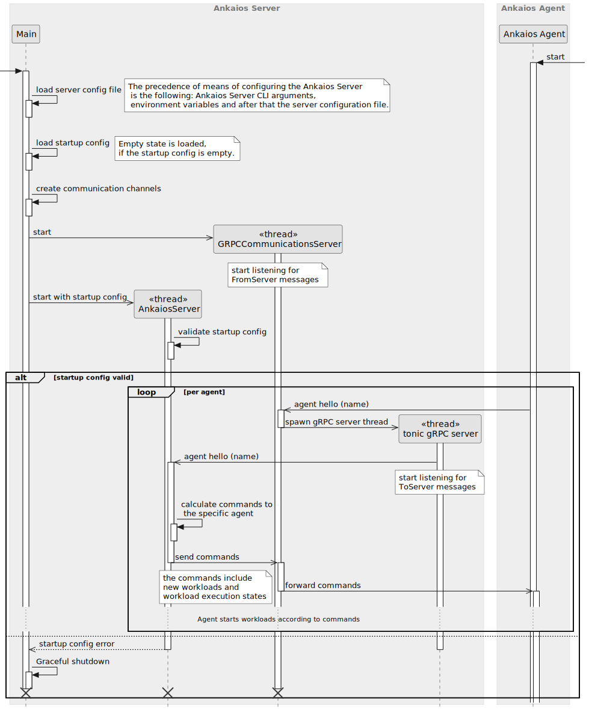
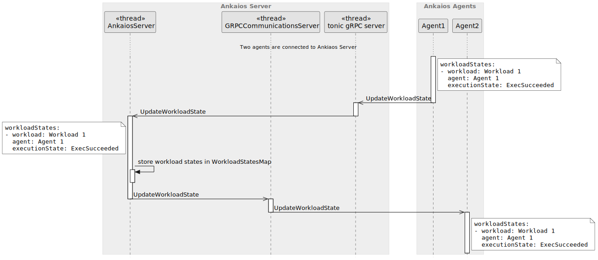

# Ankaios Server - SW Design

## About this document

This document describes the Software Design for the Ankaios Server.

Ankaios is a Workload orchestrator supporting a subset of the Kubernetes configurations and is targeted at the automotive use case.

The Ankaios Server is the main component of the Ankaios orchestrator and is responsible for the configuration of the cluster, managing the communication with the Ankaios Agents.

## Context View

An Ankaios server is connected to multiple agents that are deployed on the same or on different nodes. The server communicates with the agents to:

* send the agents lists of workloads scheduled for them
* forward workload state between agents
* receive ToServer messages from workloads running on an agent

The following diagram shows a high level view of an Ankaios Server in its context:

## Constraints, risks and decisions

### Design decisions

## Structural view

The following diagram shows the structural view of the Ankaios Server:

### AnkaiosServer

The AnkaiosServer is the main component of the Ankaios Server. It is responsible for the business logic of the Server which, amongst others, includes storing the current state, handling ToServer messages from the ToServerChannel and distributing FromServer messages through the FromServerChannel via the Communication Middleware to the Agents.

For simplicity, the initial setup of the Ankaios Server done in the main.rs is also counted as part of this unit.

### StartupStateLoader

The StartupStateLoader loads the initial startup state, parses it and pushes it into the AnkaiosServer. The StartupStateLoader is also responsible for persisting the startup state.

### Communication Middleware

The Communication Middleware is responsible for:

* establishing the connections to multiple Ankaios Agents.
* forwarding the FromServer messages from AnkaiosServer to the proper Ankaios Agents through the FromServerChannel.
* forwarding the ToServer messages from connected Agents to the AnkaiosServer.

### WorkloadStateDB

The WorkloadStateDB is a data structure for storing the Workload States of each nodes.

### ServerState

The ServerState is a data structure for maintaining the state of the Ankaios server. It prevents invariants when updating the state, by doing checks on the new state
before applying it or when a view on the state is requested.

## Behavioral view

### Startup sequence

The following diagram shows the startup sequence of the Ankaios Server:

#### Server holds Current State in memory
`swdd~server-state-in-memory~1`

Status: approved

The Ankaios Server shall hold the Current State in memory.

Tags:
- AnkaiosServer

Needs:
- impl

#### Server loads Startup State from a file
`swdd~server-loads-startup-state-file~2`

Status: approved

When the Ankaios Server starts up and a startup configuration is provided,
Ankaios shall load the Startup State specified in the startup configuration as Current State.

Note: This requirement describes only current intermediate state. The final implementation may work differently.

Tags:
- AnkaiosServer

Needs:
- impl

#### Server starts without startup config
`swdd~server-starts-without-startup-config~1`

Status: approved

When the Ankaios server is started without a startup config, the server shall start with an empty current state.

Rationale:
The Ankaios Server can also start in the "empty startup state" and get the configuration subsequently from the CLI.

Tags:
- StartupStateLoader

Needs:
- impl
- utest
- stest

#### StartupStateLoader parses yaml with Startup State
`swdd~stored-workload-spec-parses-yaml~1`

Status: approved

StartupStateLoader shall support parsing the Startup State as yaml.

Tags:
- StartupStateLoader

Needs:
- impl
- utest

#### StartupStateLoader rejects invalid config
`swdd~stored-workload-spec-checks-unique-name~1`

Status: approved

When the StartupStateLoader parses the yaml file with Startup State, it shall reject the file which is not conform to the verification schema.

Rationale: The startup configuration may contain copy-paste errors etc. Broken configuration shall be rejected by the parser.

Tags:
- StartupStateLoader

Needs:
- impl
- utest

#### Ankaios server fails to start on invalid startup state config
`swdd~server-fails-on-invalid-startup-state~1`

Status: approved

When the Startup State is invalid, the server shall not start.

Comment: If the Startup State is invalid no workloads can be deployed.

Rationale: Invalid States shall be avoided to preserve internal invariants.

Tags:

Needs:
- impl
- utest
- stest

#### All communication with Agents through Middleware
`swdd~communication-to-from-server-middleware~1`

Status: approved

All communication with the Ankaios Agents shall go through the Communication Middleware.

Tags:
- AnkaiosServer

Needs:
- impl
- itest

#### Server defaults to gRPC Communication Middleware
`swdd~server-default-communication-grpc~1`

Status: approved

The Ankaios Server shall use per default a gRPC Communication Middleware.

Tags:
- AnkaiosServer

Needs:
- impl
- itest

#### Server uses common async communication channels
`swdd~server-uses-async-channels~1`

Status: approved

The Ankaios Server shall use asynchronous communication channels from the Common library.

Rationale: The communication channels are especially needed in order to abstract the Communication Middleware.

Tags:
- AnkaiosServer

Needs:
- impl
- utest

#### AnkaiosServer sends all workloads on start
`swdd~server-sends-all-workloads-on-start~1`

Status: approved

When an Agent connects to the Server, the Ankaios Server shall send a list of all scheduled Workloads to this Agent as `AddedWorkload` message.

Tags:
- AnkaiosServer

Needs:
- impl
- utest

#### AnkaiosServer sends all Workload States on Agent connect
`swdd~server-sends-all-workload-states-on-agent-connect~1`

Status: approved

When an Agent connects to the Server, the Ankaios Server shall send all Workload States to the Agent.

Tags:
- AnkaiosServer

Needs:
- impl
- utest

#### Agent selection based on `agent` field
`swdd~agent-from-agent-field~1`

Status: approved

The Ankaios Server shall select the Agent responsible for running the Workload based on the `agent` field.

Tags:
- AnkaiosServer

Needs:
- impl
- utest

#### Server informs a newly connected agent about Workload States of the other connected agents
`swdd~server-informs-a-newly-connected-agent-workload-states~1`

Status: approved

When startup state is loaded and the ToServer message AgentHello is received from an Ankaios Agent, the Ankaios Server shall send all Workload States of other connected agents to that agent.

Tags:
- AnkaiosServer

Needs:
- impl
- utest

### Distribution of Workload State update sequence
The following diagram shows the sequence of the distribution and storage of Workload States:

#### Server forwards Workload State
`swdd~server-forwards-workload-state~1`

Status: approved

When the ToServer message UpdateWorkloadState is received by the Ankaios Server from an Ankaios Agent, the Ankaios Server shall distribute the FromServer message UpdateWorkloadState to all connected agents other than the one which send the ToServer message UpdateWorkloadState.

Tags:
- AnkaiosServer

Needs:
- impl
- utest

#### Server stores Workload State
`swdd~server-stores-workload-state~1`

Status: approved

When the ToServer message UpdateWorkloadState is received by the Ankaios Server from an Ankaios Agent, the Ankaios Server shall store all the Workload States of that Ankaios Agent in the WorkloadStateDB.

Tags:
- AnkaiosServer

Needs:
- impl
- utest

### Workload State Lost of disconnected agents
The following diagram shows the sequence of setting the Workload States of an disconnected agent to Lost and the distribution of its Workload States to other connected agents:

#### Server sets Workload State to Lost when an agent disconnects
`swdd~server-set-workload-state-lost-on-disconnect~1`

Status: approved

When the ToServer message AgentGone is received by the Ankaios server from an Ankaios agent, the Ankaios server shall set all the Workload States of that agent to Lost.

Tags:
- AnkaiosServer

Needs:
- impl
- utest

#### Server distributes Workload State when an agent disconnects
`swdd~server-distribute-workload-state-unknown-on-disconnect~1`

Status: approved

When the ToServer message AgentGone is received by the Ankaios server from an Ankaios Agent, the Ankaios server shall distribute the Workload States of that disconnected Ankaios agent via the FromServer message UpdateWorkloadState to all remaining agents.

Tags:
- AnkaiosServer

Needs:
- impl
- utest

### Control Interface

The Ankaios Server provides the Control Interface needed by the Agents.

#### GetCompleteState interface
The following diagram shows the sequence of GetCompleteState request from the agent:

##### Server provides interface GetCompleteState
`swdd~server-provides-interface-get-complete-state~1`

Status: approved

The Ankaios Server provides an interface to get the CompleteState.
The CompleteState includes:

- StartupState
- CurrentState
- WorkloadState

Tags:
- ControlInterface

Needs:
- impl
- utest

##### Server filters GetCompleteState requests
`swdd~server-filters-get-complete-state-result~1`

Status: approved

When the Ankaios Server responses to a GetCompleteState request and the request contains a `field_mask`,
it only includes fields in the response, which are listed in the `field_mask`.

Tags:
- ControlInterface

Needs:
- impl
- utest

##### Server includes RequestID in the ControlInterface response
`swdd~server-includes-id-in-control-interface-response~1`

Status: approved

When the Ankaios Server responses to a GetCompleteState request,
it includes the the RequestID from the GetCompleteState request.

Tags:
- ControlInterface

Needs:
- impl
- utest

#### UpdateState interface
The following diagram shows the sequence of UpdateState request from the agent:

##### Server provides UpdateCurrentState interface
`swdd~server-provides-update-current-state-interface~1`

Status: approved

The Ankaios Server provides an UpdateCurrentState interface.

Tags:
- ControlInterface

Needs:
- impl
- utest

##### UpdateCurrentState interface with empty update_mask
`swdd~update-current-state-empty-update-mask~1`

Status: approved

When the Ankaios Server gets an UpdateCurrentState request with empty update_mask,
the Ankaios Server replaces its CurrentState with the newState from the UpdateStateRequest.

Tags:
- ControlInterface

Needs:
- impl
- utest

##### UpdateCurrentState interface with update_mask
`swdd~update-current-state-with-update-mask~1`

Status: approved

When the Ankaios Server gets an UpdateCurrentState request with a non empty update_mask,
the Ankaios Server replaces each field of its CurrentState listed in the update_mask, with the value of the same field of the newState from the UpdateStateRequest.

Tags:
- ControlInterface

Needs:
- impl
- utest

Comment: If one field from the update_mask is not present in the CurrentState, this field is created. This can include any amount of parent fields.

If one field from the update_mask is not present in the newState, this field is deleted from the CurrentState.

### Update Current State

The behavioral diagram of the updating current state is shown in the chapter "UpdateState interface".

#### Server detects new workload
`swdd~server-detects-new-workload~1`

Status: approved

When the Ankaios Server gets the `ToServer` message `UpdateState` and detects a change of the state where a workload is present only in the New State,
the Ankaios Server shall send a `FromServer` message to the corresponding Ankaios Agent to add the workload.

Tags:
- AnkaiosServer

Needs:
- impl
- utest
- itest

#### Server detects deleted workload
`swdd~server-detects-deleted-workload~1`

Status: approved

When the Ankaios Server gets the `ToServer` message `UpdateState` and detects a change of the state where a workload is present only in the Current State,
the Ankaios Server shall send a `FromServer` message to the corresponding Ankaios Agent to delete the workload.

Tags:
- AnkaiosServer

Needs:
- impl
- utest
- itest

#### Server detects changed workload
`swdd~server-detects-changed-workload~1`

Status: approved

When the Ankaios Server gets the `ToServer` message `UpdateState` and detects a change of the state where a workload is present in both states
and at least one field of the workload is different,
the Ankaios Server shall send a `FromServer` message to the corresponding Ankaios Agents to delete and add the workload.

Tags:
- AnkaiosServer

Needs:
- impl
- utest
- itest

#### ServerState rejects state with cycle
`swdd~server-state-rejects-state-with-cyclic-dependencies~1`

Status: approved

When the ServerState is requested to update its State and the new State has a cycle in the workload dependencies, the server shall reject the new State as invalid.

Rationale: A cyclic dependency between workloads will prevent the affected workloads from starting rendering the state invalid.

Comment: The inter workload dependencies config within a state is only valid if the dependencies form an directed acyclic graph.

Tags:
- ServerState

Needs:
- impl
- utest
- stest

#### Cycle detection stops on the first detected cycle
`swdd~cycle-detection-stops-on-the-first-cycle~1`

Status: approved

When the ServerState searches for cycles within the dependency graph of the State,
the ServerState shall stop at the first detected cycle.

Rationale: Searching all cycles in a graph might have performance impacts and is not in the scope of the project.

Comment: With only one cycle, the log message remains clearer.

Tags:
- ServerState

Needs:
- impl
- utest

#### Cycle detection ignores non existing workload dependencies
`swdd~cycle-detection-ignores-non-existing-workloads~1`

Status: approved

When the ServerState searches for cycles within the dependency graph of the State
and it encounters an edge in the dependency graph that refers to a workload that does not occur in the workload nodes,
the ServerState shall ignore this edge.

Rationale: A user might want to put a workload into the State that has a dependency to a workload which config is not prepared and published into the State yet.

Comment: Continuation of the cycle search in that case does not break the cycle detection algorithm because a dependency to a workload that is not part of the State cannot introduce a cycle.

Tags:
- ServerState

Needs:
- impl
- utest
- stest

#### Server continues when receiving an invalid state
`swdd~server-continues-on-invalid-updated-state~1`

Status: approved

When the ServerState rejects an updated state, the server shall continue to listen for incoming requests.

Comment: The continuation allows the user to retry the update of the state.

Rationale: The continuation allows better use-ability.

Tags:
- AnkaiosServer

Needs:
- impl
- utest
- stest

#### ServerState stores delete condition into delete graph
`swdd~server-state-stores-delete-condition~1`

Status: approved

When the ServerState adds a new workload to its State
and the workload has a dependency with the AddCondition equal to `ADD_COND_RUNNING`,
the ServerState shall insert the DeleteCondition `DelCondNotPendingNorRunning` for the dependency on that workload into its delete graph.

Comment: The dependency shall only be deleted if the workload depending on it is neither running nor waiting. Workload dependencies with AddCondition `ADD_COND_SUCCEEDED` or `ADD_COND_FAILED` do not need DeleteConditions as they have already finished their operation.

Rationale: This prevents a workload that expects a dependency as running from errors or crashes if the dependency is deleted.

Tags:
- ServerState
- DeleteGraph

Needs:
- impl
- utest

#### ServerState adds delete conditions for a deleted workload
`swdd~server-state-adds-delete-conditions-to-deleted-workload~1`

Status: approved

When the ServerState deletes a workload from its State,
the ServerState shall insert the DeleteConditions from the delete graph into the `DeletedWorkload` message.

Rationale: The DeleteConditions allow an Ankaios agent to determine the correct circumstances when a workload is allowed to be deleted.

Tags:
- ServerState
- DeleteGraph

Needs:
- impl
- utest

## Data view

## Error management view

## Physical view

## References

## Glossary

* gRPC - [Google Remote Procedure Call](https://grpc.io/)
* SOME/IP - [Scalable service-Oriented MiddlewarE over IP](https://some-ip.com/)

<!-- markdownlint-disable-file MD004 MD022 MD032 -->
