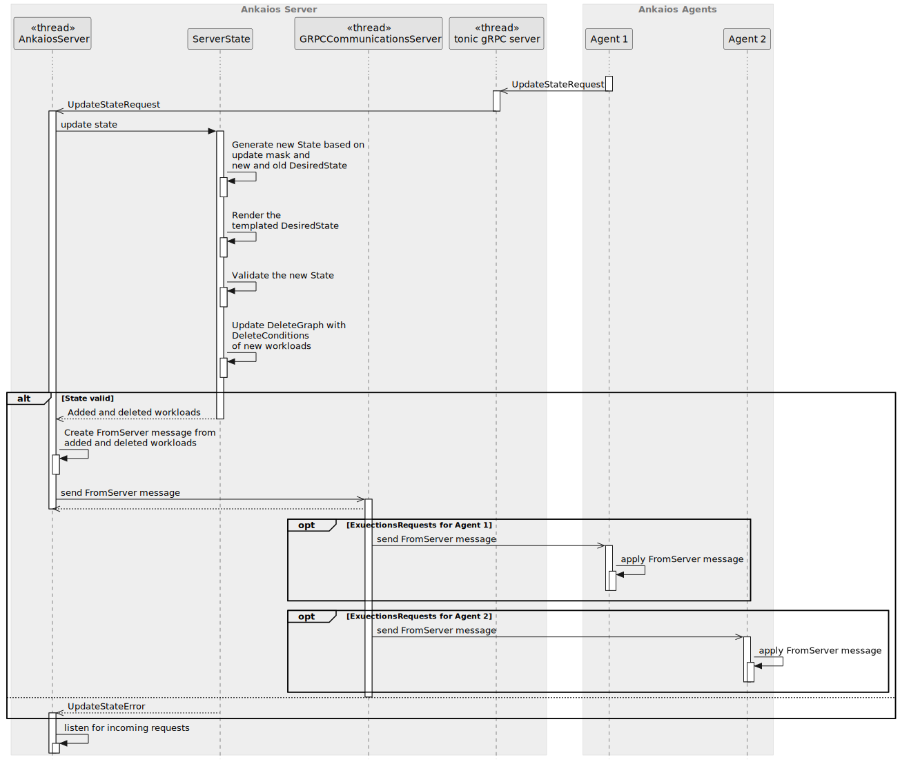

# Ankaios Server - SW Design

## About this document

This document describes the Software Design for the Ankaios Server.

Ankaios is a Workload orchestrator supporting a subset of the Kubernetes configurations and is targeted at the automotive use case.

The Ankaios Server is the main component of the Ankaios orchestrator and is responsible for the configuration of the cluster, managing the communication with the Ankaios Agents.

## Context View

An Ankaios server is connected to multiple agents that are deployed on the same or on different nodes. The server communicates with the agents to:

* send the agents lists of workloads scheduled for them
* forward workload state between agents
* receive ToServer messages from workloads running on an agent

The following diagram shows a high level view of an Ankaios Server in its context:

## Constraints, risks and decisions

### Design decisions

The following section holds the design decisions taken during the development of the Ankaios server.

#### Delegate template rendering of workload configs to the handlebars external library
`swdd~server-delegate-template-render-to-external-library~1`

Status: approved

Ankaios uses the handlebars crate to render the configs provided for a workload.

Rationale:

The handlebars crate provides all the functionality needed to render the configs with templates, reducing implementation and integration effort. It is actively maintained and widely deployed. It is not overloaded with features, instead it supports the minimum amount of features needed to cover the use cases of workload configs. In addition, its rendering capabilities are extensible if a desired feature is missing in the future.

Needs:
- impl

Assumptions:

No assumptions were taken.

Considered alternatives:

- Askama: does not support rendering templates at runtime, mainly used for generating code based on templates
- Tera: Jinja2 template engine contains too many features beyond the use case

## Structural view

The following diagram shows the structural view of the Ankaios Server:

### AnkaiosServer

The AnkaiosServer is the main component of the Ankaios Server. It is responsible for the business logic of the Server which, amongst others, includes storing the current state, handling ToServer messages from the ToServerChannel and distributing FromServer messages through the FromServerChannel via the Communication Middleware to the Agents.

For simplicity, the initial setup of the Ankaios Server done in the main.rs is also counted as part of this unit.

### StartupStateLoader

The StartupStateLoader loads the initial startup manifest file, parses it and pushes it into the AnkaiosServer. The StartupStateLoader is also responsible for persisting the startup configuration.

### Communication Middleware

The Communication Middleware is responsible for:

* establishing the connections to multiple Ankaios Agents.
* forwarding the FromServer messages from AnkaiosServer to the proper Ankaios Agents through the FromServerChannel.
* forwarding the ToServer messages from connected Agents to the AnkaiosServer.

### ServerState

The ServerState is a data structure for maintaining the state of the Ankaios server. It prevents invariants when updating the state, by doing checks on the new state
before applying it or when a view on the state is requested.

### ConfigRenderer

The ConfigRenderer is responsible for rendering the templated configuration of workloads with their corresponding configuration items provided inside the CompleteState.

## Behavioral view

### Startup sequence

The following diagram shows the startup sequence of the Ankaios Server:

#### Server holds Current State in memory
`swdd~server-state-in-memory~1`

Status: approved

The Ankaios Server shall hold the Current State in memory.

Tags:
- AnkaiosServer

Needs:
- impl

#### Server loads Startup State from a file
`swdd~server-loads-startup-state-file~3`

Status: approved

When the Ankaios Server starts up and a startup configuration file in the format YAML is provided,
Ankaios shall load the Startup State specified in the startup configuration as Current State.

Note: This requirement describes only current intermediate state. The final implementation may work differently.

Tags:
- AnkaiosServer

Needs:
- impl

#### Server starts without startup config
`swdd~server-starts-without-startup-config~1`

Status: approved

When the Ankaios server is started without a startup config, the server shall start with an empty current state.

Rationale:
The Ankaios Server can also start in the "empty startup state" and get the configuration subsequently from the CLI.

Tags:
- StartupStateLoader

Needs:
- impl
- utest
- stest

#### StartupStateLoader parses yaml with Startup State
`swdd~stored-workload-spec-parses-yaml~1`

Status: approved

StartupStateLoader shall support parsing the Startup State as yaml.

Tags:
- StartupStateLoader

Needs:
- impl
- utest

#### Server sets all new workloads to pending state
`swdd~server-sets-state-of-new-workloads-to-pending~1`

Status: approved

When the Ankaios server adds a new workload to its desired state, the workload state of this workload shall be set to `Pending(Initial)` if the workload is assigned to an agent or to `NotScheduled` otherwise.

Tags:
- AnkaiosServer

Needs:
- impl
- utest

#### StartupStateLoader rejects invalid config
`swdd~stored-workload-spec-checks-unique-name~1`

Status: approved

When the StartupStateLoader parses the yaml file with Startup State, it shall reject the file which is not conform to the verification schema.

Rationale: The startup configuration may contain copy-paste errors etc. Broken configuration shall be rejected by the parser.

Tags:
- StartupStateLoader

Needs:
- impl
- utest

#### Ankaios server fails to start on invalid startup state config
`swdd~server-fails-on-invalid-startup-state~1`

Status: approved

When the Startup State is invalid, the server shall not start.

Comment: If the Startup State is invalid no workloads can be deployed.

Rationale: Invalid States shall be avoided to preserve internal invariants.

Tags:

Needs:
- impl
- utest
- stest

#### All communication with Agents through Middleware
`swdd~communication-to-from-server-middleware~1`

Status: approved

All communication with the Ankaios Agents shall go through the Communication Middleware.

Tags:
- AnkaiosServer

Needs:
- impl
- itest

#### Server defaults to gRPC Communication Middleware
`swdd~server-default-communication-grpc~1`

Status: approved

The Ankaios Server shall use per default a gRPC Communication Middleware.

Tags:
- AnkaiosServer

Needs:
- impl
- itest

#### Server uses common async communication channels
`swdd~server-uses-async-channels~1`

Status: approved

The Ankaios Server shall use asynchronous communication channels from the Common library.

Rationale: The communication channels are especially needed in order to abstract the Communication Middleware.

Tags:
- AnkaiosServer

Needs:
- impl
- utest

#### Server supports PEM file paths as cli arguments for mTLS
`swdd~server-supports-pem-file-paths-as-cli-arguments~1`

Status: approved

The Ankaios server shall support the following cli arguments all of which contain a file path to a PEM file, alternatively configurable over environment variables which have lower priority compared to explicitly provided cli arguments:

| Argument    | Environment variable | Description                                 |
|-------------|----------------------|---------------------------------------------|
| `--ca_pem`  | `ANKSERVER_CA_PEM`    | file path to the root certificate authority |
| `--crt_pem` | `ANKSERVER_CRT_PEM`   | file path to the certificate                |
| `--key_pem` | `ANKSERVER_KEY_PEM`   | file path to the key                        |

Comment:
The PEM file format is a text-based, human-readable format. PEM files can contain certificates, private keys, public keys and even certificate chains, making them more versatile compared to other formats.

Rationale:
The Ankaios server uses the PEM files to establish a mutual transport layer security (mTLS) communication.

Tags:
- AnkaiosServer

Needs:
- impl
- stest

#### Server supports cli argument for insecure communication
`swdd~server-supports-cli-argument-for-insecure-communication~1`

Status: approved

The Ankaios server shall support the cli argument `--insecure` (short alias `-k`), alternatively configurable via the environment variable `ANKSERVER_INSECURE` which has lower priority compared to explicitly provided cli arguments.

Comment:
The Ankaios server supports an insecure communication channel to the Ankaios server. Communicating over insecure channels is convenient during an evaluation or a development phase.

Tags:
- AnkaiosServer

Needs:
- impl
- stest

#### Server establishes insecure connection on provided insecure cli argument
`swdd~server-establishes-insecure-communication-based-on-provided-insecure-cli-argument~1`

Status: approved

When the user starts the Ankaios server with the arguments `-k` or `--insecure` and the Ankaios server initializes the communication middleware, then the Ankaios server shall instruct the communication middleware to use an insecure communication channel.

Tags:
- AnkaiosServer

Needs:
- impl

#### Server provides file paths for mTLS to communication middleware
`swdd~server-provides-file-paths-to-communication-middleware~1`

Status: approved

When the file paths of the root certificate, the server certificate and the server key is provided upon startup, then the Ankaios server shall provide each of these file paths to the communication middleware.

Rationale:
The communication middleware is responsible for establishing a secure communication channel.

Tags:
- AnkaiosServer

Needs:
- impl

#### Server fails upon missing pem file paths and insecure cli arguments
`swdd~server-fails-on-missing-file-paths-and-insecure-cli-arguments~1`

Status: approved

If the user starts the Ankaios server without specifying the cli arguments for the mTLS PEM file paths or the insecure cli argument, then the Ankaios server shall:
* exit with a non zero exit code
* output an error message containing the reason and a help message

Rationale:
The demand for an explicit communication mode prevents a user from implicitly creating an Ankaios setup using insecure communication.

Tags:
- AnkaiosServer

Needs:
- impl

#### AnkaiosServer sends all workloads on start
`swdd~server-sends-all-workloads-on-start~2`

Status: approved

When an Agent connects to the Server, the Ankaios Server shall send a list of all scheduled Workloads to this Agent as `ServerHello` message.

Tags:
- AnkaiosServer

Needs:
- impl
- utest

#### Agent selection based on `agent` field
`swdd~agent-from-agent-field~1`

Status: approved

The Ankaios Server shall select the workloads targeted at an agent based on the `agent` field.

Comment:
The field contents of the workloads are already rendered.

Tags:
- AnkaiosServer

Needs:
- impl
- utest

#### Server informs a newly connected agent about Workload States of the other connected agents
`swdd~server-informs-a-newly-connected-agent-workload-states~1`

Status: approved

When startup state is loaded and the ToServer message AgentHello is received from an Ankaios Agent, the Ankaios Server shall send all Workload States of other connected agents to that agent.

Tags:
- AnkaiosServer

Needs:
- impl
- utest

#### Server stores a newly connected agent
`swdd~server-stores-newly-connected-agent~1`

Status: approved

When an Agent connects to the Ankaios server, the Ankaios server shall instruct the ServerState to store the newly connected agent within its state.

Rationale:
Storing the connected Ankaios agents allows a workload to retrieve the connected agents via the Control Interface and the Ankaios CLI to list the connected agents to the user.

Tags:
- AnkaiosServer
- ServerState

Needs:
- impl
- utest

#### ServerState stores agent inside the CompleteState
`swdd~server-state-stores-agent-in-complete-state~1`

Status: approved

When the ServerState is triggered to store the agent, the ServerState shall create an entry of the agent in the `agents` field of the `CompleteState`.

Tags:
- ServerState

Needs:
- impl
- utest

### Distribution of Workload State update sequence
The following diagram shows the sequence of the distribution and storage of Workload States:

#### Server forwards Workload State
`swdd~server-forwards-workload-state~1`

Status: approved

When the ToServer message UpdateWorkloadState is received by the Ankaios Server from an Ankaios Agent, the Ankaios Server shall distribute the FromServer message UpdateWorkloadState to all connected agents other than the one which send the ToServer message UpdateWorkloadState.

Tags:
- AnkaiosServer

Needs:
- impl
- utest

#### Server stores Workload State
`swdd~server-stores-workload-state~1`

Status: approved

When the ToServer message UpdateWorkloadState is received by the Ankaios Server from an Ankaios Agent, the Ankaios Server shall store all the Workload States of that Ankaios Agent in the WorkloadStatesMap.

Tags:
- AnkaiosServer

Needs:
- impl
- utest

### Workload State update on disconnected agents
The following diagram shows the sequence of updating the Workload States of a disconnected agent and the distribution of its Workload States to other connected agents:

#### Server sets Workload State to agent disconnects on connection loss
`swdd~server-set-workload-state-on-disconnect~1`

Status: approved

When the ToServer message AgentGone is received by the Ankaios server from an Ankaios agent, the Ankaios server shall set all the Workload States of that agent to `agent disconnected`.

Tags:
- AnkaiosServer

Needs:
- impl
- utest

#### Server distributes Workload State when an agent disconnects
`swdd~server-distribute-workload-state-on-disconnect~1`

Status: approved

When the ToServer message AgentGone is received by the Ankaios server from an Ankaios Agent, the Ankaios server shall distribute the Workload States of that disconnected Ankaios agent via the FromServer message UpdateWorkloadState to all remaining agents.

Tags:
- AnkaiosServer

Needs:
- impl
- utest

### Control Interface

The Ankaios Server provides the Control Interface needed by the Agents.

#### GetCompleteState interface
The following diagram shows the sequence of GetCompleteState request from the agent:

##### Server provides interface GetCompleteState
`swdd~server-provides-interface-get-complete-state~2`

Status: approved

The Ankaios Server provides an interface to get the CompleteState.
The CompleteState includes:

- DesiredState
- WorkloadState
- Agents

Comment:
The field `Agents` is an associative data structure with the name of a connected agent as key and an associative data structure as value to store attributes of the agent by key/value pairs. If the DesiredState contains fields with templated strings, it is returned unrendered.

Tags:
- AnkaiosServer
- ControlInterface
- ServerState

Needs:
- impl
- utest

##### Server filters GetCompleteState requests
`swdd~server-filters-get-complete-state-result~2`

Status: approved

When the Ankaios Server responses to a GetCompleteState request and the request contains a `field_mask`,
the response includes the filed `api_version` and the fields listed in the `field_mask`.

Comment:
If the fields listed in the `field_mask` contain templated strings, they are returned unrendered.

Tags:
- ControlInterface

Needs:
- impl
- utest

##### Server includes RequestID in the ControlInterface response
`swdd~server-includes-id-in-control-interface-response~1`

Status: approved

When the Ankaios Server responses to a GetCompleteState request,
it includes the the RequestID from the GetCompleteState request.

Tags:
- ControlInterface

Needs:
- impl
- utest

#### UpdateState interface
The following diagram shows the sequence of UpdateState request from the agent:

##### Server provides UpdateState interface
`swdd~server-provides-update-desired-state-interface~1`

Status: approved

The Ankaios Server provides an UpdateState interface.

Tags:
- ControlInterface

Needs:
- impl
- utest

##### UpdateState interface with empty update_mask
`swdd~update-desired-state-empty-update-mask~1`

Status: approved

When the Ankaios Server gets an UpdateStateRequest with empty update_mask,
the Ankaios Server replaces its DesiredState with the newState from the UpdateStateRequest.

Tags:
- ControlInterface

Needs:
- impl
- utest

##### UpdateState interface with update_mask
`swdd~update-desired-state-with-update-mask~1`

Status: approved

When the Ankaios Server gets an UpdateStateRequest with a non empty update_mask,
the Ankaios Server replaces each field of its DesiredState listed in the update_mask, with the value of the same field of the newState from the UpdateStateRequest.

Comment:
If one field from the update_mask is not present in the DesiredState, this field is created. This can include any amount of parent fields.
If one field from the update_mask is not present in the newState, this field is deleted from the DesiredState.

Tags:
- ControlInterface

Needs:
- impl
- utest

##### UpdateState success response message
`swdd~server-update-state-success-response~1`

Status: approved

When the Ankaios Server gets an UpdateStateRequest which can be successfully applied,
the Ankaios Server shall respond to the request with the Ids of the updated workloads.

Rational:
The Ids of the added and deleted with the request workloads are required to track the progress of the update.

Tags:
- ControlInterface

Needs:
- impl
- utest

##### UpdateState interface with invalid version
`swdd~update-desired-state-with-invalid-version~1`

Status: approved

When the Ankaios Server gets an UpdateStateRequest with an API version which is not identical to the API version expected by the Ankaios Server,
the Ankaios Server shall reject the request and keep on listening for incoming requests.

Tags:
- ControlInterface

Needs:
- impl
- utest
- stest

##### UpdateState interface with missing version
`swdd~update-desired-state-with-missing-version~1`

Status: approved

When the Ankaios Server gets an UpdateStateRequest without set API version,
the Ankaios Server shall reject the request and keep on listening for incoming requests.

Tags:
- ControlInterface

Needs:
- impl
- utest
- stest

##### Checking naming conventions
`swdd~server-naming-convention~1`

Status: approved

When the Ankaios Server gets an UpdateStateRequest, the server shall enforce the naming constraints defined in the common library.

Comment:
We need to check the names of both the workload and agent names in order to ensure the proper function of the filtering.

Tags:
- ControlInterface

Needs:
- impl
- stest

### Update Desired State

The behavioral diagram of updating the desired state is shown in the chapter "UpdateState interface".

#### Server detects new workload
`swdd~server-detects-new-workload~1`

Status: approved

When the Ankaios Server gets the `ToServer` message `UpdateStateRequest` and detects a change of the state where a workload is present only in the New State,
the Ankaios Server shall send a `FromServer` message to the corresponding Ankaios Agent to add the workload.

Tags:
- AnkaiosServer

Needs:
- impl
- utest
- itest

#### Server detects deleted workload
`swdd~server-detects-deleted-workload~1`

Status: approved

When the Ankaios Server gets the `ToServer` message `UpdateStateRequest` and detects a change of the state where a workload is present only in the Current State,
the Ankaios Server shall send a `FromServer` message to the corresponding Ankaios Agent to delete the workload.

Tags:
- AnkaiosServer

Needs:
- impl
- utest
- itest

#### Server detects changed workload
`swdd~server-detects-changed-workload~1`

Status: approved

When the Ankaios Server gets the `ToServer` message `UpdateStateRequest` and detects a change of the state where a workload is present in both states
and at least one field of the workload is different,
the Ankaios Server shall send a `FromServer` message to the corresponding Ankaios Agents to delete and add the workload.

Tags:
- AnkaiosServer

Needs:
- impl
- utest
- itest

#### ServerState compares rendered workload configurations
`swdd~server-state-compares-rendered-workloads~1`

Status: approved

When the ServerState determines changes in its State, the ServerState shall compare the rendered workload configurations of its current and new DesiredState.

Rationale:
This ensures that the system recognizes a workload as changed when a configuration item referenced by that workload is updated.

Tags:
- ServerState

Needs:
- impl
- utest
- stest

#### ServerState updates its desired state on unmodified workloads
`swdd~server-state-updates-state-on-unmodified-workloads~1`

Status: approved

When the ServerState is requested to update its State and the ServerState detects no change of workloads in its State, the ServerState shall replace its current DesiredState with the new DesiredState.

Rationale:
The DesiredState must also be updated in other cases, such as when the config items are changed.

Tags:
- ServerState

Needs:
- impl
- utest

#### ServerState triggers configuration rendering of workloads
`swdd~server-state-triggers-configuration-rendering-of-workloads~1`

Status: approved

When the ServerState is requested to update its State, the ServerState shall trigger the ConfigRenderer to render the workloads with the configuration items in the CompleteState.

Rationale:
Rendering consumes resources and shall be done only once when updating the state.

Tags:
- ServerState
- ConfigRenderer

Needs:
- impl
- utest

#### ServerState triggers validation of workload fields
`swdd~server-state-triggers-validation-of-workload-fields~1`

Status: approved

When the ServerState receives successfully rendered workloads from the ConfigRenderer, the ServerState shall trigger the workload to validate the format of its internal fields.

Rationale:
Some workload fields only contain the final content after rendering.

Tags:
- ServerState

Needs:
- impl
- utest

#### ConfigRenderer renders workload configuration
`swdd~config-renderer-renders-workload-configuration~1`

Status: approved

When the ConfigRenderer is requested to render the workloads with configuration items, for each provided workload that references config items inside its `configs` field, the ConfigRenderer shall:
* create a data structure containing memory references to the config items of the CompleteState referenced inside its `configs` field
* render the workload's `agent` and `runtimeConfig` fields by replacing each template string with the referenced configuration item content
* create a new workload configuration containing the rendered fields and the new instance name

Comment:
In case of a render error, the workload configuration remains unrendered and an error is thrown. If a workload does not reference a configuration item, the rendering of that workload is skipped and its fields remain unrendered.

Tags:
- ConfigRenderer

Needs:
- impl
- utest

#### ServerState rejects state with cycle
`swdd~server-state-rejects-state-with-cyclic-dependencies~1`

Status: approved

When the ServerState is requested to update its State and the new State has a cycle in the workload dependencies, the server shall reject the new State as invalid.

Rationale: A cyclic dependency between workloads will prevent the affected workloads from starting rendering the state invalid.

Comment: The inter workload dependencies config within a state is only valid if the dependencies form an directed acyclic graph.

Tags:
- ServerState

Needs:
- impl
- utest
- stest

#### Cycle detection stops on the first detected cycle
`swdd~cycle-detection-stops-on-the-first-cycle~1`

Status: approved

When the ServerState searches for cycles within the dependency graph of the State,
the ServerState shall stop at the first detected cycle.

Rationale: Searching all cycles in a graph might have performance impacts and is not in the scope of the project.

Comment: With only one cycle, the log message remains clearer.

Tags:
- ServerState

Needs:
- impl
- utest

#### Cycle detection ignores non existing workload dependencies
`swdd~cycle-detection-ignores-non-existing-workloads~1`

Status: approved

When the ServerState searches for cycles within the dependency graph of the State
and it encounters an edge in the dependency graph that refers to a workload that does not occur in the workload nodes,
the ServerState shall ignore this edge.

Rationale: A user might want to put a workload into the State that has a dependency to a workload which config is not prepared and published into the State yet.

Comment: Continuation of the cycle search in that case does not break the cycle detection algorithm because a dependency to a workload that is not part of the State cannot introduce a cycle.

Tags:
- ServerState

Needs:
- impl
- utest
- stest

#### Server continues when receiving an invalid state
`swdd~server-continues-on-invalid-updated-state~1`

Status: approved

When the ServerState rejects an updated state, the server shall continue to listen for incoming requests.

Comment: The continuation allows the user to retry the update of the state.

Rationale: The continuation allows better use-ability.

Tags:
- AnkaiosServer

Needs:
- impl
- utest
- stest

#### ServerState stores delete condition into delete graph
`swdd~server-state-stores-delete-condition~1`

Status: approved

When the ServerState adds a new workload to its State
and the workload has a dependency with the AddCondition equal to `ADD_COND_RUNNING`,
the ServerState shall insert the DeleteCondition `DelCondNotPendingNorRunning` for the dependency on that workload into its delete graph.

Comment: The dependency shall only be deleted if the workload depending on it is neither running nor waiting. Workload dependencies with AddCondition `ADD_COND_SUCCEEDED` or `ADD_COND_FAILED` do not need DeleteConditions as they have already finished their operation.

Rationale: This prevents a workload that expects a dependency as running from errors or crashes if the dependency is deleted.

Tags:
- ServerState
- DeleteGraph

Needs:
- impl
- utest

#### ServerState adds delete conditions for a deleted workload
`swdd~server-state-adds-delete-conditions-to-deleted-workload~1`

Status: approved

When the ServerState deletes a workload from its State,
the ServerState shall insert the DeleteConditions from the delete graph into the `DeletedWorkload` message.

Rationale: The DeleteConditions allow an Ankaios agent to determine the correct circumstances when a workload is allowed to be deleted.

Tags:
- ServerState
- DeleteGraph

Needs:
- impl
- utest

#### Server handles deletes for not started workloads
`swdd~server-handles-not-started-deleted-workloads~1`

Status: approved

When the Ankaios server distributes `DeletedWorkload` message and either the deleted workload is not scheduled (agent is empty) or its execution state is `Pending(Initial)` and its agent is disconnected, the Ankaios server shall handle the deletion.

Rationale:
There is no agent that can take care of the operation so the sever has to handle it.

Comment:
Handling the operation includes deleting the workload, its state and notifying other agents about the change.

Tags:
- AnkaiosServer
- ServerState

Needs:
- impl
- utest

#### Server receives agent node resource availability
`swdd~server-receives-resource-availability~1`

Status: approved

When the Ankaios server receives a new agent load status, the Ankaios server shall trigger the ServerState to update the connected agent's resource availability with the provided new agent load status.

Rationale:
The resource availability can be used for scheduling, e.g. done by controller workloads.

Tags:
- AnkaiosServer
- ServerState

Needs:
- impl
- utest

#### ServerState updates agent node resource availability
`swdd~server-updates-resource-availability~1`

Status: approved

When the ServerState receives a new agent load status, the ServerState shall update its internal state with agent node resource availability information regarding the cpu usage and the free memory.

Tags:
- ServerState

Needs:
- impl
- utest

#### Server cleans up state
`swdd~server-cleans-up-state~1`

Status: approved

When the Ankaios Server receives new workload states, then the Ankaios Server shall trigger the ServerState to cleanup its internal state providing it the new workload states.

Rationale:
The server state should not have any obsolete entries.

Tags:
- AnkaiosServer
- ServerState

Needs:
- impl
- utest

#### Server removes obsolete entries from delete graph
`swdd~server-removes-obsolete-delete-graph-entires~1`

Status: approved

When the ServerState receives a trigger to cleanup its state, the ServerState shall request the DeleteGraph to delete all entries for which there is a WorkloadState `Removed` in the list of provided workload states.

Comment:
The DeleteGraph ignores WorkloadStates from workloads that do not have an entry in the delete graph.

Rationale:
The entry should not exist after the workload has actually been deleted.

Tags:
- ServerState
- DeleteGraph

Needs:
- impl
- utest

#### Server removes disconnected agents from its state
`swdd~server-removes-disconnected-agents-from-state~1`

Status: approved

When the ToServer message AgentGone is received by the Ankaios server from an Ankaios agent, the AnkaiosServer shall instruct the ServerState to remove the agent from its internal state.

Tags:
- AnkaiosServer
- ServerState

Needs:
- impl
- utest

#### ServerState removes agent from CompleteState
`swdd~server-state-removes-agent-from-complete-state~1`

Status: approved

When the ServerState is triggered to remove the agent from its state, the ServerState shall remove the entry of the agent in the `agents` field of the `CompleteState`.

Tags:
- ServerState

Needs:
- impl
- utest

#### ServerState provides check for existence of a connected agent inside the complete state
`swdd~server-state-provides-connected-agent-exists-check~1`

Status: approved

When the ServerState is triggered to check if an agent is part of its state, the ServerState shall check if the `agents` field of the `CompleteState` contains the agent name passed as argument.

Tags:
- ServerState

Needs:
- impl
- utest

## Data view

## Error management view

## Physical view

## References

## Glossary

* gRPC - [Google Remote Procedure Call](https://grpc.io/)
* SOME/IP - [Scalable service-Oriented MiddlewarE over IP](https://some-ip.com/)

<!-- markdownlint-disable-file MD004 MD022 MD032 -->
