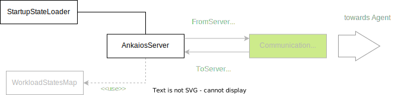

# Ankaios Server - SW Design

## About this document

This document describes the Software Design for the Ankaios Server. 

Ankaios is a Workload orchestrator supporting a subset of the Kubernetes configurations and is targeted at the automotive use case.

The Ankaios Server is the main component of the Ankaios orchestrator and is responsible for the configuration of the cluster, managing the communication with the Ankaios Agents.

## Context View

An Ankaios Server is connected to multiple Agents that are deployed on the same or on different nodes. The Server communicates with the Agents to:
* send the Agents lists of Workloads scheduled for them
* forward Workload State between Agents
* receive execution requests from Workloads running on an Agent

The following diagram shows a high level view of an Ankaios Server in its context:

## Constraints, risks and decisions

### Design decisions

## Structural view

The following diagram shows the structural view of the Ankaios Server:

### AnkaiosServer

The AnkaiosServer is the main component of the Ankaios Server. It is responsible for the business logic of the Server which, amongst others, includes storing the current state, handling StateChangeRequests from the StateChangeCommandChannel and distributing ExecutionRequests and ExecutionStateUpdates through the ExecutionCommandChannel via the Communication Middleware to the Agents.

For simplicity, the initial setup of the Ankaios Server done in the main.rs is also counted as part of this unit.

### StartupStateLoader

The StartupStateLoader loads the initial startup state, parses it and pushes it into the AnkaiosServer. The StartupStateLoader is also responsible for persisting the startup state.

### Communication Middleware

The Communication Middleware is responsible for:
 * establishing the connections to multiple Ankaios Agents.
 * forwarding the ExecutionRequests and ExecutionStateUpdates from AnkaiosServer to the proper Ankaios Agents through the ExecutionCommandChannel.
 * forwarding the StateChangeRequests from connected Agents to the AnkaiosServer. 

### WorkloadStateDB

The WorkloadStateDB is a data structure for storing the Workload States of each nodes.

## Behavioral view

### Startup sequence

The following diagram shows the startup sequence of the Ankaios Server:

#### Server holds Current State in memory
`swdd~server-state-in-memory~1`

Status: approved

The Ankaios Server shall hold the Current State in memory.

Tags:
- AnkaiosServer

Needs:
- impl

#### Server loads Startup State from a file
`swdd~server-loads-startup-state-file~1`

Status: approved

When the Ankaios Server starts up, it shall load the Startup State from a file as Current State.

Note: This requirement describes only current intermediate state. The final implementation may work differently.

Tags:
- AnkaiosServer

Needs:
- impl

#### StartupStateLoader parses yaml with Startup State
`swdd~stored-workload-spec-parses-yaml~1`

Status: approved

StartupStateLoader shall support parsing the Startup State as yaml.

Tags:
- StartupStateLoader

Needs:
- impl
- utest

#### StartupStateLoader rejects invalid config
`swdd~stored-workload-spec-checks-unique-name~1`

Status: approved

When the StartupStateLoader parses the yaml file with Startup State, it shall reject the file which is not conform to the verification schema.

Rationale: The startup configuration may contain copy-paste errors etc. Broken configuration shall be rejected by the parser.

Tags:
- StartupStateLoader

Needs:
- impl
- utest

#### All communication with Agents through Middleware
`swdd~communication-to-from-server-middleware~1`

Status: approved

All communication with the Ankaios Agents shall go through the Communication Middleware.

Tags:
- AnkaiosServer

Needs:
- impl
- itest

#### Server defaults to gRPC Communication Middleware
`swdd~server-default-communication-grpc~1`

Status: approved

The Ankaios Server shall use per default a gRPC Communication Middleware.

Tags:
- AnkaiosServer

Needs:
- impl
- itest

#### Server uses common async communication channels
`swdd~server-uses-async-channels~1`

Status: approved

The Ankaios Server shall use asynchronous communication channels from the Common library.

Rationale: The communication channels are especially needed in order to abstract the Communication Middleware.

Tags:
- AnkaiosServer

Needs:
- impl
- utest

#### AnkaiosServer sends all workloads on start
`swdd~server-sends-all-workloads-on-start~1`

Status: approved

When an Agent connects to the Server, the Ankaios Server shall send a list of all scheduled Workloads to this Agent as `AddedWorkload` message.

Tags:
- AnkaiosServer

Needs:
- impl
- utest

#### AnkaiosServer sends all Workload States on Agent connect
`swdd~server-sends-all-workload-states-on-agent-connect~1`

Status: approved

When an Agent connects to the Server, the Ankaios Server shall send all Workload States to the Agent.

Tags:
- AnkaiosServer

Needs:
- impl
- utest

#### Agent selection based on `agent` field
`swdd~agent-from-agent-field~1`

Status: approved

The Ankaios Server shall select the Agent responsible for running the Workload based on the `agent` field.

Tags:
- AnkaiosServer

Needs:
- impl
- utest

#### Server informs a newly connected agent about Workload States of the other connected agents
`swdd~server-informs-a-newly-connected-agent-workload-states~1`

Status: approved

When startup state is loaded and the state change request AgentHello is received from an agent, the Ankaios Server shall send all Workload States of other connected agents to that agent.

Tags:
- AnkaiosServer

Needs:
- impl
- utest

### Distribution of Workload State update sequence
The following diagram shows the sequence of the distribution and storage of Workload States:

#### Server forwards Workload State
`swdd~server-forwards-workload-state~1`

Status: approved

When the state change request UpdateWorkloadState is received by the Ankaios Server from an Agent, the Ankaios Server shall distribute the Execution Request UpdateWorkloadState to all connected agents other than the one which initiated the state change request UpdateWorkloadState.

Tags:
- AnkaiosServer

Needs:
- impl
- utest

#### Server stores Workload State
`swdd~server-stores-workload-state~1`

Status: approved

When the state change request UpdateWorkloadState is received by the Ankaios Server from an Agent, the Ankaios Server shall store all the Workload States of that Agent in the WorkloadStateDB.

Tags:
- AnkaiosServer

Needs:
- impl
- utest

### ExecUnknown Workload State of disconnected agents
The following diagram shows the sequence of setting the Workload States of an disconnected agent to ExecUnknown and the distribution of its Workload States to other connected agents:

#### Server sets Workload State to ExecUnknown when an agent disconnects
`swdd~server-set-workload-state-unknown-on-disconnect~1`

Status: approved

When the state change request AgentGone is received by the Ankaios Server from an Agent, the Ankaios Server shall set all the Workload States of that agent to ExecUnknown.

Tags:
- AnkaiosServer

Needs:
- impl
- utest

#### Server distributes Workload State when an agent disconnects
`swdd~server-distribute-workload-state-unknown-on-disconnect~1`

Status: approved

When the state change request AgentGone is received by the Ankaios Server from an Agent, the Ankaios Server shall distribute the Workload States of that disconnected agent via the Execution Request UpdateWorkloadState to all remaining agents.

Tags:
- AnkaiosServer

Needs:
- impl
- utest

### Control Interface

The Ankaios Server provides the Control Interface needed by the Agents.

#### GetCompleteState interface
The following diagram shows the sequence of GetCompleteState request from the agent:

##### Server provides interface GetCompleteState
`swdd~server-provides-interface-get-complete-state~1`

The Ankaios Server provides an interface to get the CompleteState.
The CompleteState includes:

- StartupState
- CurrentState
- WorkloadState

Tags:
- ControlInterface

Needs:
- impl
- utest

##### Server filters GetCompleteState requests
`swdd~server-filters-get-complete-state-result~1`

When the Ankaios Server responses to a GetCompleteState request and the request contains a `field_mask`,
it only includes fields in the response, which are listed in the `field_mask`.

Tags:
- ControlInterface

Needs:
- impl
- utest

##### Server includes RequestID in the ControlInterface response
`swdd~server-includes-id-in-control-interface-response~1`

When the Ankaios Server responses to a GetCompleteState request,
it includes the the RequestID from the GetCompleteState request.

Tags:
- ControlInterface

Needs:
- impl
- utest

#### UpdateState interface
The following diagram shows the sequence of UpdateState request from the agent:

##### Server provides UpdateCurrentState interface
`swdd~server-provides-update-current-state-interface~1`

The Ankaios Server provides an UpdateCurrentState interface.

Tags:
- ControlInterface

Needs:
- impl
- utest

##### UpdateCurrentState interface with empty update_mask
`swdd~update-current-state-empty-update-mask~1`

When the Ankaios Server gets an UpdateCurrentState request with empty update_mask,
the Ankaios Server replaces its CurrentState with the newState from the UpdateStateRequest.

Tags:
- ControlInterface

Needs:
- impl
- utest

##### UpdateCurrentState interface with update_mask
`swdd~update-current-state-with-update-mask~1`

When the Ankaios Server gets an UpdateCurrentState request with a non empty update_mask,
the Ankaios Server replaces each field of its CurrentState listed in the update_mask, with the value of the same field of the newState from the UpdateStateRequest.

Tags:
- ControlInterface

Needs:
- impl
- utest

Comment: If one field from the update_mask is not present in the CurrentState, this field is created. This can include any amount of parent fields.

If one field from the update_mask is not present in the newState, this field is deleted from the CurrentState.

### Update Current State

The behavioral diagram of the updating current state is shown in the chapter "UpdateState interface".

#### Server detects new workload
`swdd~server-detects-new-workload~1`

When the Ankaios Server gets the `StateChangeCommand` `UpdateState` and detects a change of the state where a workload is present only in the New State, 
the Ankaios Server shall send `ExecutionCommand` to the corresponding Ankaios Agent to add the workload.

Tags:
- AnkaiosServer

Needs:
- impl
- utest
- itest

#### Server detects deleted workload
`swdd~server-detects-deleted-workload~1`

When the Ankaios Server gets the `StateChangeCommand` `UpdateState` and detects a change of the state where a workload is present only in the Current State, 
the Ankaios Server shall send `ExecutionCommand` to the corresponding Ankaios Agent to delete the workload.

Tags:
- AnkaiosServer

Needs:
- impl
- utest
- itest

#### Server detects changed workload
`swdd~server-detects-changed-workload~1`

When the Ankaios Server gets the `StateChangeCommand` `UpdateState` and detects a change of the state where a workload is present in both states 
and at least one field of the workload is different,
the Ankaios Server shall send `ExecutionCommand` to the corresponding Ankaios Agents to delete and add the workload.

Tags:
- AnkaiosServer

Needs:
- impl
- utest
- itest

## Data view

## Error management view

## Physical view

## References

## Glossary

* gRPC - [Google Remote Procedure Call](https://grpc.io/)
* SOME/IP - [Scalable service-Oriented MiddlewarE over IP](https://some-ip.com/)
